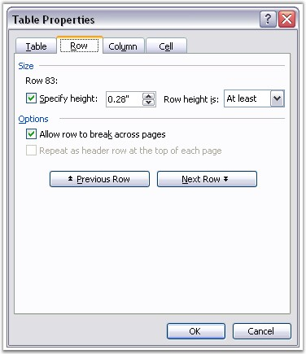

::: {style="DISPLAY: none"}
{#d2h_url_template}{#d2h_package_url style="WIDTH: 0px; DISPLAY: none; HEIGHT: 0px"}
:::

:::: {.d2h_secondary_topic style="PADDING-BOTTOM: 10pt; MARGIN: 0pt; PADDING-LEFT: 0pt; PADDING-RIGHT: 0pt; PADDING-TOP: 0pt"}
#### Row Format {#row-format style="tab-stops: 0pt"}

 

**RowFormat** class represents **table or table row** formatting in the Word document.

 

**Properties**

 

[·      ]{style="FONT-FAMILY: Symbol"}**Borders**: defines format of row borders (width of line, line color and so on)

[·      ]{style="FONT-FAMILY: Symbol"}**Paddings**: defines margins for the cells in the row or table

[·      ]{style="FONT-FAMILY: Symbol"}**CellSpacing**: defines spacing between cells

[·      ]{style="FONT-FAMILY: Symbol"}**LeftIndent**: defines left indent of table or table row

[·      ]{style="FONT-FAMILY: Symbol"}**IsAutoResized**: defines if table or row auto resizes to fit the text

 

The following screen shot illustrates how to set the Row Format in MS Word.

 

{border="0"}

Figure 40: Row Format Options in Table Properties Dialog Box

 

 

**Public Properties**

 

::: {align="center"}
  --------------------- -----------------------------------------------------------------------------
  Name                  Description
  Bidi                  Gets or sets whether table is right-to-left.  
  Borders               Gets borders.
  CellSpacing           Gets or sets spacing between cells (in points).  
  HorizontalAlignment   Gets or sets horizontal alignment for the paragraph.  
  IsAutoResized         Gets or sets the boolean value indicating if the table is auto resized.
  IsBreakAcrossPages    Gets or sets the boolean value indicating if there is a break across pages.
  LeftIndent            Gets or sets table indent (in points).
  Paddings              Gets paddings.
  --------------------- -----------------------------------------------------------------------------
:::

 

+------------------------------------------------------------------------------------------------------------------------------+
| **[\[C#\]]{style="FONT-FAMILY: 'Courier New'; COLOR: black"}**                                                               |
|                                                                                                                              |
| []{style="COLOR: black"}                                                                                                     |
|                                                                                                                              |
| [// Adding a new Table to the textbody.]{style="FONT-FAMILY: 'Courier New'; COLOR: green"}                                   |
|                                                                                                                              |
| [IWTable table = sec.body.AddTable();]{style="FONT-FAMILY: 'Courier New'"}                                                   |
|                                                                                                                              |
| []{style="FONT-FAMILY: 'Courier New'"}                                                                                       |
|                                                                                                                              |
| [RowFormat format = [new]{style="COLOR: blue"} RowFormat();]{style="FONT-FAMILY: 'Courier New'"}                             |
|                                                                                                                              |
| [format.Paddings.All = 5;]{style="FONT-FAMILY: 'Courier New'"}                                                               |
|                                                                                                                              |
| [format.Borders.BorderType = Syncfusion.DocIO.DLS.BorderStyle.Dot;]{style="FONT-FAMILY: 'Courier New'"}                      |
|                                                                                                                              |
| [format.Borders.LineWidth = 2;]{style="FONT-FAMILY: 'Courier New'"}                                                          |
|                                                                                                                              |
| []{style="FONT-FAMILY: 'Courier New'"}                                                                                       |
|                                                                                                                              |
| [// Inserting rows to the table.This will apply the format to whole table]{style="FONT-FAMILY: 'Courier New'; COLOR: green"} |
|                                                                                                                              |
| [table.ResetCells(6, 6, format, 80);]{style="FONT-FAMILY: 'Courier New'"}                                                    |
+------------------------------------------------------------------------------------------------------------------------------+

 

+----------------------------------------------------------------------------------------------------------------------------------------------------------------------+
| **[\[VB.NET\]]{style="FONT-FAMILY: 'Courier New'; COLOR: black"}**                                                                                                   |
|                                                                                                                                                                      |
| []{style="COLOR: black"}                                                                                                                                             |
|                                                                                                                                                                      |
| [\' Adding a new Table to the textbody. ]{style="FONT-FAMILY: 'Courier New'; COLOR: green"}                                                                          |
|                                                                                                                                                                      |
| [Dim]{style="FONT-FAMILY: 'Courier New'; COLOR: blue"}[ table [As]{style="COLOR: blue"} IWTable = sec.body.AddTable()]{style="FONT-FAMILY: 'Courier New'"}           |
|                                                                                                                                                                      |
| []{style="FONT-FAMILY: 'Courier New'"}                                                                                                                               |
|                                                                                                                                                                      |
| [Dim]{style="FONT-FAMILY: 'Courier New'; COLOR: blue"}[ format [As]{style="COLOR: blue"} [New]{style="COLOR: blue"} RowFormat()]{style="FONT-FAMILY: 'Courier New'"} |
|                                                                                                                                                                      |
| [format.Paddings.All = 5 ]{style="FONT-FAMILY: 'Courier New'"}                                                                                                       |
|                                                                                                                                                                      |
| [format.Borders.BorderType = Syncfusion.DocIO.DLS.BorderStyle.Dot ]{style="FONT-FAMILY: 'Courier New'"}                                                              |
|                                                                                                                                                                      |
| [format.Borders.LineWidth = 2 ]{style="FONT-FAMILY: 'Courier New'"}                                                                                                  |
|                                                                                                                                                                      |
| []{style="FONT-FAMILY: 'Courier New'"}                                                                                                                               |
|                                                                                                                                                                      |
| [\' Inserting rows to the table.This will apply the format to whole table ]{style="FONT-FAMILY: 'Courier New'; COLOR: green"}                                        |
|                                                                                                                                                                      |
| [table.ResetCells(6, 6, format, 80) ]{style="FONT-FAMILY: 'Courier New'"}                                                                                            |
+----------------------------------------------------------------------------------------------------------------------------------------------------------------------+

 

 

[]{#related-topics}
::::
