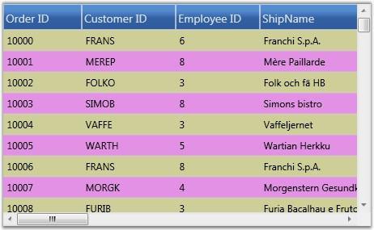
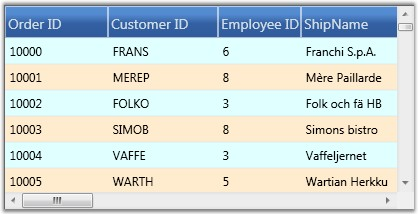

::: {style="DISPLAY: none"}
{#d2h_url_template}{#d2h_package_url style="WIDTH: 0px; DISPLAY: none; HEIGHT: 0px"}
:::

::: {.d2h_secondary_topic style="PADDING-BOTTOM: 10pt; MARGIN: 0pt; PADDING-LEFT: 0pt; PADDING-RIGHT: 0pt; PADDING-TOP: 0pt"}
##### Row Styles {#row-styles style="tab-stops: 0pt"}

There are two ways to format the grid rows. They are,

 

[·      ]{style="FONT-FAMILY: Symbol"}Using properties

[·      ]{style="FONT-FAMILY: Symbol"}By handling QueryCellInfo event

**[]{style="COLOR: #15428b"}** 

Using Properties

 

You can change the background of the grid rows by setting a color for the RowBackground property. To override the color of the alternative rows in the same grid use the AlternatingRowBackground property.

 

The following code illustrates the properties settings.

 

+--------------------------------------------------------------------------------------------------------------------------------------------------------------------------------------+
| [\[C#\]]{style="FONT-FAMILY: 'Courier New'; COLOR: black"}                                                                                                                           |
|                                                                                                                                                                                      |
| []{style="FONT-FAMILY: 'Courier New'; COLOR: black"}                                                                                                                                 |
|                                                                                                                                                                                      |
| [grid.AlternatingRowBackground = [new]{style="COLOR: blue"} [SolidColorBrush]{style="COLOR: #2b91af"}([Colors]{style="COLOR: #2b91af"}.Orchid);]{style="FONT-FAMILY: 'Courier New'"} |
|                                                                                                                                                                                      |
| [grid.RowBackground = [new]{style="COLOR: blue"} [SolidColorBrush]{style="COLOR: #2b91af"}([Colors]{style="COLOR: #2b91af"}.Tan);]{style="FONT-FAMILY: 'Courier New'"}               |
+--------------------------------------------------------------------------------------------------------------------------------------------------------------------------------------+

 

The following image corresponds to the output of the above given code:

 

{border="0"}

Figure 202: Applying row and alternative row backgrounds for the Grid

 

The row styles of the GDC are customized using background properties.

 

Using QueryCellInfo Event

 

QueryCellInfo event is handled whenever a grid cell needs to be redrawn or repainted. In the GDC, you can use Model.QueryCellInfo event to format the rows by checking the row and column indices on the event arguments.

 

The following code illustrates this:

 

+-----------------------------------------------------------------------------------------------------------------------------------------------------------------------------------------------------------------+
| [\[C#\]]{style="FONT-FAMILY: 'Courier New'; COLOR: black"}                                                                                                                                                      |
|                                                                                                                                                                                                                 |
| []{style="FONT-FAMILY: 'Courier New'; COLOR: black"}                                                                                                                                                            |
|                                                                                                                                                                                                                 |
| [grid.Model.QueryCellInfo += [new]{style="COLOR: blue"} [GridQueryCellInfoEventHandler]{style="COLOR: #2b91af"}(Model_QueryCellInfo);]{style="FONT-FAMILY: 'Courier New'"}                                      |
|                                                                                                                                                                                                                 |
| [void]{style="FONT-FAMILY: 'Courier New'; COLOR: blue"}[ Model_QueryCellInfo([object]{style="COLOR: blue"} sender, [GridQueryCellInfoEventArgs]{style="COLOR: #2b91af"} e)]{style="FONT-FAMILY: 'Courier New'"} |
|                                                                                                                                                                                                                 |
| [        {]{style="FONT-FAMILY: 'Courier New'"}                                                                                                                                                                 |
|                                                                                                                                                                                                                 |
| [            [if]{style="COLOR: blue"} (e.Cell.RowIndex \> 0)]{style="FONT-FAMILY: 'Courier New'"}                                                                                                              |
|                                                                                                                                                                                                                 |
| [            {]{style="FONT-FAMILY: 'Courier New'"}                                                                                                                                                             |
|                                                                                                                                                                                                                 |
| [                [if]{style="COLOR: blue"} (e.Cell.RowIndex % 2 == 0)]{style="FONT-FAMILY: 'Courier New'"}                                                                                                      |
|                                                                                                                                                                                                                 |
| [                    e.Style.Background = [Brushes]{style="COLOR: #2b91af"}.BlanchedAlmond;]{style="FONT-FAMILY: 'Courier New'"}                                                                                |
|                                                                                                                                                                                                                 |
| [                [else]{style="COLOR: blue"}]{style="FONT-FAMILY: 'Courier New'"}                                                                                                                               |
|                                                                                                                                                                                                                 |
| [                    e.Style.Background = [Brushes]{style="COLOR: #2b91af"}.LightCyan;]{style="FONT-FAMILY: 'Courier New'"}                                                                                     |
|                                                                                                                                                                                                                 |
| [            }]{style="FONT-FAMILY: 'Courier New'"}                                                                                                                                                             |
|                                                                                                                                                                                                                 |
| [        }]{style="FONT-FAMILY: 'Courier New'"}                                                                                                                                                                 |
+-----------------------------------------------------------------------------------------------------------------------------------------------------------------------------------------------------------------+

 

The following image corresponds to the output of the above given code:

 

{border="0"}

Figure 203: Applying row styles using QueryCellInfo Event

***[]{style="COLOR: #15428b"}*** 

The row styles of the GDC are customized by handling the QueryCellInfo event.

 

 

[]{#related-topics}
:::
