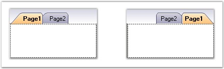
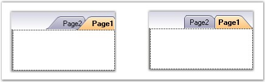

::: {style="DISPLAY: none"}
{#d2h_url_template}{#d2h_package_url style="WIDTH: 0px; DISPLAY: none; HEIGHT: 0px"}
:::

:::::: {.d2h_secondary_topic style="PADDING-BOTTOM: 10pt; MARGIN: 0pt; PADDING-LEFT: 0pt; PADDING-RIGHT: 0pt; PADDING-TOP: 0pt"}
##### RTL Support {#rtl-support style="MARGIN-LEFT: 18pt; tab-stops: 18.0pt"}

[]{style="COLOR: #15428b"} 

RightToLeft

 

Tabs framework allows the tabitems in the TabControlAdv to be drawn from right to left. This can be done by setting the RightToLeft property to Yes.

 

This property aligns the tabs and the text from right to left which proves to be helpful for the Right-To-Left languages.

[]{style="COLOR: #15428b"} 

::: {align="center"}
  ------------------------ --------------------------------------------------------------------------------------
  TabControlAdv Property   Description
  RightToLeft              Specifies to draw the tabs and the text from right to left. The default value is No.
  ------------------------ --------------------------------------------------------------------------------------
:::

[]{style="COLOR: #15428b"} 

[ {border="0"}]{style="COLOR: #15428b"}

**[]{style="COLOR: #15428b"}** 

Figure 1072: TabControlAdv with Tabs drawn from Left and Right

**[]{style="COLOR: #15428b"}** 

Rotating Tabs

[]{style="COLOR: #15428b"} 

**RotateTabsWhenRTL** property can be used to rotate the tabs of the tabcontroladv that are aligned to the left and right of the tabpages. This specifies whether a tab should be drawn from left to right or from right to left. The default value is False.

 

When the RightToLeft mode is activated and RotateTabsWhenRTL property is enabled, tab rotation is allowed.

[]{style="COLOR: #15428b"} 

::: {align="center"}
  ------------------------ -------------------------------------------------------------------------------------------------------------
  TabControlAdv Property   Description
  RotateTabsWhenRTL        Gets / sets the value that decides whether the tabs can be rotated, when the RightToLeft mode is activated.
  ------------------------ -------------------------------------------------------------------------------------------------------------
:::

[]{style="COLOR: #15428b"} 

{border="0"}

[]{style="COLOR: #15428b"} 

Figure 1073: TabControlAdv with RotateTabsWhenRTL set to False and True

**[]{style="COLOR: #15428b"}** 

+------------------------------------------------------------------------------------------------------------------------------------------------------------------+
| **[\[C#\]]{style="FONT-FAMILY: 'Courier New'; COLOR: black"}**                                                                                                   |
|                                                                                                                                                                  |
| **[]{style="FONT-FAMILY: 'Courier New'; COLOR: black"}**                                                                                                         |
|                                                                                                                                                                  |
| [this]{style="FONT-FAMILY: 'Courier New'; COLOR: blue"}[.tabControlAdv1.RightToLeft = System.Windows.Forms.RightToLeft.Yes;]{style="FONT-FAMILY: 'Courier New'"} |
|                                                                                                                                                                  |
| [this]{style="FONT-FAMILY: 'Courier New'; COLOR: blue"}[.tabControlAdv1.RotateTabsWhenRTL = [true]{style="COLOR: blue"};]{style="FONT-FAMILY: 'Courier New'"}    |
+------------------------------------------------------------------------------------------------------------------------------------------------------------------+

[]{style="COLOR: #15428b"} 

+---------------------------------------------------------------------------------------------------------------------------------------------------------------+
| **[\[VB.NET\]]{style="FONT-FAMILY: 'Courier New'; COLOR: black"}**                                                                                            |
|                                                                                                                                                               |
| **[]{style="FONT-FAMILY: 'Courier New'; COLOR: black"}**                                                                                                      |
|                                                                                                                                                               |
| [Me]{style="FONT-FAMILY: 'Courier New'; COLOR: blue"}[.tabControlAdv1.RightToLeft = System.Windows.Forms.RightToLeft.Yes]{style="FONT-FAMILY: 'Courier New'"} |
|                                                                                                                                                               |
| [Me]{style="FONT-FAMILY: 'Courier New'; COLOR: blue"}[.tabControlAdv1.RotateTabsWhenRTL = [True]{style="COLOR: blue"}]{style="FONT-FAMILY: 'Courier New'"}    |
+---------------------------------------------------------------------------------------------------------------------------------------------------------------+

**[]{style="COLOR: #15428b"}** 

::: {style="BORDER-BOTTOM: windowtext 1pt solid; BORDER-LEFT: medium none; PADDING-BOTTOM: 1pt; MARGIN: 9pt 0pt 9pt 18pt; PADDING-LEFT: 0pt; PADDING-RIGHT: 0pt; BORDER-TOP: windowtext 1pt solid; BORDER-RIGHT: medium none; PADDING-TOP: 1pt"}
{border="0"} Note: Only VS2005Style, OneNoteStyle and DockingWhidbeyStyle support RotateTabsWhenRTL property.
:::

 

 

 

 

[]{#related-topics}
::::::
