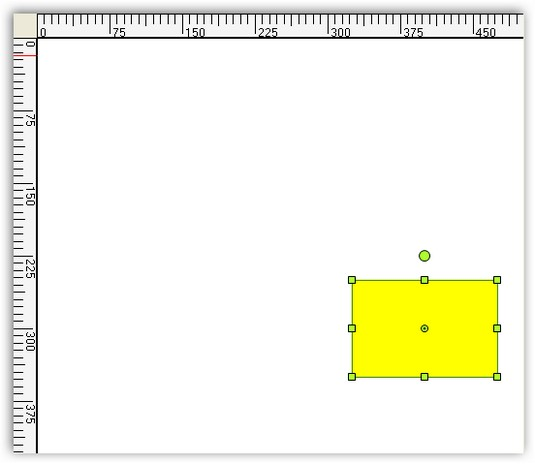
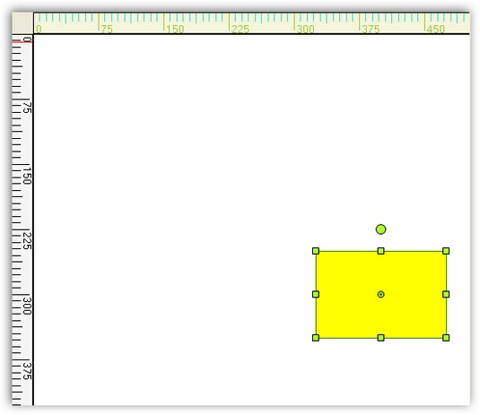

::: {style="DISPLAY: none"}
{#d2h_url_template}{#d2h_package_url style="WIDTH: 0px; DISPLAY: none; HEIGHT: 0px"}
:::

::::: {#nsbanner .d2h_main_nsbanner style="BORDER-BOTTOM: #999999 1px solid; POSITION: relative; PADDING-BOTTOM: 0px; BACKGROUND-COLOR: transparent; PADDING-LEFT: 0px; PADDING-RIGHT: 0px; DISPLAY: none; BORDER-TOP: #999999 1px solid; PADDING-TOP: 0px; LEFT: 0px"}
:::: {#TitleRow .d2h_main_titlerow style="PADDING-BOTTOM: 4px; BACKGROUND-COLOR: transparent; PADDING-LEFT: 22px; WIDTH: 100%; PADDING-RIGHT: 10px; DISPLAY: none; PADDING-TOP: 4px"}
::: {#ienav .d2h_main_ienav style="DISPLAY: none"}
{#D2HPrevious .D2HPreviousEnabled}  {#D2HNext .D2HNextEnabled}
:::
::::
:::::

:::::: {#nstext .d2h_main_nstext style="PADDING-BOTTOM: 10px; BACKGROUND-COLOR: transparent; PADDING-LEFT: 22px; PADDING-RIGHT: 10px; HEIGHT: 100%; OVERFLOW: auto; PADDING-TOP: 5px" hasuserbackground="true" valign="bottom"}
::: {#d2h_breadcrumbs .d2h_breadcrumbs}
[Essential Studio User Guide Documentation](ms-xhelp:///?Id=12457748-09e3-4d74-a240-8e049cedf030){.d2h_breadcrumbsNormal}[ \> ]{.d2h_breadcrumbsLinkSeparator}[User Interface Edition](ms-xhelp:///?Id=c29296b7-531c-413b-a0ec-488ca1f7f669){.d2h_breadcrumbsNormal}[ \> ]{.d2h_breadcrumbsLinkSeparator}[Essential Windows](ms-xhelp:///?Id=e60759d8-47a4-4570-9d7a-16a68d63f2ea){.d2h_breadcrumbsNormal}[ \> ]{.d2h_breadcrumbsLinkSeparator}[Essential Diagram]{.d2h_breadcrumbsContentsOnly}[ \> ]{.d2h_breadcrumbsLinkSeparator}[Concepts And Features](ms-xhelp:///?Id=008cec4b-5177-4859-8616-c062751d8fb6){.d2h_breadcrumbsNormal}[ \> ]{.d2h_breadcrumbsLinkSeparator}[Advanced Features](ms-xhelp:///?Id=f661be94-4825-49a2-ac75-df5e8495098e){.d2h_breadcrumbsNormal}
:::

### Rulers {#rulers style="tab-stops: 0pt"}

[]{style="FONT-FAMILY: 'Trebuchet MS','sans-serif'; COLOR: #15428b; FONT-SIZE: 9pt"} 

Rulers can be enabled by setting the **ShowRulers** property for the diagram control. The rulers will automatically inherit the MeasurementUnit set for the diagram model and get converted accordingly.

[]{style="FONT-FAMILY: 'Trebuchet MS','sans-serif'; COLOR: #15428b; FONT-SIZE: 9pt"} 

The height of the ruler can be set through **RulersHeight** property.

[]{style="FONT-FAMILY: 'Trebuchet MS','sans-serif'; COLOR: #15428b; FONT-SIZE: 9pt"} 

::: {align="center"}
  -------------- -------------------------------------------------------------
  Property       Description
  ShowRulers     Specifies whether to display ruler for the diagram control.
  RulersHeight   Specifies the height of the ruler.
  -------------- -------------------------------------------------------------
:::

[]{style="FONT-FAMILY: 'Trebuchet MS','sans-serif'; COLOR: #15428b; FONT-SIZE: 9pt"} 

Programmatically the ruler properties can be set as follows.

[]{style="FONT-FAMILY: 'Trebuchet MS','sans-serif'; COLOR: #15428b; FONT-SIZE: 9pt"} 

+--------------------------------------------------------------------------------------------------------------------------------------------------+
| **[\[C#\]]{style="FONT-FAMILY: 'Courier New'; COLOR: black"}**                                                                                   |
|                                                                                                                                                  |
| []{style="FONT-FAMILY: 'Courier New'"}                                                                                                           |
|                                                                                                                                                  |
| [this]{style="FONT-FAMILY: 'Courier New'; COLOR: blue"}[.diagram1.ShowRulers = [true]{style="COLOR: blue"};]{style="FONT-FAMILY: 'Courier New'"} |
|                                                                                                                                                  |
| [this]{style="FONT-FAMILY: 'Courier New'; COLOR: blue"}[.diagram1.RulersHeight = 25;]{style="FONT-FAMILY: 'Courier New'"}                        |
+--------------------------------------------------------------------------------------------------------------------------------------------------+

[]{style="FONT-FAMILY: 'Courier New'"} 

+-----------------------------------------------------------------------------------------------------------------------------------------------+
| **[\[VB\]]{style="FONT-FAMILY: 'Courier New'; COLOR: black"}**                                                                                |
|                                                                                                                                               |
| []{style="FONT-FAMILY: 'Courier New'"}                                                                                                        |
|                                                                                                                                               |
| [Me]{style="FONT-FAMILY: 'Courier New'; COLOR: blue"}[.diagram1.ShowRulers = [True]{style="COLOR: blue"}]{style="FONT-FAMILY: 'Courier New'"} |
|                                                                                                                                               |
| [Me]{style="FONT-FAMILY: 'Courier New'; COLOR: blue"}[.diagram1.RulersHeight = 25]{style="FONT-FAMILY: 'Courier New'"}                        |
+-----------------------------------------------------------------------------------------------------------------------------------------------+

[]{style="FONT-FAMILY: 'Courier New'; COLOR: blue"} 

Sample diagram is as follows,

[]{style="FONT-FAMILY: 'Trebuchet MS','sans-serif'; COLOR: #15428b; FONT-SIZE: 9pt"} 

{border="0"}

***[]{style="FONT-FAMILY: 'Trebuchet MS','sans-serif'; BACKGROUND: white; COLOR: #15428b; FONT-SIZE: 9pt"}*** 

Figure 82: Diagram with Rulers

**[]{style="FONT-FAMILY: 'Trebuchet MS','sans-serif'; COLOR: #15428b"}** 

Diagram With Rulers

[]{style="FONT-FAMILY: 'Trebuchet MS','sans-serif'; COLOR: #15428b; FONT-SIZE: 9pt"} 

Horizontal and vertical rulers can be displayed by setting the **ShowRulers** property. Both the horizontal and vertical rulers can be customized using various properties, which can be separately applied for each of the rulers.

[]{style="FONT-FAMILY: 'Trebuchet MS','sans-serif'; COLOR: #15428b; FONT-SIZE: 9pt"} 

::: {align="center"}
  ----------------- -----------------------------------------------------
  Ruler Property    Description
  BackgroundColor   Specifies the back color for the ruler.
  HighlightColor    Specifies the highlight color.
  MajorLinesColor   Specifies the color for the main line in the ruler.
  MarkerColor       Specifies the marker color in the ruler.
  MinorLinesColor   Specifies the color for the sub-division lines.
  TextStyle         Specifies the text style.
  ----------------- -----------------------------------------------------
:::

[]{style="FONT-FAMILY: 'Trebuchet MS','sans-serif'; COLOR: #15428b; FONT-SIZE: 9pt"} 

Programmatically the properties can be set as follows for vertical lines.

[]{style="FONT-FAMILY: 'Trebuchet MS','sans-serif'; COLOR: #15428b; FONT-SIZE: 9pt"} 

+-------------------------------------------------------------------------------------------------------------------------------------------------------------------------------------------------+
| **[\[C#\]]{style="FONT-FAMILY: 'Courier New'; COLOR: black"}**                                                                                                                                  |
|                                                                                                                                                                                                 |
| []{style="FONT-FAMILY: 'Courier New'"}                                                                                                                                                          |
|                                                                                                                                                                                                 |
| [this]{style="FONT-FAMILY: 'Courier New'; COLOR: blue"}[.diagram1.VerticalRuler.BackgroundColor = System.Drawing.[Color]{style="COLOR: teal"}.Beige;]{style="FONT-FAMILY: 'Courier New'"}       |
|                                                                                                                                                                                                 |
| [this]{style="FONT-FAMILY: 'Courier New'; COLOR: blue"}[.diagram1.VerticalRuler.HighlightColor = System.Drawing.[Color]{style="COLOR: teal"}.Yellow;]{style="FONT-FAMILY: 'Courier New'"}       |
|                                                                                                                                                                                                 |
| [this]{style="FONT-FAMILY: 'Courier New'; COLOR: blue"}[.diagram1.VerticalRuler.MajorLinesColor = System.Drawing.[Color]{style="COLOR: teal"}.YellowGreen;]{style="FONT-FAMILY: 'Courier New'"} |
|                                                                                                                                                                                                 |
| [this]{style="FONT-FAMILY: 'Courier New'; COLOR: blue"}[.diagram1.VerticalRuler.MarkerColor = System.Drawing.[Color]{style="COLOR: teal"}.Thistle;]{style="FONT-FAMILY: 'Courier New'"}         |
|                                                                                                                                                                                                 |
| [this]{style="FONT-FAMILY: 'Courier New'; COLOR: blue"}[.diagram1.VerticalRuler.MinorLinesColor = System.Drawing.[Color]{style="COLOR: teal"}.Turquoise;]{style="FONT-FAMILY: 'Courier New'"}   |
|                                                                                                                                                                                                 |
| []{style="FONT-FAMILY: 'Courier New'"}                                                                                                                                                          |
|                                                                                                                                                                                                 |
| [this]{style="FONT-FAMILY: 'Courier New'; COLOR: blue"}[.diagram1.VerticalRuler.TextStyle.Bold = [true]{style="COLOR: blue"};]{style="FONT-FAMILY: 'Courier New'"}                              |
|                                                                                                                                                                                                 |
| [this]{style="FONT-FAMILY: 'Courier New'; COLOR: blue"}[.diagram1.VerticalRuler.TextStyle.Italic = [true]{style="COLOR: blue"};]{style="FONT-FAMILY: 'Courier New'"}                            |
|                                                                                                                                                                                                 |
| [this]{style="FONT-FAMILY: 'Courier New'; COLOR: blue"}[.diagram1.VerticalRuler.TextStyle.PointSize = 20;]{style="FONT-FAMILY: 'Courier New'"}                                                  |
|                                                                                                                                                                                                 |
| [this]{style="FONT-FAMILY: 'Courier New'; COLOR: blue"}[.diagram1.VerticalRuler.TextStyle.Strikeout = [true]{style="COLOR: blue"};]{style="FONT-FAMILY: 'Courier New'"}                         |
|                                                                                                                                                                                                 |
| [this]{style="FONT-FAMILY: 'Courier New'; COLOR: blue"}[.diagram1.VerticalRuler.TextStyle.Style = System.Drawing.[FontStyle]{style="COLOR: teal"}.Bold;]{style="FONT-FAMILY: 'Courier New'"}    |
|                                                                                                                                                                                                 |
| [this]{style="FONT-FAMILY: 'Courier New'; COLOR: blue"}[.diagram1.VerticalRuler.TextStyle.Underline = [true]{style="COLOR: blue"};]{style="FONT-FAMILY: 'Courier New'"}                         |
|                                                                                                                                                                                                 |
| [this]{style="FONT-FAMILY: 'Courier New'; COLOR: blue"}[.diagram1.VerticalRuler.TextStyle.Unit = [MeasureUnits]{style="COLOR: teal"}.Point;]{style="FONT-FAMILY: 'Courier New'"}                |
+-------------------------------------------------------------------------------------------------------------------------------------------------------------------------------------------------+

[]{style="FONT-FAMILY: 'Courier New'"} 

+-----------------------------------------------------------------------------------------------------------------------------------------------------------------------+
| **[\[VB\]]{style="FONT-FAMILY: 'Courier New'; COLOR: black"}**                                                                                                        |
|                                                                                                                                                                       |
| []{style="FONT-FAMILY: 'Courier New'"}                                                                                                                                |
|                                                                                                                                                                       |
| [Me]{style="FONT-FAMILY: 'Courier New'; COLOR: blue"}[.diagram1.VerticalRuler.BackgroundColor = System.Drawing.Color.Beige]{style="FONT-FAMILY: 'Courier New'"}       |
|                                                                                                                                                                       |
| [Me]{style="FONT-FAMILY: 'Courier New'; COLOR: blue"}[.diagram1.VerticalRuler.HighlightColor = System.Drawing.Color.Yellow]{style="FONT-FAMILY: 'Courier New'"}       |
|                                                                                                                                                                       |
| [Me]{style="FONT-FAMILY: 'Courier New'; COLOR: blue"}[.diagram1.VerticalRuler.MajorLinesColor = System.Drawing.Color.YellowGreen]{style="FONT-FAMILY: 'Courier New'"} |
|                                                                                                                                                                       |
| [Me]{style="FONT-FAMILY: 'Courier New'; COLOR: blue"}[.diagram1.VerticalRuler.MarkerColor = System.Drawing.Color.Thistle]{style="FONT-FAMILY: 'Courier New'"}         |
|                                                                                                                                                                       |
| [Me]{style="FONT-FAMILY: 'Courier New'; COLOR: blue"}[.diagram1.VerticalRuler.MinorLinesColor = System.Drawing.Color.Turquoise]{style="FONT-FAMILY: 'Courier New'"}   |
|                                                                                                                                                                       |
| []{style="FONT-FAMILY: 'Courier New'"}                                                                                                                                |
|                                                                                                                                                                       |
| [Me]{style="FONT-FAMILY: 'Courier New'; COLOR: blue"}[.diagram1.VerticalRuler.TextStyle.Bold = [True]{style="COLOR: blue"}]{style="FONT-FAMILY: 'Courier New'"}       |
|                                                                                                                                                                       |
| [Me]{style="FONT-FAMILY: 'Courier New'; COLOR: blue"}[.diagram1.VerticalRuler.TextStyle.Italic = [True]{style="COLOR: blue"}]{style="FONT-FAMILY: 'Courier New'"}     |
|                                                                                                                                                                       |
| [Me]{style="FONT-FAMILY: 'Courier New'; COLOR: blue"}[.diagram1.VerticalRuler.TextStyle.PointSize = 20]{style="FONT-FAMILY: 'Courier New'"}                           |
|                                                                                                                                                                       |
| [Me]{style="FONT-FAMILY: 'Courier New'; COLOR: blue"}[.diagram1.VerticalRuler.TextStyle.Strikeout = [True]{style="COLOR: blue"}]{style="FONT-FAMILY: 'Courier New'"}  |
|                                                                                                                                                                       |
| [Me]{style="FONT-FAMILY: 'Courier New'; COLOR: blue"}[.diagram1.VerticalRuler.TextStyle.Style = System.Drawing.FontStyle.Bold]{style="FONT-FAMILY: 'Courier New'"}    |
|                                                                                                                                                                       |
| [Me]{style="FONT-FAMILY: 'Courier New'; COLOR: blue"}[.diagram1.VerticalRuler.TextStyle.Underline = [True]{style="COLOR: blue"}]{style="FONT-FAMILY: 'Courier New'"}  |
|                                                                                                                                                                       |
| [Me]{style="FONT-FAMILY: 'Courier New'; COLOR: blue"}[.diagram1.VerticalRuler.TextStyle.Unit = MeasureUnits.Point]{style="FONT-FAMILY: 'Courier New'"}                |
+-----------------------------------------------------------------------------------------------------------------------------------------------------------------------+

[]{style="FONT-FAMILY: 'Trebuchet MS','sans-serif'; COLOR: #15428b; FONT-SIZE: 9pt"} 

Sample diagram is as follows,

[]{style="FONT-FAMILY: 'Trebuchet MS','sans-serif'; COLOR: #15428b; FONT-SIZE: 9pt"} 

{border="0"}

[]{style="FONT-FAMILY: 'Trebuchet MS','sans-serif'; COLOR: #15428b; FONT-SIZE: 9pt"} 

Figure 83: Vertical ruler Property Settings

[]{style="FONT-FAMILY: 'Trebuchet MS','sans-serif'; COLOR: #15428b; FONT-SIZE: 9pt"} 

[]{#Rulers2}These properties can be set separately for the horizontal ruler by using HorizontalRuler instead of VerticalRuler as follows.

[]{style="FONT-FAMILY: 'Trebuchet MS','sans-serif'; COLOR: #15428b; FONT-SIZE: 9pt"} 

+---------------------------------------------------------------------------------------------------------------------------------------------------------------------------------------------------+
| **[\[C#\]]{style="FONT-FAMILY: 'Courier New'; COLOR: black"}**                                                                                                                                    |
|                                                                                                                                                                                                   |
| []{style="FONT-FAMILY: 'Courier New'"}                                                                                                                                                            |
|                                                                                                                                                                                                   |
| [this]{style="FONT-FAMILY: 'Courier New'; COLOR: blue"}[.diagram1.HorizontalRuler.BackgroundColor = System.Drawing.[Color]{style="COLOR: teal"}.Beige;]{style="FONT-FAMILY: 'Courier New'"}       |
|                                                                                                                                                                                                   |
| [this]{style="FONT-FAMILY: 'Courier New'; COLOR: blue"}[.diagram1.HorizontalRuler.HighlightColor = System.Drawing.[Color]{style="COLOR: teal"}.Yellow;]{style="FONT-FAMILY: 'Courier New'"}       |
|                                                                                                                                                                                                   |
| [this]{style="FONT-FAMILY: 'Courier New'; COLOR: blue"}[.diagram1.HorizontalRuler.MajorLinesColor = System.Drawing.[Color]{style="COLOR: teal"}.YellowGreen;]{style="FONT-FAMILY: 'Courier New'"} |
|                                                                                                                                                                                                   |
| [this]{style="FONT-FAMILY: 'Courier New'; COLOR: blue"}[.diagram1.HorizontalRuler.MarkerColor = System.Drawing.[Color]{style="COLOR: teal"}.Thistle;]{style="FONT-FAMILY: 'Courier New'"}         |
|                                                                                                                                                                                                   |
| [this]{style="FONT-FAMILY: 'Courier New'; COLOR: blue"}[.diagram1.HorizontalRuler.MinorLinesColor = System.Drawing.[Color]{style="COLOR: teal"}.Turquoise;]{style="FONT-FAMILY: 'Courier New'"}   |
|                                                                                                                                                                                                   |
| []{style="FONT-FAMILY: 'Courier New'"}                                                                                                                                                            |
|                                                                                                                                                                                                   |
| [this]{style="FONT-FAMILY: 'Courier New'; COLOR: blue"}[.diagram1.HorizontalRuler.TextStyle.Bold = [true]{style="COLOR: blue"};]{style="FONT-FAMILY: 'Courier New'"}                              |
|                                                                                                                                                                                                   |
| [this]{style="FONT-FAMILY: 'Courier New'; COLOR: blue"}[.diagram1.HorizontalRuler.TextStyle.Italic = [true]{style="COLOR: blue"};]{style="FONT-FAMILY: 'Courier New'"}                            |
|                                                                                                                                                                                                   |
| [this]{style="FONT-FAMILY: 'Courier New'; COLOR: blue"}[.diagram1.HorizontalRuler.TextStyle.PointSize = 20;]{style="FONT-FAMILY: 'Courier New'"}                                                  |
|                                                                                                                                                                                                   |
| [this]{style="FONT-FAMILY: 'Courier New'; COLOR: blue"}[.diagram1.HorizontalRuler.TextStyle.Strikeout = [true]{style="COLOR: blue"};]{style="FONT-FAMILY: 'Courier New'"}                         |
|                                                                                                                                                                                                   |
| [this]{style="FONT-FAMILY: 'Courier New'; COLOR: blue"}[.diagram1.HorizontalRuler.TextStyle.Style = System.Drawing.[FontStyle]{style="COLOR: teal"}.Bold;]{style="FONT-FAMILY: 'Courier New'"}    |
|                                                                                                                                                                                                   |
| [this]{style="FONT-FAMILY: 'Courier New'; COLOR: blue"}[.diagram1.HorizontalRuler.TextStyle.Underline = [true]{style="COLOR: blue"};]{style="FONT-FAMILY: 'Courier New'"}                         |
|                                                                                                                                                                                                   |
| [this]{style="FONT-FAMILY: 'Courier New'; COLOR: blue"}[.diagram1.HorizontalRuler.TextStyle.Unit = [MeasureUnits]{style="COLOR: teal"}.Point;]{style="FONT-FAMILY: 'Courier New'"}                |
+---------------------------------------------------------------------------------------------------------------------------------------------------------------------------------------------------+

[]{style="FONT-FAMILY: 'Courier New'"} 

+-------------------------------------------------------------------------------------------------------------------------------------------------------------------------+
| **[\[VB\]]{style="FONT-FAMILY: 'Courier New'; COLOR: black"}**                                                                                                          |
|                                                                                                                                                                         |
| []{style="FONT-FAMILY: 'Courier New'"}                                                                                                                                  |
|                                                                                                                                                                         |
| [Me]{style="FONT-FAMILY: 'Courier New'; COLOR: blue"}[.diagram1.HorizontalRuler.BackgroundColor = System.Drawing.Color.Beige]{style="FONT-FAMILY: 'Courier New'"}       |
|                                                                                                                                                                         |
| [Me]{style="FONT-FAMILY: 'Courier New'; COLOR: blue"}[.diagram1.HorizontalRuler.HighlightColor = System.Drawing.Color.Yellow]{style="FONT-FAMILY: 'Courier New'"}       |
|                                                                                                                                                                         |
| [Me]{style="FONT-FAMILY: 'Courier New'; COLOR: blue"}[.diagram1.HorizontalRuler.MajorLinesColor = System.Drawing.Color.YellowGreen]{style="FONT-FAMILY: 'Courier New'"} |
|                                                                                                                                                                         |
| [Me]{style="FONT-FAMILY: 'Courier New'; COLOR: blue"}[.diagram1.HorizontalRuler.MarkerColor = System.Drawing.Color.Thistle]{style="FONT-FAMILY: 'Courier New'"}         |
|                                                                                                                                                                         |
| [Me]{style="FONT-FAMILY: 'Courier New'; COLOR: blue"}[.diagram1.HorizontalRuler.MinorLinesColor = System.Drawing.Color.Turquoise]{style="FONT-FAMILY: 'Courier New'"}   |
|                                                                                                                                                                         |
| []{style="FONT-FAMILY: 'Courier New'"}                                                                                                                                  |
|                                                                                                                                                                         |
| [Me]{style="FONT-FAMILY: 'Courier New'; COLOR: blue"}[.diagram1.HorizontalRuler.TextStyle.Bold = [True]{style="COLOR: blue"}]{style="FONT-FAMILY: 'Courier New'"}       |
|                                                                                                                                                                         |
| [Me]{style="FONT-FAMILY: 'Courier New'; COLOR: blue"}[.diagram1.HorizontalRuler.TextStyle.Italic = [True]{style="COLOR: blue"}]{style="FONT-FAMILY: 'Courier New'"}     |
|                                                                                                                                                                         |
| [Me]{style="FONT-FAMILY: 'Courier New'; COLOR: blue"}[.diagram1.HorizontalRuler.TextStyle.PointSize = 20]{style="FONT-FAMILY: 'Courier New'"}                           |
|                                                                                                                                                                         |
| [Me]{style="FONT-FAMILY: 'Courier New'; COLOR: blue"}[.diagram1.HorizontalRuler.TextStyle.Strikeout = [True]{style="COLOR: blue"}]{style="FONT-FAMILY: 'Courier New'"}  |
|                                                                                                                                                                         |
| [Me]{style="FONT-FAMILY: 'Courier New'; COLOR: blue"}[.diagram1.HorizontalRuler.TextStyle.Style = System.Drawing.FontStyle.Bold]{style="FONT-FAMILY: 'Courier New'"}    |
|                                                                                                                                                                         |
| [Me]{style="FONT-FAMILY: 'Courier New'; COLOR: blue"}[.diagram1.HorizontalRuler.TextStyle.Underline = [True]{style="COLOR: blue"}]{style="FONT-FAMILY: 'Courier New'"}  |
|                                                                                                                                                                         |
| [Me]{style="FONT-FAMILY: 'Courier New'; COLOR: blue"}[.diagram1.HorizontalRuler.TextStyle.Unit = MeasureUnits.Point]{style="FONT-FAMILY: 'Courier New'"}                |
+-------------------------------------------------------------------------------------------------------------------------------------------------------------------------+

[]{style="FONT-FAMILY: 'Trebuchet MS','sans-serif'; COLOR: #15428b; FONT-SIZE: 9pt"} 

Sample diagram is as follows,

[]{style="FONT-FAMILY: 'Trebuchet MS','sans-serif'; COLOR: #15428b; FONT-SIZE: 9pt"} 

{border="0"}

 

Figure 84: Horizontal Ruler Property Settings

[]{#p49} 

[]{#related-topics}
::::::
