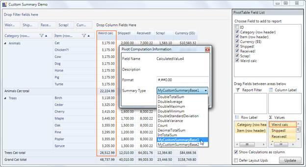

::: {style="DISPLAY: none"}
{#d2h_url_template} {#d2h_package_url style="WIDTH: 0px; DISPLAY: none; HEIGHT: 0px"}
:::

::::: {.d2h_secondary_topic style="PADDING-BOTTOM: 10pt; MARGIN: 0pt; PADDING-LEFT: 0pt; PADDING-RIGHT: 0pt; PADDING-TOP: 0pt"}
#### Runtime Custom Summary Type setting {#runtime-custom-summary-type-setting style="tab-stops: 0pt"}

This feature enables the user to set the custom summaries to the pivot item at both load time and runtime (using PivotComputationInfo dialog).

Use Case Scenarios

The user can set different custom summary types at runtime.[]{style="COLOR: #c00000"}[]{style="COLOR: #c00000"}

The following screenshot shows the custom summary at runtime:

{border="0"}

Figure 32 Setting Custom Summary at Runtime[]{style="COLOR: #c00000"}

[]{style="COLOR: #c00000"} 

Property

Table 6: Property Table

::: {align="center"}
  -------------------------------------------------------------------------------- ----------------------------------------------------------------------------------------------- --------- ------------------------------------------ -----------------
  Property                                                                         Description                                                                                     Type      Data Type                                  Reference links
  CustomSummaryBaseCollection[]{style="FONT-FAMILY: Consolas; FONT-SIZE: 9.5pt"}   Gets/Sets the Custom SummaryBase collection to set via PivotComputationInfo Dialog at runtime   **CLR**   ObservableCollection of type SummaryBase   \-
  -------------------------------------------------------------------------------- ----------------------------------------------------------------------------------------------- --------- ------------------------------------------ -----------------
:::

[]{style="FONT-WEIGHT: normal"} 

Sample Link

The user can find a sample in the following location:

**{InstalledLoction}:\\Users\\{User}AppData\\Local\\Syncfusion\\EssentialStudio\\{InstalledVersion}\\BI\\WPF\\PivotAnalysis.WPF\\Samples\\Summaries\\CustomSummariesDemo**

 

Adding Runtime Custom Summary Type setting to an Application

To add the feature to an application:

1.   Create a Custom SummaryBase class using the abstract class SummaryBase.

2.   Implement your summary logics by overriding Combine(), CombineSummary(),GetResult() methods.

3.   Create an object for the Custom Summary.

4.   Set the created object to PivotSchemaDesigner object's  **CustomSummaryBaseCollection** property.

Hence this property is an ObservableCollection type of SummaryBase that enable the user to add more than one class object. Each object is considered as a unique Custom SummaryBase.

5.   Using the **CustomSummaryBaseCollection**, set the summary for the respective columns by its **Summary** property. 

::: {style="BORDER-BOTTOM: windowtext 1pt solid; BORDER-LEFT: medium none; PADDING-BOTTOM: 1pt; MARGIN-TOP: 9pt; PADDING-LEFT: 0pt; PADDING-RIGHT: 0pt; MARGIN-BOTTOM: 9pt; BORDER-TOP: windowtext 1pt solid; BORDER-RIGHT: medium none; PADDING-TOP: 1pt"}
Notes: Ensure to set the SummaryType as Custom, otherwise the default type Count will be assigned.
:::

To set Custom Summary at runtime:

1.   Double click Items from the PivotSchemaDesigner which will pop up the Pivot Computation Information dialog box.

2.   In the Summary Type combo box, you can select the Custom summaries.

 

The following code snippets, explains the implementation of adding Runtime Custom Summary Type settings feature:

+---------------------------------------------------------------------------------------------------------------------------------------------------------------------------------------------------------------------------------------------------------------------------------------------------------------------------------------------------------------------------------------------------------------------------------------------------------------------------------------+
| **[\[C#\]]{style="FONT-FAMILY: 'Courier New'"}**                                                                                                                                                                                                                                                                                                                                                                                                                                      |
|                                                                                                                                                                                                                                                                                                                                                                                                                                                                                       |
| []{style="FONT-FAMILY: 'Courier New'; COLOR: gray"}                                                                                                                                                                                                                                                                                                                                                                                                                                   |
|                                                                                                                                                                                                                                                                                                                                                                                                                                                                                       |
| [///]{style="FONT-FAMILY: 'Courier New'; COLOR: gray"} [ Adding Custom SummaryBases to the CustomSummaryBaseCollection property]{style="FONT-FAMILY: 'Courier New'; COLOR: green"} []{style="FONT-FAMILY: 'Courier New'"}                                                                                                                                                                                                                                                             |
|                                                                                                                                                                                                                                                                                                                                                                                                                                                                                       |
| [this]{style="FONT-FAMILY: 'Courier New'; COLOR: blue"} [.Designer.CustomSummaryBaseCollection = [new]{style="COLOR: blue"} System.Collections.ObjectModel.[ObservableCollection]{style="COLOR: #2b91af"}\<[SummaryBase]{style="COLOR: #2b91af"}\> { [new]{style="COLOR: blue"} CustomSummaries.[MyCustomSummaryBase1]{style="COLOR: #2b91af"}(), [new]{style="COLOR: blue"} CustomSummaries.[MyCustomSummaryBase2]{style="COLOR: #2b91af"}() };]{style="FONT-FAMILY: 'Courier New'"} |
|                                                                                                                                                                                                                                                                                                                                                                                                                                                                                       |
| []{style="FONT-FAMILY: 'Courier New'"}                                                                                                                                                                                                                                                                                                                                                                                                                                                |
|                                                                                                                                                                                                                                                                                                                                                                                                                                                                                       |
| [///]{style="FONT-FAMILY: 'Courier New'; COLOR: gray"} [ Setting the summary to the Pivot item using the same collection]{style="FONT-FAMILY: 'Courier New'; COLOR: green"} []{style="FONT-FAMILY: 'Courier New'"}                                                                                                                                                                                                                                                                    |
|                                                                                                                                                                                                                                                                                                                                                                                                                                                                                       |
| [CalcColumn.Summary = [this]{style="COLOR: blue"}.Designer.CustomSummaryBaseCollection\[0\];]{style="FONT-FAMILY: 'Courier New'"}                                                                                                                                                                                                                                                                                                                                                     |
|                                                                                                                                                                                                                                                                                                                                                                                                                                                                                       |
| []{style="FONT-FAMILY: 'Courier New'"}                                                                                                                                                                                                                                                                                                                                                                                                                                                |
|                                                                                                                                                                                                                                                                                                                                                                                                                                                                                       |
| [///]{style="FONT-FAMILY: 'Courier New'; COLOR: gray"} [ Setting the Summary type to Custom]{style="FONT-FAMILY: 'Courier New'; COLOR: green"} []{style="FONT-FAMILY: 'Courier New'"}                                                                                                                                                                                                                                                                                                 |
|                                                                                                                                                                                                                                                                                                                                                                                                                                                                                       |
| [CalcColumn.SummaryType = [SummaryType]{style="COLOR: #2b91af"}.Custom;]{style="FONT-FAMILY: 'Courier New'"} []{style="FONT-FAMILY: 'Courier New'"}                                                                                                                                                                                                                                                                                                                                   |
|                                                                                                                                                                                                                                                                                                                                                                                                                                                                                       |
| []{style="FONT-FAMILY: 'Courier New'; FONT-SIZE: 9.5pt"}                                                                                                                                                                                                                                                                                                                                                                                                                              |
+---------------------------------------------------------------------------------------------------------------------------------------------------------------------------------------------------------------------------------------------------------------------------------------------------------------------------------------------------------------------------------------------------------------------------------------------------------------------------------------+

 

+------------------------------------------------------------------------------------------------------------------------------------------------------------------------------------------------------------------------------------------------------------------------------------------------------------------------------------------------------------------------------------------------------------------------------+
| **[\[VB\]]{style="FONT-FAMILY: 'Courier New'"}**                                                                                                                                                                                                                                                                                                                                                                             |
|                                                                                                                                                                                                                                                                                                                                                                                                                              |
| [\' Adding Custom SummaryBases to the CustomSummaryBaseCollection property]{style="FONT-FAMILY: 'Courier New'; COLOR: green"} **[]{style="FONT-FAMILY: 'Courier New'"}**                                                                                                                                                                                                                                                     |
|                                                                                                                                                                                                                                                                                                                                                                                                                              |
| [Me]{style="FONT-FAMILY: 'Courier New'; COLOR: blue"} [.Designer.CustomSummaryBaseCollection = [New]{style="COLOR: blue"} System.Collections.ObjectModel.ObservableCollection([Of]{style="COLOR: blue"} SummaryBase) [From]{style="COLOR: blue"} {[New]{style="COLOR: blue"} CustomSummaries.MyCustomSummaryBase1(), [New]{style="COLOR: blue"} CustomSummaries.MyCustomSummaryBase2()}]{style="FONT-FAMILY: 'Courier New'"} |
|                                                                                                                                                                                                                                                                                                                                                                                                                              |
| []{style="FONT-FAMILY: 'Courier New'"}                                                                                                                                                                                                                                                                                                                                                                                       |
|                                                                                                                                                                                                                                                                                                                                                                                                                              |
| [\' Setting the summary to the Pivot item using the same collection]{style="FONT-FAMILY: 'Courier New'; COLOR: green"} []{style="FONT-FAMILY: 'Courier New'"}                                                                                                                                                                                                                                                                |
|                                                                                                                                                                                                                                                                                                                                                                                                                              |
| [CalcColumn.Summary = [Me]{style="COLOR: blue"}.Designer.CustomSummaryBaseCollection(0)]{style="FONT-FAMILY: 'Courier New'"}                                                                                                                                                                                                                                                                                                 |
|                                                                                                                                                                                                                                                                                                                                                                                                                              |
| []{style="FONT-FAMILY: 'Courier New'"}                                                                                                                                                                                                                                                                                                                                                                                       |
|                                                                                                                                                                                                                                                                                                                                                                                                                              |
| [\' Setting the Summary type to Custom]{style="FONT-FAMILY: 'Courier New'; COLOR: green"} []{style="FONT-FAMILY: 'Courier New'"}                                                                                                                                                                                                                                                                                             |
|                                                                                                                                                                                                                                                                                                                                                                                                                              |
| [CalcColumn.SummaryType = SummaryType.Custom]{style="FONT-FAMILY: 'Courier New'"} []{style="FONT-FAMILY: 'Courier New'"}                                                                                                                                                                                                                                                                                                     |
|                                                                                                                                                                                                                                                                                                                                                                                                                              |
| []{style="FONT-FAMILY: 'Courier New'; FONT-SIZE: 9.5pt"}                                                                                                                                                                                                                                                                                                                                                                     |
+------------------------------------------------------------------------------------------------------------------------------------------------------------------------------------------------------------------------------------------------------------------------------------------------------------------------------------------------------------------------------------------------------------------------------+

 

[]{#related-topics}
:::::
