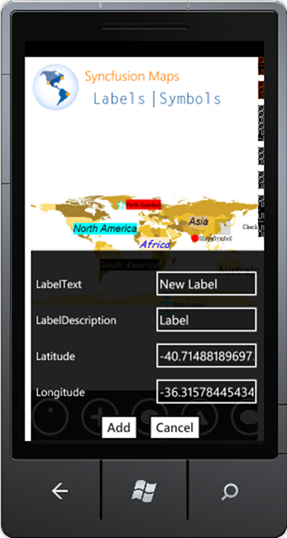
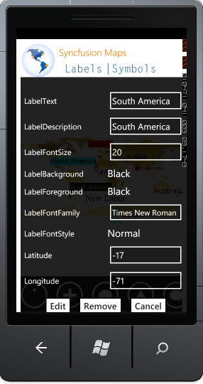

::: {style="DISPLAY: none"}
{#d2h_url_template}{#d2h_package_url style="WIDTH: 0px; DISPLAY: none; HEIGHT: 0px"}
:::

:::: {.d2h_secondary_topic style="PADDING-BOTTOM: 10pt; MARGIN: 0pt; PADDING-LEFT: 0pt; PADDING-RIGHT: 0pt; PADDING-TOP: 0pt"}
#### Run Time Options: {#run-time-options style="tab-stops: 0pt"}

 

Following run time options are available for Label support:

[·      ]{style="FONT-FAMILY: Symbol"}Add Label

[·      ]{style="FONT-FAMILY: Symbol"}Edit Label Text

[·      ]{style="FONT-FAMILY: Symbol"}Rearranging

[·      ]{style="FONT-FAMILY: Symbol"}Removing Label

 

Add Label

Set the *EnableLabel* property of **** *MapControl* to True, to enable adding label at run time.

Follow the below steps to add a label

1.   Double Tap at a desired point in the map.

2.   **Add Label** dialog will open.

 

{border="0"}\
Figure 20: Added Label

 

3.   Fill required information in the fields.

::: {style="BORDER-BOTTOM: windowtext 1pt solid; BORDER-LEFT: medium none; PADDING-BOTTOM: 1pt; MARGIN-TOP: 9pt; PADDING-LEFT: 0pt; PADDING-RIGHT: 0pt; MARGIN-BOTTOM: 9pt; BORDER-TOP: windowtext 1pt solid; BORDER-RIGHT: medium none; PADDING-TOP: 1pt"}
Note: LabelText, Latitude and Longitude are mandatory.
:::

 

4.   Click **Add**.

5.   Label will be added.

 

 

Edit Label Text

Follow the below steps to edit a label:

1.   Double Tap on the label.

2.   **Edit Label** dialog will open.

 

{border="0"}

Figure 21: Edit Label

 

3.   Fill required information in the fields.

4.   Click **Edit**.

5.   Changes will be accepted.

 

**Rearrange Label**

You can drag the label to rearrange them at a desired location.

 

**Remove Label**

Press double Tap on  the label, a popup will open.Click *Remove,* Label will be deleted.

 

[]{#related-topics}
::::
