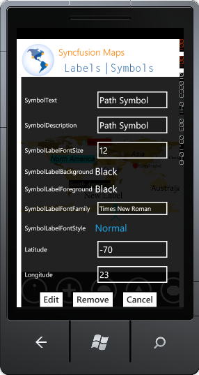

::: {style="DISPLAY: none"}
{#d2h_url_template}{#d2h_package_url style="WIDTH: 0px; DISPLAY: none; HEIGHT: 0px"}
:::

::: {.d2h_secondary_topic style="PADDING-BOTTOM: 10pt; MARGIN: 0pt; PADDING-LEFT: 0pt; PADDING-RIGHT: 0pt; PADDING-TOP: 0pt"}
#### Run Time Options: {#run-time-options style="tab-stops: 0pt"}

Following run time options are available for Maps control:

[·      ]{style="FONT-FAMILY: Symbol"}Add Symbol

[·      ]{style="FONT-FAMILY: Symbol"}Edit Symbol Text

[·      ]{style="FONT-FAMILY: Symbol"}Rearranging

[·      ]{style="FONT-FAMILY: Symbol"}Removing Symbol

 

Add Symbol

Symbol can be added through [[Symbol Palette]{.UGHyperlink}](ms-xhelp:///?Id=b19f910c-29e3-4e73-86a2-575122081468).  

 

**Edit Symbol** **Text**

Follow the below steps to edit a label:

1.   Double Tap on the Symbol.

2.   Edit Symbol dialog will open.

 

{border="0"}

Figure 23: Edit Symbol Dialog box

 

3.   Fill required information in the fields.

4.   Click **Edit**.

5.   Changes will be accepted.

 

 

Rearrange Symbol

 

You can drag the symbol to the desired location.

 

Remove Symbol

Double tap on the symbol, a popup will openl.Click *Remove,* Symbol will be deleted.

 

[]{#related-topics}
:::
