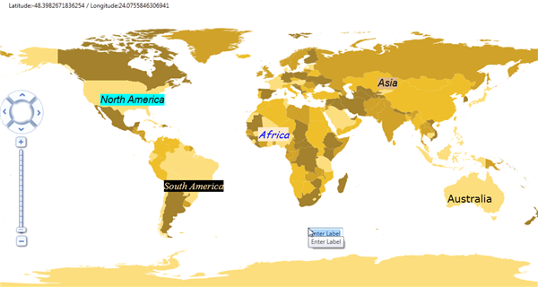
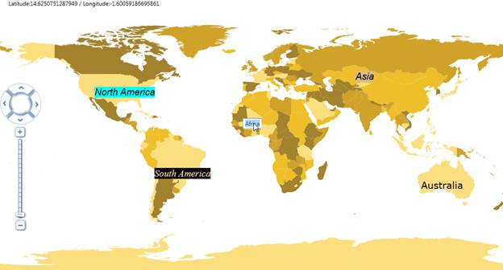

::: {style="DISPLAY: none"}
{#d2h_url_template}{#d2h_package_url style="WIDTH: 0px; DISPLAY: none; HEIGHT: 0px"}
:::

:::: {.d2h_secondary_topic style="PADDING-BOTTOM: 10pt; MARGIN: 0pt; PADDING-LEFT: 0pt; PADDING-RIGHT: 0pt; PADDING-TOP: 0pt"}
#### Run Time Options {#run-time-options style="tab-stops: 0pt"}

 

Following run time options are available for Label support:

 

[·      ]{style="FONT-FAMILY: Symbol"}Add Label

[·      ]{style="FONT-FAMILY: Symbol"}Edit Label Text

[·      ]{style="FONT-FAMILY: Symbol"}Rearranging

[·      ]{style="FONT-FAMILY: Symbol"}Removing Label

 

Add Label

To enable adding label at run time, set the *EnableLabel* property of **** *MapControl* to True. Press Shift + Click desired point in the map, label will be added.

 

{border="0"}

Figure 30: Add Label At Run time

 

Edit Label Text

To edit label text, press Shift + Click the label. A text box will be enabled, where you can edit the label. Press *Enter* to accept the changes. Press *Esc* to cancel the change.

{border="0"}

Figure 31: Edit Map Label At Run Time

 

 

Rearrange Label

You can drag the label to rearrange them at a desired location.

 

Remove Label

Press Ctrl+ Click the label. Label will be deleted.

[]{style="FONT-SIZE: 9pt"} 

::: {align="center"}
  ------------------------------------------------- ------------------------
  Key                                               Action
  Shift+Click the map.                              Label will be added.
  Shift + Click the label                           Label can be edited.
  [Ctrl+ Click the Label]{style="FONT-SIZE: 9pt"}   Label will be deleted.
  ------------------------------------------------- ------------------------
:::

 

 

[]{#related-topics}
::::
