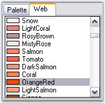

::: {style="DISPLAY: none"}
{#d2h_url_template}{#d2h_package_url style="WIDTH: 0px; DISPLAY: none; HEIGHT: 0px"}
:::

:::: {.d2h_secondary_topic style="PADDING-BOTTOM: 10pt; MARGIN: 0pt; PADDING-LEFT: 0pt; PADDING-RIGHT: 0pt; PADDING-TOP: 0pt"}
##### Runtime Settings {#runtime-settings style="tab-stops: 0pt"}

[]{style="COLOR: #15428b"} 

At run time a particular color group tab should be focussed or selected. Use **SelectedColorGroup** property of the ColorUI property for this purpose.

[]{style="COLOR: #15428b"} 

The options are as follows.

*[]{style="FONT-SIZE: 8pt"}* 

[·      ]{style="FONT-FAMILY: Symbol"}CustomColors

[·      ]{style="FONT-FAMILY: Symbol"}StandardColors

[·      ]{style="FONT-FAMILY: Symbol"}SystemColors

[·      ]{style="FONT-FAMILY: Symbol"}UserColors

[·      ]{style="FONT-FAMILY: Symbol"}None (Default)

[]{style="COLOR: #15428b"} 

Use **SelectedColor** property to specify the initially selected color.

*[]{style="FONT-SIZE: 8pt"}* 

+--------------------------------------------------------------------------------------------------------------------------------------------------------------------------------------------------------------------------+
| **[\[C#\]]{style="FONT-FAMILY: 'Courier New'; COLOR: black"}**                                                                                                                                                           |
|                                                                                                                                                                                                                          |
| []{style="COLOR: #15428b"}                                                                                                                                                                                               |
|                                                                                                                                                                                                                          |
| [this]{style="FONT-FAMILY: 'Courier New'; COLOR: blue"}[.colorUIControl1.SelectedColorGroup = Syncfusion.Windows.Forms.[ColorUISelectedGroup]{style="COLOR: black"}.StandardColors;]{style="FONT-FAMILY: 'Courier New'"} |
|                                                                                                                                                                                                                          |
| [this]{style="FONT-FAMILY: 'Courier New'; COLOR: blue"}[.colorUIControl1.SelectedColor = System.Drawing.[Color]{style="COLOR: black"}.OrangeRed;]{style="FONT-FAMILY: 'Courier New'"}                                    |
+--------------------------------------------------------------------------------------------------------------------------------------------------------------------------------------------------------------------------+

[]{style="COLOR: #15428b"} 

+------------------------------------------------------------------------------------------------------------------------------------------------------------------------------------------------------------------------+
| **[\[VB.NET\]]{style="FONT-FAMILY: 'Courier New'; COLOR: black"}**                                                                                                                                                     |
|                                                                                                                                                                                                                        |
| []{style="COLOR: #15428b"}                                                                                                                                                                                             |
|                                                                                                                                                                                                                        |
| [Me]{style="FONT-FAMILY: 'Courier New'; COLOR: blue"}[.colorUIControl1.SelectedColorGroup = Syncfusion.Windows.Forms.[ColorUISelectedGroup]{style="COLOR: black"}.StandardColors;]{style="FONT-FAMILY: 'Courier New'"} |
|                                                                                                                                                                                                                        |
| [Me]{style="FONT-FAMILY: 'Courier New'; COLOR: blue"}[.colorUIControl1.SelectedColor = System.Drawing.[Color]{style="COLOR: black"}.OrangeRed;]{style="FONT-FAMILY: 'Courier New'"}                                    |
+------------------------------------------------------------------------------------------------------------------------------------------------------------------------------------------------------------------------+

[]{style="COLOR: #15428b"} 

{border="0"}

[]{style="COLOR: #15428b"} 

Figure 298: SelectedColor = \"OrangeRed\"; SelectedColorGroup = \"StandardColors\"

[]{style="COLOR: #15428b"} 

::: {style="BORDER-BOTTOM: windowtext 1pt solid; BORDER-LEFT: medium none; PADDING-BOTTOM: 1pt; MARGIN-TOP: 9pt; PADDING-LEFT: 0pt; PADDING-RIGHT: 0pt; MARGIN-BOTTOM: 9pt; BORDER-TOP: windowtext 1pt solid; BORDER-RIGHT: medium none; PADDING-TOP: 1pt"}
{border="0"} Note: These property settings can be reset using ResetSelectedColorGroup() and ResetSelectedColor() methods.
:::

[]{style="COLOR: #15428b"} 

See Also

[]{style="COLOR: #15428b"} 

[Color Groups]{.UGHyperlink}[]{.UGHyperlink}

[]{#related-topics}
::::
