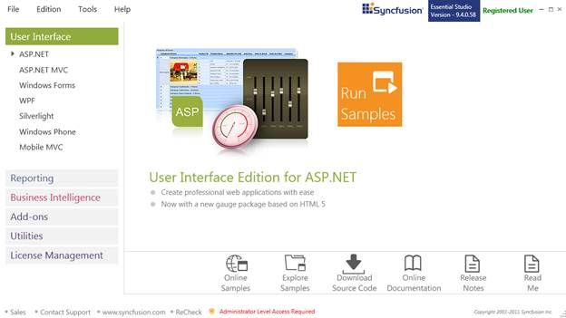
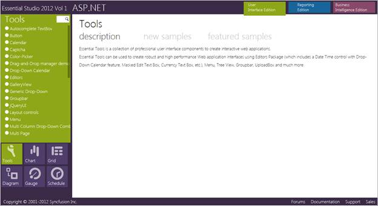
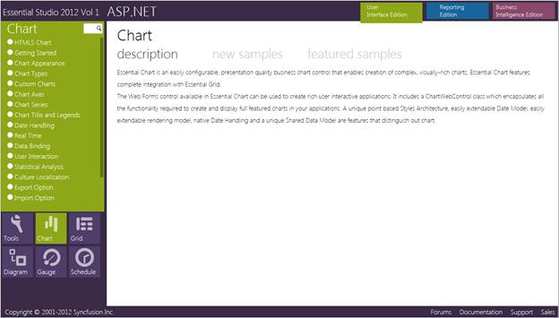

::: {style="DISPLAY: none"}
{#d2h_url_template}{#d2h_package_url style="WIDTH: 0px; DISPLAY: none; HEIGHT: 0px"}
:::

::::: {#nsbanner .d2h_main_nsbanner style="BORDER-BOTTOM: #999999 1px solid; POSITION: relative; PADDING-BOTTOM: 0px; BACKGROUND-COLOR: transparent; PADDING-LEFT: 0px; PADDING-RIGHT: 0px; DISPLAY: none; BORDER-TOP: #999999 1px solid; PADDING-TOP: 0px; LEFT: 0px"}
:::: {#TitleRow .d2h_main_titlerow style="PADDING-BOTTOM: 4px; BACKGROUND-COLOR: transparent; PADDING-LEFT: 22px; WIDTH: 100%; PADDING-RIGHT: 10px; DISPLAY: none; PADDING-TOP: 4px"}
::: {#ienav .d2h_main_ienav style="DISPLAY: none"}
{#D2HPrevious .D2HPreviousEnabled}  {#D2HNext .D2HNextEnabled}
:::
::::
:::::

::::: {#nstext .d2h_main_nstext style="PADDING-BOTTOM: 10px; BACKGROUND-COLOR: transparent; PADDING-LEFT: 22px; PADDING-RIGHT: 10px; HEIGHT: 100%; OVERFLOW: auto; PADDING-TOP: 5px" hasuserbackground="true" valign="bottom"}
::: {#d2h_breadcrumbs .d2h_breadcrumbs}
[Essential Studio User Guide Documentation](ms-xhelp:///?Id=12457748-09e3-4d74-a240-8e049cedf030){.d2h_breadcrumbsNormal}[ \> ]{.d2h_breadcrumbsLinkSeparator}[User Interface Edition](ms-xhelp:///?Id=c29296b7-531c-413b-a0ec-488ca1f7f669){.d2h_breadcrumbsNormal}[ \> ]{.d2h_breadcrumbsLinkSeparator}[Essential ASP.NET](ms-xhelp:///?Id=25c35330-c127-4dad-9a92-ed79dc7261a6){.d2h_breadcrumbsNormal}[ \> ]{.d2h_breadcrumbsLinkSeparator}[Essential Chart in HTML 5]{.d2h_breadcrumbsContentsOnly}[ \> ]{.d2h_breadcrumbsLinkSeparator}[Installation and Deployment](ms-xhelp:///?Id=695ababb-5473-474b-af2e-63a4a8d37003){.d2h_breadcrumbsNormal}
:::

## [Sample and Installation]{#_Ref316471101} {#sample-and-installation style="tab-stops: 0pt"}

This section covers the location of the installed samples and describes the procedure to run the samples through the sample browser and online. It also provides the location of the source code.

Samples Installation Location

The ChartAdv samples are installed in the following location, locally on the disk:

***\<Install Location\>\\Syncfusion\\EssentialStudio\\\<Version Number\>\\Web\\Chart.Web\\Samples\\3.5***

Viewing Samples

To view the samples, follow the steps below:

1\. Click **Start** \> **All Programs** \> **Syncfusion** \> **Essential Studio \<version number\>** \> **Dashboard**. The **Syncfusion Essential Studio Dashboard \<version number\>** window is displayed.

{border="0"}

Figure 1: Syncfusion Essential Studio Dashboard

[]{style="FONT-FAMILY: 'Trebuchet MS','sans-serif'; FONT-SIZE: 9pt"} 

2.   In the **Dashboard** window, click **Run Locally Installed Samples for ASP.NET** under the **User Interface Edition** panel. The **ASP.NET Sample Browser** window is displayed.

[]{style="FONT-FAMILY: 'Trebuchet MS','sans-serif'; FONT-SIZE: 9pt"} 

::: {style="BORDER-BOTTOM: windowtext 1pt solid; BORDER-LEFT: medium none; PADDING-BOTTOM: 1pt; MARGIN-TOP: 9pt; PADDING-LEFT: 0pt; PADDING-RIGHT: 0pt; MARGIN-BOTTOM: 9pt; BORDER-TOP: windowtext 1pt solid; BORDER-RIGHT: medium none; PADDING-TOP: 1pt"}
{border="0"}Note: You can view the samples in any of the following three ways:
:::

[]{style="FONT-FAMILY: 'Trebuchet MS','sans-serif'; FONT-SIZE: 9pt"} 

[·      ]{style="FONT-FAMILY: Symbol"}**Run Samples**---Click to view the locally installed samples.

[·      ]{style="FONT-FAMILY: Symbol"}**Online Samples---**Click to view online samples.

[·      ]{style="FONT-FAMILY: Symbol"}**Explore Samples**---Explore ASP.NET samples on local disk drive.

 

 

{border="0"}

Figure 2: ASP.NET Sample Browser

[]{style="FONT-FAMILY: 'Trebuchet MS','sans-serif'; FONT-SIZE: 9pt"} 

3.   Click **Essential Chart** under **Other Products**. The Essential Chart samples are displayed.

[]{style="FONT-FAMILY: 'Trebuchet MS','sans-serif'; FONT-SIZE: 9pt"} 

{border="0"}

Figure 3: Chart Samples Displayed in the ASP.NET Sample Browser

***[]{style="FONT-FAMILY: 'Trebuchet MS','sans-serif'; FONT-SIZE: 9pt"}*** 

***[]{style="FONT-FAMILY: 'Trebuchet MS','sans-serif'; FONT-SIZE: 9pt"}*** 

4.   Select any sample and browse through the features.

[]{style="FONT-FAMILY: 'Trebuchet MS','sans-serif'; FONT-SIZE: 9pt"} 

 

[]{style="FONT-FAMILY: 'Trebuchet MS','sans-serif'; FONT-SIZE: 9pt"} 

[]{#p7} 

Source Code Location

The default location of the Essential Chart for ASP.NET source code is:

**\[System Drive\]:\\Program Files\\Syncfusion\\Essential Studio\\\[Version Number\]\\Web\\Chart.Web\\Src**

[]{#related-topics}
:::::
