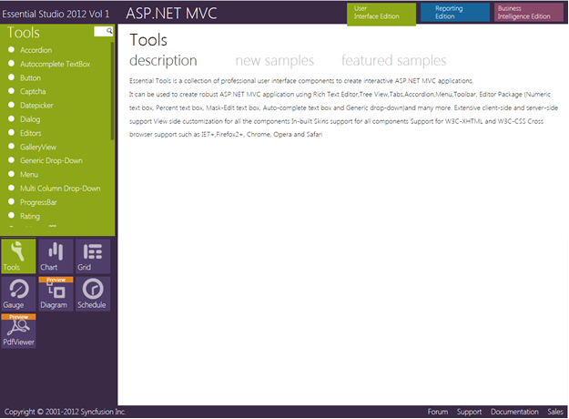
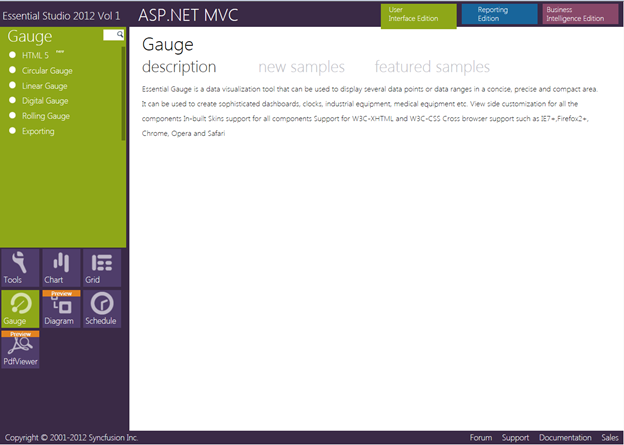

::: {style="DISPLAY: none"}
{#d2h_url_template}{#d2h_package_url style="WIDTH: 0px; DISPLAY: none; HEIGHT: 0px"}
:::

::::: {#nsbanner .d2h_main_nsbanner style="BORDER-BOTTOM: #999999 1px solid; POSITION: relative; PADDING-BOTTOM: 0px; BACKGROUND-COLOR: transparent; PADDING-LEFT: 0px; PADDING-RIGHT: 0px; DISPLAY: none; BORDER-TOP: #999999 1px solid; PADDING-TOP: 0px; LEFT: 0px"}
:::: {#TitleRow .d2h_main_titlerow style="PADDING-BOTTOM: 4px; BACKGROUND-COLOR: transparent; PADDING-LEFT: 22px; WIDTH: 100%; PADDING-RIGHT: 10px; DISPLAY: none; PADDING-TOP: 4px"}
::: {#ienav .d2h_main_ienav style="DISPLAY: none"}
{#D2HPrevious .D2HPreviousEnabled}  {#D2HNext .D2HNextEnabled}
:::
::::
:::::

:::: {#nstext .d2h_main_nstext style="PADDING-BOTTOM: 10px; BACKGROUND-COLOR: transparent; PADDING-LEFT: 22px; PADDING-RIGHT: 10px; HEIGHT: 100%; OVERFLOW: auto; PADDING-TOP: 5px" hasuserbackground="true" valign="bottom"}
::: {#d2h_breadcrumbs .d2h_breadcrumbs}
[Essential Studio User Guide Documentation](ms-xhelp:///?Id=12457748-09e3-4d74-a240-8e049cedf030){.d2h_breadcrumbsNormal}[ \> ]{.d2h_breadcrumbsLinkSeparator}[User Interface Edition](ms-xhelp:///?Id=c29296b7-531c-413b-a0ec-488ca1f7f669){.d2h_breadcrumbsNormal}[ \> ]{.d2h_breadcrumbsLinkSeparator}[Essential ASP.NET MVC](ms-xhelp:///?Id=4b14e7d1-65c4-4f67-b1aa-2c37709905a5){.d2h_breadcrumbsNormal}[ \> ]{.d2h_breadcrumbsLinkSeparator}[Essential Gauge]{.d2h_breadcrumbsContentsOnly}[ \> ]{.d2h_breadcrumbsLinkSeparator}[Installation and Deployment](ms-xhelp:///?Id=84d0d995-6b1f-4f32-a489-3269a7898e27){.d2h_breadcrumbsNormal}
:::

## Sample and Location {#sample-and-location style="tab-stops: 0pt"}

 

This section covers the location of the installed samples and describes the procedure to run the samples through the sample browser and online. It also provides the location of the source code.

 

Samples Installation Location

           

The Gauge MVC samples are installed in the following location, locally on the disk:

 

***C:\\Syncfusion\\EssentialStudio\\\<Version Number\>\\MVC\\Gaugemvc\\samples\\3.5***

 

Viewing Samples

[]{style="FONT-FAMILY: 'Calibri','sans-serif'; COLOR: black"} 

To view the samples:

[]{style="FONT-FAMILY: 'Calibri','sans-serif'; COLOR: black"} 

1.   Click **Start\--\>All Programs\--\>Syncfusion\--\>Essential Studio \<version number\> \--\>Dashboard**.

[]{style="FONT-FAMILY: 'Calibri','sans-serif'; COLOR: black"} 

Essential Studio Enterprise Edition window is displayed.

[]{style="FONT-FAMILY: 'Calibri','sans-serif'; COLOR: black"} 

{border="0"}

Figure 5: Syncfusion Essential Studio Dashboard

[]{style="FONT-FAMILY: 'Calibri','sans-serif'; COLOR: black"} 

User Interface Edition panel is displayed by default.

[]{style="FONT-FAMILY: 'Calibri','sans-serif'; COLOR: black"} 

2.   Click the drop-down button of the **ASP.NET MVC** platform. The following options are displayed.

[]{style="FONT-FAMILY: 'Calibri','sans-serif'; COLOR: black"} 

[·      ]{style="FONT-FAMILY: Symbol"}Run Locally Installed Samples - View the locally installed Gauge samples for ASP.NET MVC using the sample browser

[·      ]{style="FONT-FAMILY: Symbol"}Run Online Samples - View the online Gauge samples for ASP.NET MVC

[·      ]{style="FONT-FAMILY: Symbol"}Explore Samples - Locate the Gauge samples on the disk

[]{style="FONT-FAMILY: 'Calibri','sans-serif'; COLOR: black"} 

You can view the samples in the preceding three ways.

[]{style="FONT-FAMILY: 'Calibri','sans-serif'; COLOR: black"} 

3.   Click **Run Locally Installed Samples** link. Essential Studio - ASP.NET MVC Edition sample browser is displayed.

[]{style="FONT-FAMILY: 'Calibri','sans-serif'; COLOR: black"} 

{border="0"}

Figure 6: ASP.NET MVC Sample Browser

[]{style="FONT-FAMILY: 'Calibri','sans-serif'; COLOR: black"} 

4.   Click Essential Gauge under Other Products lists. A list of samples is displayed on the left hand side of the page.

[]{style="FONT-FAMILY: 'Calibri','sans-serif'; COLOR: black"} 

{border="0"}

Figure 7: Gauge Samples Displayed in the ASP.NET MVC Sample Browser

[]{style="FONT-FAMILY: 'Calibri','sans-serif'; COLOR: black"} 

5.   Select any sample and browse through the features.

[]{style="FONT-FAMILY: 'Calibri','sans-serif'; COLOR: black"} 

Source Code Location

[]{style="FONT-FAMILY: 'Calibri','sans-serif'; COLOR: black"} 

The default location of the Gauge MVC source code is:

 

***\[System Drive\]:\\Program Files\\Syncfusion\\Essential Studio\\\[Version Number\]\\MVC\\Gauge.MVC\\Src***

[]{#related-topics}
::::
