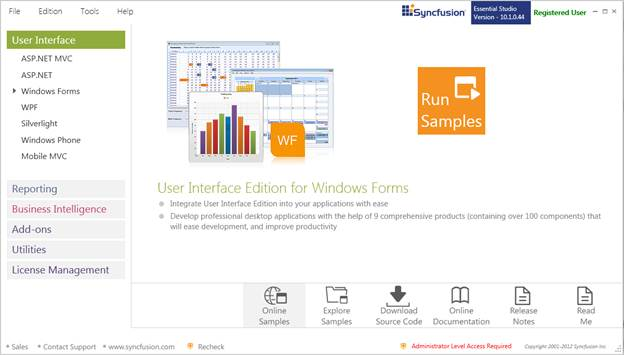
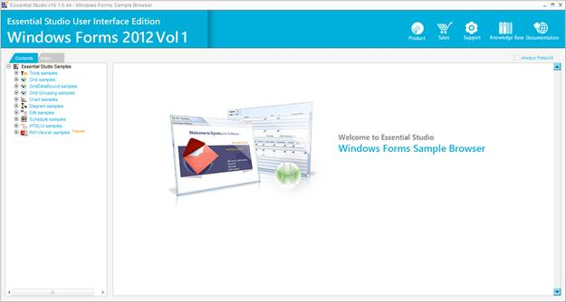
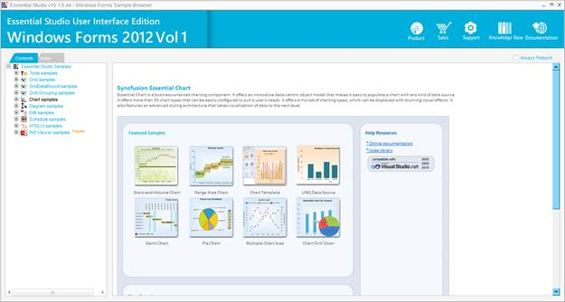

::: {style="DISPLAY: none"}
{#d2h_url_template}{#d2h_package_url style="WIDTH: 0px; DISPLAY: none; HEIGHT: 0px"}
:::

::::: {#nsbanner .d2h_main_nsbanner style="BORDER-BOTTOM: #999999 1px solid; POSITION: relative; PADDING-BOTTOM: 0px; BACKGROUND-COLOR: transparent; PADDING-LEFT: 0px; PADDING-RIGHT: 0px; DISPLAY: none; BORDER-TOP: #999999 1px solid; PADDING-TOP: 0px; LEFT: 0px"}
:::: {#TitleRow .d2h_main_titlerow style="PADDING-BOTTOM: 4px; BACKGROUND-COLOR: transparent; PADDING-LEFT: 22px; WIDTH: 100%; PADDING-RIGHT: 10px; DISPLAY: none; PADDING-TOP: 4px"}
::: {#ienav .d2h_main_ienav style="DISPLAY: none"}
{#D2HPrevious .D2HPreviousEnabled}  {#D2HNext .D2HNextEnabled}
:::
::::
:::::

::::: {#nstext .d2h_main_nstext style="PADDING-BOTTOM: 10px; BACKGROUND-COLOR: transparent; PADDING-LEFT: 22px; PADDING-RIGHT: 10px; HEIGHT: 100%; OVERFLOW: auto; PADDING-TOP: 5px" hasuserbackground="true" valign="bottom"}
::: {#d2h_breadcrumbs .d2h_breadcrumbs}
[Essential Studio User Guide Documentation](ms-xhelp:///?Id=12457748-09e3-4d74-a240-8e049cedf030){.d2h_breadcrumbsNormal}[ \> ]{.d2h_breadcrumbsLinkSeparator}[User Interface Edition](ms-xhelp:///?Id=c29296b7-531c-413b-a0ec-488ca1f7f669){.d2h_breadcrumbsNormal}[ \> ]{.d2h_breadcrumbsLinkSeparator}[Essential Windows](ms-xhelp:///?Id=e60759d8-47a4-4570-9d7a-16a68d63f2ea){.d2h_breadcrumbsNormal}[ \> ]{.d2h_breadcrumbsLinkSeparator}[Essential Chart]{.d2h_breadcrumbsContentsOnly}[ \> ]{.d2h_breadcrumbsLinkSeparator}[Installation and Deployment](ms-xhelp:///?Id=743096e2-f64b-4926-8ef2-12e015b606e2){.d2h_breadcrumbsNormal}
:::

## Sample and Location {#sample-and-location style="tab-stops: 0pt"}

 

This section covers the location of the installed samples and describes the procedure to run the samples through the sample browser. It also lists the location of source code.

 

Sample Installation Location

 

The Chart Windows Forms samples are installed in the following location:

 

[\...\\My Documents\\Syncfusion\\EssentialStudio\\Version Number\\Windows\\Chart.Windows\\Samples\\2.0]{.UGHyperlink}

 

Viewing Samples

 

To view the samples, follow the steps below:

 

1.   Click Start\--\>All Programs\--\>Syncfusion\--\>Essential Studio \<version number\> \--\>Dashboard.

 

{border="0"} 

Figure 2: Syncfusion Essential Studio Dashboard

**** 

2.   Select In the Dashboard window, click **Run Samples** for Windows Forms under UI Edition. The UI Windows Forms Sample Browser window is displayed.

[]{style="COLOR: black"} 

::: {style="BORDER-BOTTOM: windowtext 1pt solid; BORDER-LEFT: medium none; PADDING-BOTTOM: 1pt; MARGIN-TOP: 9pt; PADDING-LEFT: 0pt; PADDING-RIGHT: 0pt; MARGIN-BOTTOM: 9pt; BORDER-TOP: windowtext 1pt solid; BORDER-RIGHT: medium none; PADDING-TOP: 1pt"}
{border="0"}Note: You can view the samples in any of the following three ways:
:::

[]{style="COLOR: black"} 

[·      ]{style="FONT-FAMILY: Symbol"}**Run Samples**-Click to view the locally installed samples

[·      ]{style="FONT-FAMILY: Symbol"}**Online Samples**-Click to view online samples

[·      ]{style="FONT-FAMILY: Symbol"}**Explore Samples**-Explore BI Web samples on disk

 

{border="0"}

Figure 3: User Interface Edition Windows Forms Sample Browser

 

3.   Under **Contents** tab, expand the **Chart samples** to view the samples of Chart control.

 

 

{border="0"}

Figure 4: Chart Samples for Windows

 

4.   A list of samples will be displayed on the left pane. Select any sample and browse through the features.

 

5.   In the right pane, click **Run Sample** icon to run the selected sample.

 

Source Code Location

 

The default location of the Chart Windows source code is

**** 

[\[Install Drive\]:\\Program Files\\Syncfusion\\Essential Studio\\\[Version Number\]\\Windows\\Chart.Windows\\Src]{.UGHyperlink}

 

[]{#p7} 

 

[]{#related-topics}
:::::
