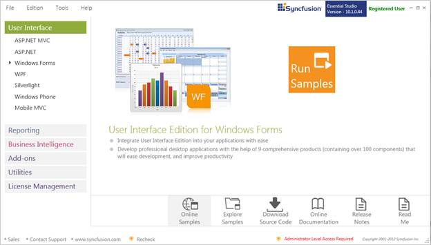
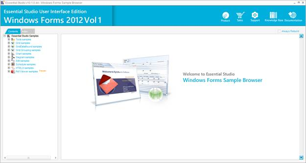
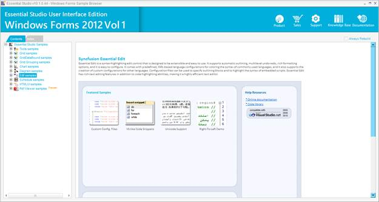

::: {style="DISPLAY: none"}
{#d2h_url_template}{#d2h_package_url style="WIDTH: 0px; DISPLAY: none; HEIGHT: 0px"}
:::

::::: {#nsbanner .d2h_main_nsbanner style="BORDER-BOTTOM: #999999 1px solid; POSITION: relative; PADDING-BOTTOM: 0px; BACKGROUND-COLOR: transparent; PADDING-LEFT: 0px; PADDING-RIGHT: 0px; DISPLAY: none; BORDER-TOP: #999999 1px solid; PADDING-TOP: 0px; LEFT: 0px"}
:::: {#TitleRow .d2h_main_titlerow style="PADDING-BOTTOM: 4px; BACKGROUND-COLOR: transparent; PADDING-LEFT: 22px; WIDTH: 100%; PADDING-RIGHT: 10px; DISPLAY: none; PADDING-TOP: 4px"}
::: {#ienav .d2h_main_ienav style="DISPLAY: none"}
{#D2HPrevious .D2HPreviousEnabled}  {#D2HNext .D2HNextEnabled}
:::
::::
:::::

::::: {#nstext .d2h_main_nstext style="PADDING-BOTTOM: 10px; BACKGROUND-COLOR: transparent; PADDING-LEFT: 22px; PADDING-RIGHT: 10px; HEIGHT: 100%; OVERFLOW: auto; PADDING-TOP: 5px" hasuserbackground="true" valign="bottom"}
::: {#d2h_breadcrumbs .d2h_breadcrumbs}
[Essential Studio User Guide Documentation](ms-xhelp:///?Id=12457748-09e3-4d74-a240-8e049cedf030){.d2h_breadcrumbsNormal}[ \> ]{.d2h_breadcrumbsLinkSeparator}[User Interface Edition](ms-xhelp:///?Id=c29296b7-531c-413b-a0ec-488ca1f7f669){.d2h_breadcrumbsNormal}[ \> ]{.d2h_breadcrumbsLinkSeparator}[Essential Windows](ms-xhelp:///?Id=e60759d8-47a4-4570-9d7a-16a68d63f2ea){.d2h_breadcrumbsNormal}[ \> ]{.d2h_breadcrumbsLinkSeparator}[Essential Edit]{.d2h_breadcrumbsContentsOnly}[ \> ]{.d2h_breadcrumbsLinkSeparator}[Installation and Deployment](ms-xhelp:///?Id=1137d10d-c39c-4c14-b69f-abcf0d306119){.d2h_breadcrumbsNormal}
:::

## Sample and Location {#sample-and-location style="tab-stops: 0pt"}

 

[This section covers the location of the installed samples and describes the procedure to run the samples through the sample browser. It also lists the location of source code.]{style="FONT-SIZE: 9pt"}

[]{style="FONT-SIZE: 9pt"} 

Sample Installation Location

 

[The Essential Edit Windows Forms samples are installed in the following location.]{style="FONT-SIZE: 9pt"}

***[]{style="FONT-FAMILY: 'Trebuchet MS','sans-serif'; COLOR: #15428b; FONT-SIZE: 9pt"}*** 

***\...\\My Documents\\Syncfusion\\EssentialStudio\\Version Number\\Windows\\Edit.Windows\\Samples\\2.0***

***[]{style="FONT-FAMILY: 'Trebuchet MS','sans-serif'; COLOR: #15428b; FONT-SIZE: 9pt"}*** 

Viewing Samples

 

To view the samples, follow the steps below:

 

1.   Click **Start\--\>All Programs\--\>Syncfusion\--\>Essential Studio \<version number\> \--\>Dashboard.**

 

{border="0"}

Figure 2: Syncfusion Essential Studio Dashboard

[]{style="FONT-FAMILY: 'Trebuchet MS','sans-serif'; COLOR: #15428b; FONT-SIZE: 9pt"} 

2.   In the Dashboard window, click **Run Samples** for Windows Forms under UI Edition. The UI Windows Form Sample Browser window is displayed.

[]{style="COLOR: black"} 

::: {style="BORDER-BOTTOM: windowtext 1pt solid; BORDER-LEFT: medium none; PADDING-BOTTOM: 1pt; MARGIN-TOP: 9pt; PADDING-LEFT: 0pt; PADDING-RIGHT: 0pt; MARGIN-BOTTOM: 9pt; BORDER-TOP: windowtext 1pt solid; BORDER-RIGHT: medium none; PADDING-TOP: 1pt"}
{border="0"}Note: You can view the samples in any of the following three ways:
:::

[]{style="COLOR: black"} 

[·      ]{style="FONT-FAMILY: Symbol"}**Run Samples**-Click to view the locally installed samples

[·      ]{style="FONT-FAMILY: Symbol"}**Online Samples**-Click to view online samples

[·      ]{style="FONT-FAMILY: Symbol"}**Explore Samples**-Explore BI Web samples on disk

 

 

{border="0"}

Figure 3: User Interface Edition Windows Forms Sample Browser

 

3.   Under **Contents** tab, expand **Edit samples** to view the samples of Edit control.

 

{border="0"}

Figure 4: Essential Edit Samples for Windows

[]{style="FONT-FAMILY: 'Trebuchet MS','sans-serif'; COLOR: #15428b; FONT-SIZE: 9pt"} 

4.   A list of samples will be displayed on the left pane. Select any sample and browse through the features.

5.   In the right pane, click **Run Sample** icon to run the selected sample.

[]{style="FONT-FAMILY: 'Trebuchet MS','sans-serif'; COLOR: #15428b; FONT-SIZE: 9pt"} 

Source Code Location

 

The source code for Edit Windows is available under the following default location:

 

***\[System Drive\]:\\Program Files\\Syncfusion\\Essential Studio\\\[Version Number\]\\Windows\\Edit.Windows\\Src***

[]{#p7} 

[]{#related-topics}
:::::
