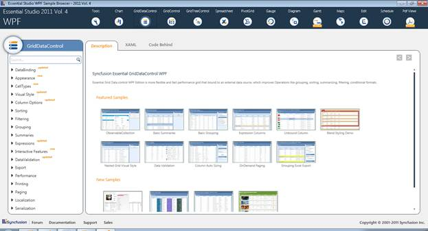
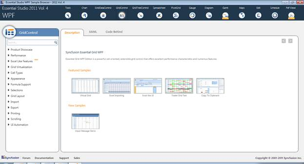
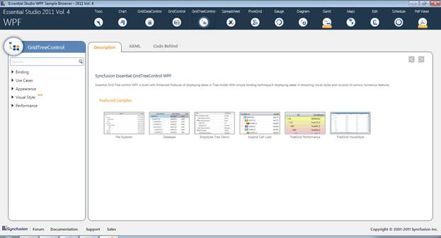

::: {style="DISPLAY: none"}
{#d2h_url_template}{#d2h_package_url style="WIDTH: 0px; DISPLAY: none; HEIGHT: 0px"}
:::

::::: {#nsbanner .d2h_main_nsbanner style="BORDER-BOTTOM: #999999 1px solid; POSITION: relative; PADDING-BOTTOM: 0px; BACKGROUND-COLOR: transparent; PADDING-LEFT: 0px; PADDING-RIGHT: 0px; DISPLAY: none; BORDER-TOP: #999999 1px solid; PADDING-TOP: 0px; LEFT: 0px"}
:::: {#TitleRow .d2h_main_titlerow style="PADDING-BOTTOM: 4px; BACKGROUND-COLOR: transparent; PADDING-LEFT: 22px; WIDTH: 100%; PADDING-RIGHT: 10px; DISPLAY: none; PADDING-TOP: 4px"}
::: {#ienav .d2h_main_ienav style="DISPLAY: none"}
{#D2HPrevious .D2HPreviousEnabled}  {#D2HNext .D2HNextEnabled}
:::
::::
:::::

:::: {#nstext .d2h_main_nstext style="PADDING-BOTTOM: 10px; BACKGROUND-COLOR: transparent; PADDING-LEFT: 22px; PADDING-RIGHT: 10px; HEIGHT: 100%; OVERFLOW: auto; PADDING-TOP: 5px" hasuserbackground="true" valign="bottom"}
::: {#d2h_breadcrumbs .d2h_breadcrumbs}
[Essential Studio User Guide Documentation](ms-xhelp:///?Id=12457748-09e3-4d74-a240-8e049cedf030){.d2h_breadcrumbsNormal}[ \> ]{.d2h_breadcrumbsLinkSeparator}[User Interface Edition](ms-xhelp:///?Id=c29296b7-531c-413b-a0ec-488ca1f7f669){.d2h_breadcrumbsNormal}[ \> ]{.d2h_breadcrumbsLinkSeparator}[Essential WPF](ms-xhelp:///?Id=7f4f82c5-151c-4262-94d0-75c4626c77bc){.d2h_breadcrumbsNormal}[ \> ]{.d2h_breadcrumbsLinkSeparator}[Essential Grid]{.d2h_breadcrumbsContentsOnly}[ \> ]{.d2h_breadcrumbsLinkSeparator}[Installation and Deployment](ms-xhelp:///?Id=094c35c7-db8e-4341-9619-16644b2a4e34){.d2h_breadcrumbsNormal}
:::

## Sample and Location {#sample-and-location style="tab-stops: 0pt"}

This section covers the location of the installed samples and describes the procedure to run the samples through the sample browser and online. It also lists the location of utilities, assemblies and source code.

 

Sample Installation Location

The Essential Grid for WPF samples are installed in the following location, locally on the disk:

 

***\...\\My Documents\\Syncfusion\\EssentialStudio\\\<Version Number\>\\WPF\\Grid.WPF\\Samples\\3.5***

 

Viewing Samples

Following are the steps to view the samples:

 

1.   Click Start\--\>All Programs\--\>Syncfusion\--\>Essential Studio \< v9.4.0.62\> \--\>Dashboard. Syncfusion Essential Studio Dashboard \<v9.4.0.62\> window is displayed.

{border="0"}

 

2.   In the Dashboard window, click Run Samples for WPF under User Interface Edition panel. The WPF Sample Browser window is displayed.

3.   Tools samples are displayed by default.

 

{border="0"}

 

4.   Click the GridDataControl to view GridDataControl samples.

 

{border="0"}

 

 

5.   Click the GridControl to view GridControl samples.

 

{border="0"}

 

6.   Click the GridTreeControl to view GridTreeControl samples.

 

{border="0"}

 

7.   Select any sample and browse through the features.

 

Source Code Location

 

The default location of the Essential Grid for WPF source code is:

 ***\[System Drive\]:\\Program Files\\Syncfusion\\Essential Studio\\\<Version Number\>\\WPF\\Grid.WPF\\Src***

[]{#related-topics}
::::
