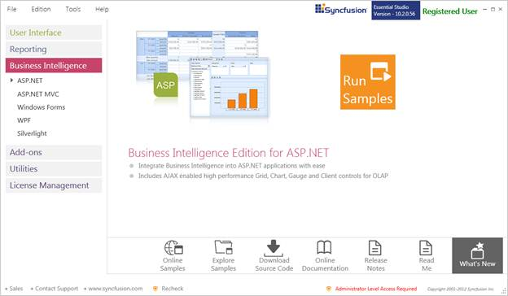

::: {style="DISPLAY: none"}
{#d2h_url_template}{#d2h_package_url style="WIDTH: 0px; DISPLAY: none; HEIGHT: 0px"}
:::

::::: {#nsbanner .d2h_main_nsbanner style="BORDER-BOTTOM: #999999 1px solid; POSITION: relative; PADDING-BOTTOM: 0px; BACKGROUND-COLOR: transparent; PADDING-LEFT: 0px; PADDING-RIGHT: 0px; DISPLAY: none; BORDER-TOP: #999999 1px solid; PADDING-TOP: 0px; LEFT: 0px"}
:::: {#TitleRow .d2h_main_titlerow style="PADDING-BOTTOM: 4px; BACKGROUND-COLOR: transparent; PADDING-LEFT: 22px; WIDTH: 100%; PADDING-RIGHT: 10px; DISPLAY: none; PADDING-TOP: 4px"}
::: {#ienav .d2h_main_ienav style="DISPLAY: none"}
{#D2HPrevious .D2HPreviousEnabled}  {#D2HNext .D2HNextEnabled}
:::
::::
:::::

::::: {#nstext .d2h_main_nstext style="PADDING-BOTTOM: 10px; BACKGROUND-COLOR: transparent; PADDING-LEFT: 22px; PADDING-RIGHT: 10px; HEIGHT: 100%; OVERFLOW: auto; PADDING-TOP: 5px" hasuserbackground="true" valign="bottom"}
::: {#d2h_breadcrumbs .d2h_breadcrumbs}
[Essential Studio User Guide Documentation](ms-xhelp:///?Id=12457748-09e3-4d74-a240-8e049cedf030){.d2h_breadcrumbsNormal}[ \> ]{.d2h_breadcrumbsLinkSeparator}[Business Intelligence Edition](ms-xhelp:///?Id=fdf33dd8-62b2-47b9-ad7b-fc50e590bca5){.d2h_breadcrumbsNormal}[ \> ]{.d2h_breadcrumbsLinkSeparator}[Essential BI ASP.NET](ms-xhelp:///?Id=99c6694e-59c3-4c59-abb5-ce9ce9a948bc){.d2h_breadcrumbsNormal}[ \> ]{.d2h_breadcrumbsLinkSeparator}[Essential BI Chart]{.d2h_breadcrumbsContentsOnly}[ \> ]{.d2h_breadcrumbsLinkSeparator}[Installation and Deployment](ms-xhelp:///?Id=78ef7522-5b71-46fb-998a-6bdab307bf83){.d2h_breadcrumbsNormal}
:::

## Sample and Location {#sample-and-location style="tab-stops: 0pt"}

[]{style="FONT-FAMILY: 'Times New Roman','serif'; COLOR: black"} 

[]{#p6}This section covers the location of the installed samples and describes the procedure to run the samples through the sample browser and online. It also provides the location of the source code.

 

[]{#_Samples_Installation_Location}Samples Installation Location

[]{style="FONT-FAMILY: 'Times New Roman','serif'; COLOR: black"} 

The OLAP Chart samples are installed locally on the disk in the following location:

[]{style="FONT-FAMILY: 'Times New Roman','serif'; COLOR: black"} 

Windows XP:

C:\\Syncfusion\\Essential Studio\<version number\>\\BI\\Web\\OlapChart.Web\\Samples\\

 

Windows 7/Vista:

C:\\Users\\\<User Name\>\\AppData\\Local\\Syncfusion\\EssentialStudio\\\<version number\>\\BI\\Web\\OlapChart.Web\\Samples

[]{#_Viewing_Samples} 

Viewing Samples

[]{style="FONT-FAMILY: 'Times New Roman','serif'; COLOR: black"} 

To view the samples:

[]{style="COLOR: black"} 

1.   Click **Start[à]{style="FONT-FAMILY: Wingdings"}All Programs[à]{style="FONT-FAMILY: Wingdings"}Syncfusion[à]{style="FONT-FAMILY: Wingdings"}Essential Studio \<version number\>** **[à]{style="FONT-FAMILY: Wingdings"}Dashboard**. 

 

 

 

{border="0"}

Figure 2: Syncfusion Essential Studio Dashboard BI

[]{style="COLOR: black"} 

2.   In the Dashboard window, click **Run Samples** for ASP.NET under BI Edition. The BI Web Sample Browser window is displayed.

[]{style="COLOR: black"} 

::: {style="BORDER-BOTTOM: windowtext 1pt solid; BORDER-LEFT: medium none; PADDING-BOTTOM: 1pt; MARGIN-TOP: 9pt; PADDING-LEFT: 0pt; PADDING-RIGHT: 0pt; MARGIN-BOTTOM: 9pt; BORDER-TOP: windowtext 1pt solid; BORDER-RIGHT: medium none; PADDING-TOP: 1pt"}
{border="0"}Note: You can view the samples in any of the following three ways:
:::

[]{style="COLOR: black"} 

[·      ]{style="FONT-FAMILY: Symbol"}**Run Samples** -- Click to view the locally installed samples

[·      ]{style="FONT-FAMILY: Symbol"}**Online Samples** -- Click to view online samples

[·      ]{style="FONT-FAMILY: Symbol"}**Explore Samples** -- Explore BI Web samples on disk

 

 

 

 

{border="0"}

Figure 3: OLAP Chart ASP.NET Samples

 

[]{style="COLOR: black"} 

3.   Select any sample and browse the features.

[]{style="COLOR: black"} 

[]{#_Source_Code_Location}Source Code Location

[]{style="COLOR: black"} 

The default location of the OLAP Chart source code is:

*\[System Drive\]:\\Program Files\\Syncfusion\\Essential Studio\\\[Version Number\]\\BI\\OlapChart.Web\\Src*

***[]{style="FONT-FAMILY: 'Times New Roman','serif'; COLOR: black"}*** 

[]{#related-topics}
:::::
