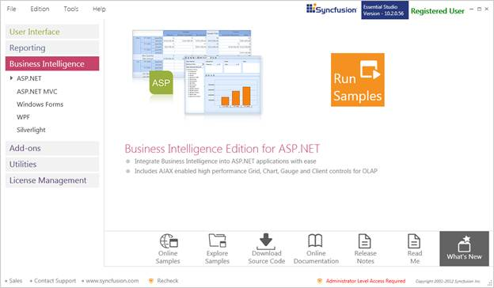
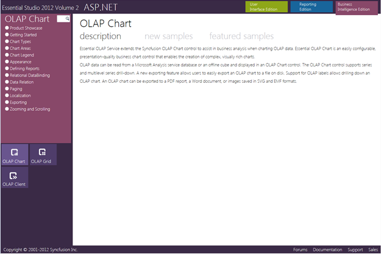
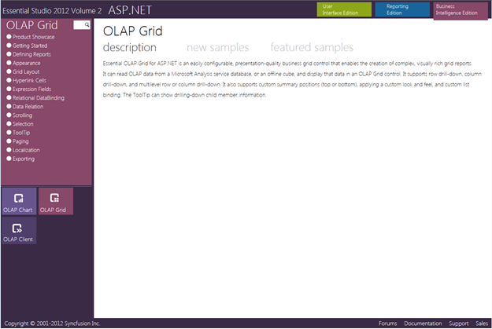

::: {style="DISPLAY: none"}
{#d2h_url_template}{#d2h_package_url style="WIDTH: 0px; DISPLAY: none; HEIGHT: 0px"}
:::

::::: {#nsbanner .d2h_main_nsbanner style="BORDER-BOTTOM: #999999 1px solid; POSITION: relative; PADDING-BOTTOM: 0px; BACKGROUND-COLOR: transparent; PADDING-LEFT: 0px; PADDING-RIGHT: 0px; DISPLAY: none; BORDER-TOP: #999999 1px solid; PADDING-TOP: 0px; LEFT: 0px"}
:::: {#TitleRow .d2h_main_titlerow style="PADDING-BOTTOM: 4px; BACKGROUND-COLOR: transparent; PADDING-LEFT: 22px; WIDTH: 100%; PADDING-RIGHT: 10px; DISPLAY: none; PADDING-TOP: 4px"}
::: {#ienav .d2h_main_ienav style="DISPLAY: none"}
{#D2HPrevious .D2HPreviousEnabled}  {#D2HNext .D2HNextEnabled}
:::
::::
:::::

::::: {#nstext .d2h_main_nstext style="PADDING-BOTTOM: 10px; BACKGROUND-COLOR: transparent; PADDING-LEFT: 22px; PADDING-RIGHT: 10px; HEIGHT: 100%; OVERFLOW: auto; PADDING-TOP: 5px" hasuserbackground="true" valign="bottom"}
::: {#d2h_breadcrumbs .d2h_breadcrumbs}
[Essential Studio User Guide Documentation](ms-xhelp:///?Id=12457748-09e3-4d74-a240-8e049cedf030){.d2h_breadcrumbsNormal}[ \> ]{.d2h_breadcrumbsLinkSeparator}[Business Intelligence Edition](ms-xhelp:///?Id=fdf33dd8-62b2-47b9-ad7b-fc50e590bca5){.d2h_breadcrumbsNormal}[ \> ]{.d2h_breadcrumbsLinkSeparator}[Essential BI ASP.NET](ms-xhelp:///?Id=99c6694e-59c3-4c59-abb5-ce9ce9a948bc){.d2h_breadcrumbsNormal}[ \> ]{.d2h_breadcrumbsLinkSeparator}[Essential BI Grid]{.d2h_breadcrumbsContentsOnly}[ \> ]{.d2h_breadcrumbsLinkSeparator}[Installation and Deployment](ms-xhelp:///?Id=6b9f68b4-b33c-49cd-926a-e99959f8bc3e){.d2h_breadcrumbsNormal}
:::

## Sample and Location {#sample-and-location style="tab-stops: 0pt"}

[]{#p6}This section covers the location of the installed samples and describes the procedure to run the samples through the sample browser and online. It also provides the location of the source code.

[]{#_Samples_Installation_Location} 

Samples Installation Location

The Essential BI Grid samples are installed in the following location on the local disk drive:

Windows XP:

C:\\Syncfusion\\Essential Studio\<version number\>\\BI\\Web\\OlapGrid.Web\\Samples\\

Windows 7/Vista:

C:\\Users\\\<User Name\>\\AppData\\Local\\Syncfusion\\EssentialStudio\\Essential Studio\<version number\>\\BI\\Web\\OlapGrid.Web\\Samples

 

Viewing Samples

The steps to view samples are as follows:

1.   Click **Start** \> **All Programs** \> **Syncfusion** \> **Essential Studio \<version number\>** \> **Dashboard**.

 

{border="0"}

Figure 2: Syncfusion Essential Studio BI Edition Dashboard

 

2.   On the Dashboard window, click **Run Samples** for **ASP.NET** under **BI Edition**. The **BI** **Web Sample Browser** window will be displayed.

[]{style="COLOR: black"} 

::: {style="BORDER-BOTTOM: windowtext 1pt solid; BORDER-LEFT: medium none; PADDING-BOTTOM: 1pt; MARGIN-TOP: 9pt; PADDING-LEFT: 0pt; PADDING-RIGHT: 0pt; MARGIN-BOTTOM: 9pt; BORDER-TOP: windowtext 1pt solid; BORDER-RIGHT: medium none; PADDING-TOP: 1pt"}
{border="0"}Note: You can view the samples in any of the following three ways:
:::

[·      ]{style="FONT-FAMILY: Symbol"}**Run Samples**---Click to view the locally installed samples.

[·      ]{style="FONT-FAMILY: Symbol"}**Online Samples**---Click to view online samples.

[·      ]{style="FONT-FAMILY: Symbol"}**Explore Samples**---Explore BI Web samples on the disk.

 

{border="0"}

Figure 3: OLAP Chart ASP.NET Sample Browser

[]{style="COLOR: black"} 

3.   Click **OLAP Grid** under **Other Products**. The OLAP grid samples will be displayed.

 

{border="0"}

Figure 4: OLAP Grid Sample Browser

[4.   ]{style="COLOR: black"}Select any sample and browse through the features.[]{style="COLOR: black"}

 

Source Code Location

The default location of the OLAP grid source code is the following:

***[\[System Drive\]:\\Program Files\\Syncfusion\\Essential Studio\\\[Version Number\]\\BI\\OlapGrid.Web\\Src]{style="COLOR: black"}***

***[]{style="COLOR: black"}*** 

[]{#related-topics}
:::::
