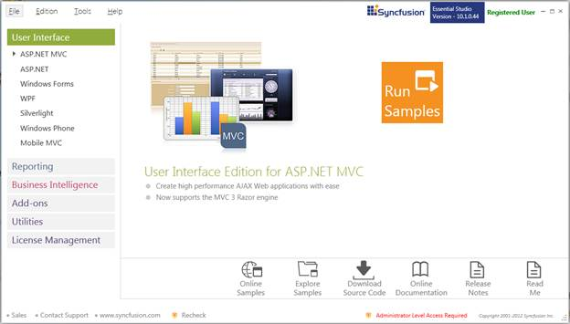
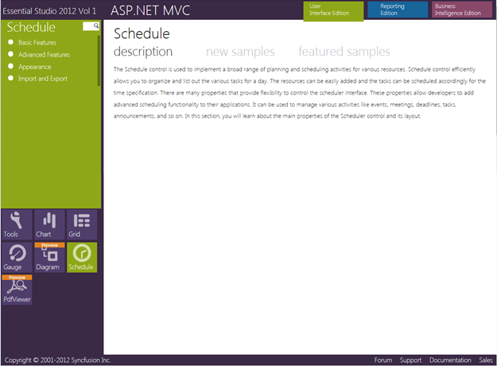

::: {style="DISPLAY: none"}
{#d2h_url_template}{#d2h_package_url style="WIDTH: 0px; DISPLAY: none; HEIGHT: 0px"}
:::

::::: {#nsbanner .d2h_main_nsbanner style="BORDER-BOTTOM: #999999 1px solid; POSITION: relative; PADDING-BOTTOM: 0px; BACKGROUND-COLOR: transparent; PADDING-LEFT: 0px; PADDING-RIGHT: 0px; DISPLAY: none; BORDER-TOP: #999999 1px solid; PADDING-TOP: 0px; LEFT: 0px"}
:::: {#TitleRow .d2h_main_titlerow style="PADDING-BOTTOM: 4px; BACKGROUND-COLOR: transparent; PADDING-LEFT: 22px; WIDTH: 100%; PADDING-RIGHT: 10px; DISPLAY: none; PADDING-TOP: 4px"}
::: {#ienav .d2h_main_ienav style="DISPLAY: none"}
{#D2HPrevious .D2HPreviousEnabled}  {#D2HNext .D2HNextEnabled}
:::
::::
:::::

::::: {#nstext .d2h_main_nstext style="PADDING-BOTTOM: 10px; BACKGROUND-COLOR: transparent; PADDING-LEFT: 22px; PADDING-RIGHT: 10px; HEIGHT: 100%; OVERFLOW: auto; PADDING-TOP: 5px" hasuserbackground="true" valign="bottom"}
::: {#d2h_breadcrumbs .d2h_breadcrumbs}
[Essential Studio User Guide Documentation](ms-xhelp:///?Id=12457748-09e3-4d74-a240-8e049cedf030){.d2h_breadcrumbsNormal}[ \> ]{.d2h_breadcrumbsLinkSeparator}[User Interface Edition](ms-xhelp:///?Id=c29296b7-531c-413b-a0ec-488ca1f7f669){.d2h_breadcrumbsNormal}[ \> ]{.d2h_breadcrumbsLinkSeparator}[Essential ASP.NET MVC](ms-xhelp:///?Id=4b14e7d1-65c4-4f67-b1aa-2c37709905a5){.d2h_breadcrumbsNormal}[ \> ]{.d2h_breadcrumbsLinkSeparator}[Essential Schedule]{.d2h_breadcrumbsContentsOnly}[ \> ]{.d2h_breadcrumbsLinkSeparator}[Installation and Deployment](ms-xhelp:///?Id=0c3eb03f-4f85-4b12-b7ae-a7197ac82692){.d2h_breadcrumbsNormal}
:::

## Sample and Location {#sample-and-location style="tab-stops: 0pt"}

 

This section covers the location of the installed samples and describes the procedure to run the samples through the sample browser and online. It also provides the location of the source code.

[]{style="FONT-FAMILY: 'Calibri','sans-serif'; COLOR: black"} 

Samples Installation Location

[                ]{style="FONT-FAMILY: 'Calibri','sans-serif'; COLOR: black"}

The Schedule MVC samples are installed in the following location, locally on the disk:

[]{style="FONT-FAMILY: 'Calibri','sans-serif'; COLOR: black"} 

\<Install Location\>\\Syncfusion\\EssentialStudio\\\<Version Number\>\\MVC\\Schedulemvc\\samples\\3.5

[]{style="FONT-FAMILY: 'Calibri','sans-serif'; COLOR: black"} 

Viewing Samples

[]{style="FONT-FAMILY: 'Calibri','sans-serif'; COLOR: black"} 

To view the samples, follow the steps given below:

[]{style="FONT-FAMILY: 'Calibri','sans-serif'; COLOR: black"} 

1.   Click Start\--\>All Programs\--\>Syncfusion\--\>Essential Studio \<version number\> \--\>Dashboard. **Syncfusion Essential Studio Dashboard \<version number\>** window is displayed.

[]{style="FONT-FAMILY: 'Calibri','sans-serif'; COLOR: black"} 

{border="0"}

Figure 2: Syncfusion Essential Studio Dashboard

[]{style="FONT-FAMILY: 'Calibri','sans-serif'; COLOR: black"} 

2.   In the Dashboard window, click Run Locally Installed Samples for ASP.NET MVC under **User** Interface Edition panel. The **ASP.NET MVC Sample Browser** window is displayed.

::: {style="BORDER-BOTTOM: windowtext 1pt solid; BORDER-LEFT: medium none; PADDING-BOTTOM: 1pt; MARGIN: 9pt 0pt 9pt 27pt; PADDING-LEFT: 0pt; PADDING-RIGHT: 0pt; BORDER-TOP: windowtext 1pt solid; BORDER-RIGHT: medium none; PADDING-TOP: 1pt"}
{border="0"}Note:[ You can view the samples in any of the following three ways:]{style="FONT-FAMILY: 'Calibri','sans-serif'; COLOR: black"}
:::

[·      ]{style="FONT-FAMILY: Symbol"}**Run Locally Installed Samples**-Click to view the locally installed samples

[·      ]{style="FONT-FAMILY: Symbol"}**Run Online Samples**-Click to view online samples

[·      ]{style="FONT-FAMILY: Symbol"}**Explore Samples**-Explore ASP.NET MVC samples on disk

[]{style="FONT-FAMILY: 'Calibri','sans-serif'; COLOR: black"} 

{border="0"}

Figure 3: ASP.NET MVC Sample Browser[]{style="FONT-FAMILY: 'Calibri','sans-serif'; COLOR: black"}

[]{style="FONT-FAMILY: 'Calibri','sans-serif'; COLOR: black"} 

[3.   ]{style="COLOR: black"}[Click **Essential Schedule** under **Other Products**. The Schedule samples are displayed.]{.NumberedListChar}[]{style="FONT-FAMILY: 'Calibri','sans-serif'; COLOR: black"}

[]{style="FONT-FAMILY: 'Calibri','sans-serif'; COLOR: black"} 

{border="0"}

Figure 4[: Schedule Samples Displayed in the ASP.NET MVC Sample Browser]{style="FONT-FAMILY: 'Calibri','sans-serif'; COLOR: black"}

[]{style="FONT-FAMILY: 'Calibri','sans-serif'; COLOR: black"} 

[4.   ]{style="COLOR: black"}[Select any sample and browse through the features.]{.NumberedListChar}[]{style="FONT-FAMILY: 'Calibri','sans-serif'; COLOR: black"}

[]{style="FONT-FAMILY: 'Calibri','sans-serif'; COLOR: black"} 

Source Code Location

[]{style="FONT-FAMILY: 'Calibri','sans-serif'; COLOR: black"} 

The default location of the Schedule MVC source code is:

[]{style="FONT-FAMILY: 'Calibri','sans-serif'; COLOR: black"} 

\[System Drive\]:\\Program Files\\Syncfusion\\Essential Studio\\\[Version Number\]\\MVC\\Schedule.MVC\\Src

[]{style="FONT-FAMILY: 'Calibri','sans-serif'; COLOR: black"} 

[]{#related-topics}
:::::
