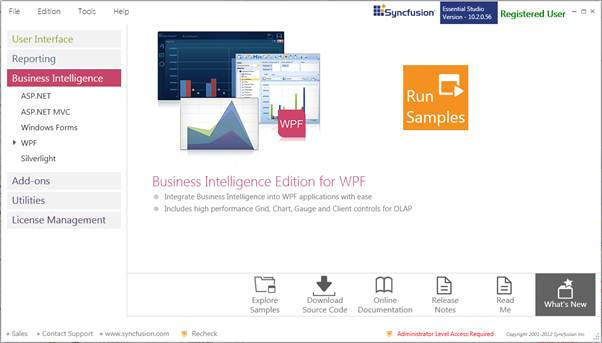
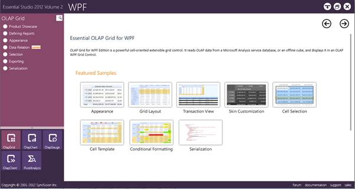
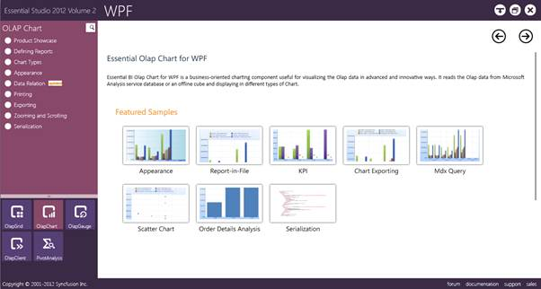

::: {style="DISPLAY: none"}
{#d2h_url_template}{#d2h_package_url style="WIDTH: 0px; DISPLAY: none; HEIGHT: 0px"}
:::

::::: {#nsbanner .d2h_main_nsbanner style="BORDER-BOTTOM: #999999 1px solid; POSITION: relative; PADDING-BOTTOM: 0px; BACKGROUND-COLOR: transparent; PADDING-LEFT: 0px; PADDING-RIGHT: 0px; DISPLAY: none; BORDER-TOP: #999999 1px solid; PADDING-TOP: 0px; LEFT: 0px"}
:::: {#TitleRow .d2h_main_titlerow style="PADDING-BOTTOM: 4px; BACKGROUND-COLOR: transparent; PADDING-LEFT: 22px; WIDTH: 100%; PADDING-RIGHT: 10px; DISPLAY: none; PADDING-TOP: 4px"}
::: {#ienav .d2h_main_ienav style="DISPLAY: none"}
{#D2HPrevious .D2HPreviousEnabled}  {#D2HNext .D2HNextEnabled}
:::
::::
:::::

::::: {#nstext .d2h_main_nstext style="PADDING-BOTTOM: 10px; BACKGROUND-COLOR: transparent; PADDING-LEFT: 22px; PADDING-RIGHT: 10px; HEIGHT: 100%; OVERFLOW: auto; PADDING-TOP: 5px" hasuserbackground="true" valign="bottom"}
::: {#d2h_breadcrumbs .d2h_breadcrumbs}
[Essential Studio User Guide Documentation](ms-xhelp:///?Id=12457748-09e3-4d74-a240-8e049cedf030){.d2h_breadcrumbsNormal}[ \> ]{.d2h_breadcrumbsLinkSeparator}[Business Intelligence Edition](ms-xhelp:///?Id=fdf33dd8-62b2-47b9-ad7b-fc50e590bca5){.d2h_breadcrumbsNormal}[ \> ]{.d2h_breadcrumbsLinkSeparator}[Essential BI WPF](ms-xhelp:///?Id=41e3d586-d922-4a01-8272-679fe4ae7343){.d2h_breadcrumbsNormal}[ \> ]{.d2h_breadcrumbsLinkSeparator}[Essential BI Chart]{.d2h_breadcrumbsContentsOnly}[ \> ]{.d2h_breadcrumbsLinkSeparator}[Essential OLAP Chart for WPF](ms-xhelp:///?Id=4d89e52f-a14a-4da7-a710-b908bfbede08){.d2h_breadcrumbsNormal}[ \> ]{.d2h_breadcrumbsLinkSeparator}[Installation and Deployment](ms-xhelp:///?Id=9d4badb5-c4c4-47ec-84a9-b3a01af9dc6a){.d2h_breadcrumbsNormal}
:::

### Sample and Location {#sample-and-location style="tab-stops: 0pt"}

[]{style="FONT-FAMILY: 'Calibri','sans-serif'; COLOR: black; FONT-SIZE: 11pt"} 

[]{#p6}This section covers the location of the installed samples and describes the procedure to run the samples through the sample browser and online. It also provides the location of the source code.

 

Samples Installation Location

 

The OLAP Chart samples are installed in the following location, locally on the disk:

 

**C:\\Syncfusion\\\<Version Number\>\\BI\\WPF\\OlapChart.WPF\\Samples**

 

Viewing Samples

 

The steps to view the samples are as follows:

 

1.   Click **Start -\> All Programs -\> Syncfusion -\> Essential Studio \<version number\> -\> Dashboard -\> Syncfusion Essential Studio Dashboard \<version number\> -\> BI**.

 

 

 

{border="0"}

 

Figure 2: Syncfusion Essential Studio Dashboard BI[]{style="FONT-FAMILY: 'Calibri','sans-serif'; COLOR: black; FONT-SIZE: 11pt"}

**[]{style="FONT-FAMILY: 'Calibri','sans-serif'; COLOR: black; FONT-SIZE: 11pt"}** 

2.   On the Dashboard window, click **Run Samples** for **WPF** under BI Edition panel. The **BI** **WPF** Sample Browser window will be displayed.

 

::: {style="BORDER-BOTTOM: windowtext 1pt solid; BORDER-LEFT: medium none; PADDING-BOTTOM: 1pt; MARGIN-TOP: 9pt; PADDING-LEFT: 0pt; PADDING-RIGHT: 0pt; MARGIN-BOTTOM: 9pt; BORDER-TOP: windowtext 1pt solid; BORDER-RIGHT: medium none; PADDING-TOP: 1pt"}
{border="0"}Note: You can view the samples in any of the following three ways:
:::

 

[·      ]{style="FONT-FAMILY: Symbol"}**Run Samples** **-** Click to view the locally installed samples.

[·      ]{style="FONT-FAMILY: Symbol"}**Online Samples** **-** Click to view online samples.

[·      ]{style="FONT-FAMILY: Symbol"}**Explore Samples** **-** Explore BI WPF samples on the disk.

 

 

{border="0"}

Figure 3: BI WPF Sample Browser[]{style="FONT-FAMILY: 'Calibri','sans-serif'; FONT-SIZE: 11pt"}

 

 

3.   Select **OLAP Chart**. OLAP Chart samples are displayed.

 

{border="0"}

Figure 4: OlapChart Tab in Syncfusion BI WPF Sample Browser[]{style="FONT-FAMILY: 'Trebuchet MS','sans-serif'; COLOR: #15428b"}

 

4.   Select any sample and browse through the features.

 

Source Code Location

 

The default location of the OLAP Chart source code is the following:

**\[System Drive\]:\\Program Files\\Syncfusion\\Essential Studio\\\[Version Number\]\\BI\\OlapChart.WPF\\Src**

[]{style="FONT-FAMILY: 'Calibri','sans-serif'; COLOR: #002060; FONT-SIZE: 11pt"} 

[]{#related-topics}
:::::
