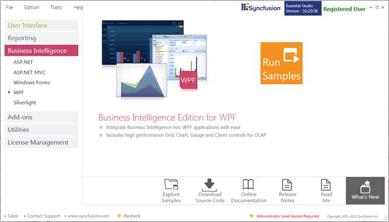
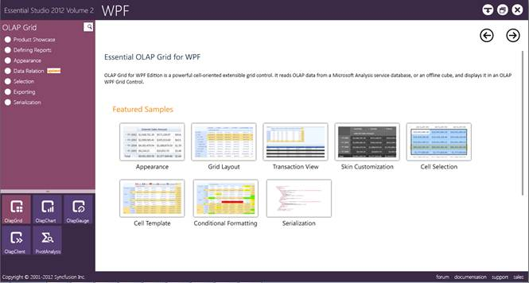

::: {style="DISPLAY: none"}
{#d2h_url_template} {#d2h_package_url style="WIDTH: 0px; DISPLAY: none; HEIGHT: 0px"}
:::

::::: {#nsbanner .d2h_main_nsbanner style="BORDER-BOTTOM: #999999 1px solid; POSITION: relative; PADDING-BOTTOM: 0px; BACKGROUND-COLOR: transparent; PADDING-LEFT: 0px; PADDING-RIGHT: 0px; DISPLAY: none; BORDER-TOP: #999999 1px solid; PADDING-TOP: 0px; LEFT: 0px"}
:::: {#TitleRow .d2h_main_titlerow style="PADDING-BOTTOM: 4px; BACKGROUND-COLOR: transparent; PADDING-LEFT: 22px; WIDTH: 100%; PADDING-RIGHT: 10px; DISPLAY: none; PADDING-TOP: 4px"}
::: {#ienav .d2h_main_ienav style="DISPLAY: none"}
{#D2HPrevious .D2HPreviousEnabled}  {#D2HNext .D2HNextEnabled}
:::
::::
:::::

:::: {#nstext .d2h_main_nstext style="PADDING-BOTTOM: 10px; BACKGROUND-COLOR: transparent; PADDING-LEFT: 22px; PADDING-RIGHT: 10px; HEIGHT: 100%; OVERFLOW: auto; PADDING-TOP: 5px" hasuserbackground="true" valign="bottom"}
::: {#d2h_breadcrumbs .d2h_breadcrumbs}
[Essential Studio User Guide Documentation](ms-xhelp:///?Id=12457748-09e3-4d74-a240-8e049cedf030){.d2h_breadcrumbsNormal} [ \> ]{.d2h_breadcrumbsLinkSeparator} [Business Intelligence Edition](ms-xhelp:///?Id=fdf33dd8-62b2-47b9-ad7b-fc50e590bca5){.d2h_breadcrumbsNormal} [ \> ]{.d2h_breadcrumbsLinkSeparator} [Essential BI WPF](ms-xhelp:///?Id=41e3d586-d922-4a01-8272-679fe4ae7343){.d2h_breadcrumbsNormal} [ \> ]{.d2h_breadcrumbsLinkSeparator} [Essential BI Grid]{.d2h_breadcrumbsContentsOnly} [ \> ]{.d2h_breadcrumbsLinkSeparator} [Installation and Deployment](ms-xhelp:///?Id=267788d8-b80b-4395-82c5-3140e58dcadb){.d2h_breadcrumbsNormal}
:::

## Sample and Location {#sample-and-location style="tab-stops: 0pt"}

[]{style="COLOR: black; FONT-SIZE: 11pt"} 

[]{#p6}This section covers the location of the installed samples and describes the procedure to run the samples through the sample browser and online. It also provides the location of the source code.

 

Samples Installation Location

 

The OlapGrid samples are installed in the following location, locally on the disk:

 

Windows XP:

C:\\Syncfusion\\Essential Studio\<version number\>\\BI\\WPF\\OlapGrid.WPF\\Samples\\

 

Windows 7/Vista:

C:\\Users\\\<User Name\>\\AppData\\Local\\Syncfusion\\EssentialStudio\\Essential Studio\<version number\>\\BI\\WPF\\OlapGrid.WPF\\Samples

 

Viewing Samples

 

To view the samples, follow the steps given below:

 

1.   Click **Start[à]{style="FONT-FAMILY: Wingdings"}All Programs[à]{style="FONT-FAMILY: Wingdings"}Syncfusion[à]{style="FONT-FAMILY: Wingdings"}Essential Studio \<version number\>** **[à]{style="FONT-FAMILY: Wingdings"}Dashboard**. 

[]{style="FONT-SIZE: 11pt"} 

[]{style="FONT-SIZE: 11pt"} 

{border="0"}

Figure 2: Syncfusion Essential Studio Dashboard BI

[]{style="COLOR: black; FONT-SIZE: 11pt"} 

2.   In the Dashboard window, click **Run Samples** for **WPF** under **BI Edition**. The **BIWPF Sample Browser** window is displayed.

 

[ {border="0"} ]{.Note} [Note: You can view the samples in any of the following three ways:]{.Note}

 

[·      ]{style="FONT-FAMILY: Symbol"} **Run Samples**-Click to view the locally installed samples.

[·      ]{style="FONT-FAMILY: Symbol"} **Online Samples**-Click to view online samples.

[·      ]{style="FONT-FAMILY: Symbol"} **Explore Samples**-Explore BI WPF samples on disk.

 

{border="0"}

Figure 3: BI WPF Sample Browser

 

 

3.   Select any sample and browse through the features.

 

 

Source Code Location

 

The default location of the OLAP Grid source code is:

 

**\[System Drive\]:\\Program Files\\Syncfusion\\Essential Studio\\\[Version Number\]\\BI\\OlapGrid.WPF\\Src**

[]{#related-topics}
::::
