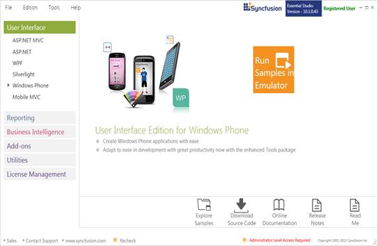
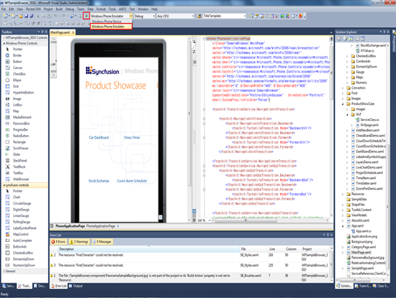
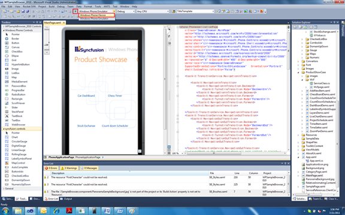
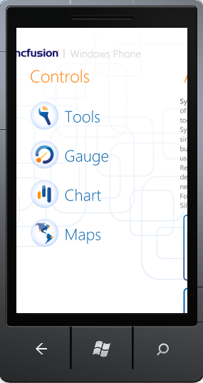
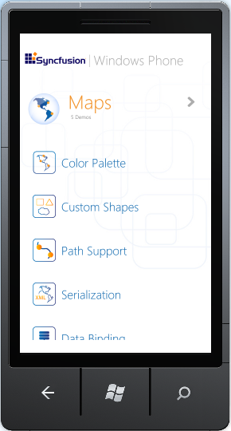

::: {style="DISPLAY: none"}
{#d2h_url_template}{#d2h_package_url style="WIDTH: 0px; DISPLAY: none; HEIGHT: 0px"}
:::

::::: {#nsbanner .d2h_main_nsbanner style="BORDER-BOTTOM: #999999 1px solid; POSITION: relative; PADDING-BOTTOM: 0px; BACKGROUND-COLOR: transparent; PADDING-LEFT: 0px; PADDING-RIGHT: 0px; DISPLAY: none; BORDER-TOP: #999999 1px solid; PADDING-TOP: 0px; LEFT: 0px"}
:::: {#TitleRow .d2h_main_titlerow style="PADDING-BOTTOM: 4px; BACKGROUND-COLOR: transparent; PADDING-LEFT: 22px; WIDTH: 100%; PADDING-RIGHT: 10px; DISPLAY: none; PADDING-TOP: 4px"}
::: {#ienav .d2h_main_ienav style="DISPLAY: none"}
{#D2HPrevious .D2HPreviousEnabled}  {#D2HNext .D2HNextEnabled}
:::
::::
:::::

::::: {#nstext .d2h_main_nstext style="PADDING-BOTTOM: 10px; BACKGROUND-COLOR: transparent; PADDING-LEFT: 22px; PADDING-RIGHT: 10px; HEIGHT: 100%; OVERFLOW: auto; PADDING-TOP: 5px" hasuserbackground="true" valign="bottom"}
::: {#d2h_breadcrumbs .d2h_breadcrumbs}
[Essential Studio User Guide Documentation](ms-xhelp:///?Id=12457748-09e3-4d74-a240-8e049cedf030){.d2h_breadcrumbsNormal}[ \> ]{.d2h_breadcrumbsLinkSeparator}[User Interface Edition](ms-xhelp:///?Id=c29296b7-531c-413b-a0ec-488ca1f7f669){.d2h_breadcrumbsNormal}[ \> ]{.d2h_breadcrumbsLinkSeparator}[Essential Windows Phone](ms-xhelp:///?Id=5ea1999c-4eff-4775-b84e-407dc825f555){.d2h_breadcrumbsNormal}[ \> ]{.d2h_breadcrumbsLinkSeparator}[Essential Maps]{.d2h_breadcrumbsContentsOnly}[ \> ]{.d2h_breadcrumbsLinkSeparator}[Installation and Deployment](ms-xhelp:///?Id=0f10cd79-9036-4b0a-8346-a5e6f3dd0c16){.d2h_breadcrumbsNormal}
:::

## Sample and Location {#sample-and-location style="tab-stops: 0pt"}

This section covers the location of the installed samples and describes the procedure to run the samples through the sample browser.  

 

Sample Installation Location 

The Essential Windows Phone samples are installed in the following location: 

***C:\\Program Files (x86)\\Syncfusion\\Essential Studio\\\<Version Number\>\\Samples\\Windows Phone\\ ***

 

Viewing Samples 

The following are the steps to view the samples: 

1.   Click **Start \> All Programs \> Syncfusion \> Essential Studio x.x.x.x \>Dashboard.**

2.   Select **User Interface \>** **Windows Phone**.

 

{border="0"}

Figure 1: Syncfusion Essential Studio Dashboard

 

3.   Click **Run Samples in Emulator**. This will run the Essential Studio Windows phone Edition sample browser in the Emulator.

::: {style="BORDER-BOTTOM: windowtext 1pt solid; BORDER-LEFT: medium none; PADDING-BOTTOM: 1pt; MARGIN-TOP: 9pt; PADDING-LEFT: 0pt; PADDING-RIGHT: 0pt; MARGIN-BOTTOM: 9pt; BORDER-TOP: windowtext 1pt solid; BORDER-RIGHT: medium none; PADDING-TOP: 1pt"}
{border="0"}Note: The Run Samples in Emulator option will be available in the Dashboard only when all prerequisites for Essential Windows Phone are installed in your machine.  
:::

 

 

Running the samples from Visual Studio

You can also run the samples in Visual Studio. []{style="FONT-FAMILY: 'Times New Roman','serif'; FONT-SIZE: 12pt"}

The follow are the steps to run the samples from Visual Studio: 

1.   Open **Syncfusion Dashboard**.

2.   Select **User Interface \>** **Windows Phone**.

 

{border="0"}

Figure 2: Syncfusion Dashboard

 

3.   Click **Explore Samples**. This locates the Windows Phone samples on the disk.

4.   Open the sample in Visual Studio.

5.   Select the deployment type as **Device** or **Emulator** as needed.  

[·      ]{style="FONT-FAMILY: Symbol"}To deploy in Emulator, select **Windows Phone Emulator**. 

 

{border="0"}

Figure 3: Deploy in Emulator

 

[·      ]{style="FONT-FAMILY: Symbol"}To deploy in Device, select **Windows Phone Device.**

[]{style="FONT-FAMILY: 'Times New Roman','serif'; FONT-SIZE: 12pt"} 

{border="0"}

Figure 4: Deploy in Device[ ]{style="FONT-FAMILY: 'Times New Roman','serif'; FONT-SIZE: 12pt"}

[]{style="FONT-FAMILY: 'Times New Roman','serif'; FONT-SIZE: 12pt"} 

6.     Run the application*.* The Essential Studio Windows phone Edition sample browser will open.[]{style="FONT-FAMILY: 'Times New Roman','serif'; FONT-SIZE: 12pt"}

[{border="0"}]{style="FONT-FAMILY: 'Times New Roman','serif'; FONT-SIZE: 12pt"}

Figure 5: Windows Phone Sample Browser

[]{style="FONT-FAMILY: 'Times New Roman','serif'; FONT-SIZE: 12pt"} 

7.   Click **Maps.** The Maps samples will open.

[]{style="FONT-FAMILY: 'Times New Roman','serif'; FONT-SIZE: 12pt"} 

[{border="0"}]{style="FONT-FAMILY: 'Times New Roman','serif'; FONT-SIZE: 12pt"}

Figure 6: Maps Sample Browser

[]{style="FONT-FAMILY: 'Times New Roman','serif'; FONT-SIZE: 12pt"} 

8.   Select the samples and browse through the features.

 

[]{#related-topics}
:::::
