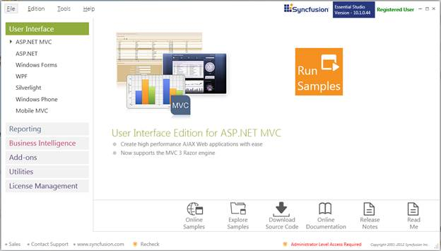

::: {style="DISPLAY: none"}
{#d2h_url_template}{#d2h_package_url style="WIDTH: 0px; DISPLAY: none; HEIGHT: 0px"}
:::

::::: {#nsbanner .d2h_main_nsbanner style="BORDER-BOTTOM: #999999 1px solid; POSITION: relative; PADDING-BOTTOM: 0px; BACKGROUND-COLOR: transparent; PADDING-LEFT: 0px; PADDING-RIGHT: 0px; DISPLAY: none; BORDER-TOP: #999999 1px solid; PADDING-TOP: 0px; LEFT: 0px"}
:::: {#TitleRow .d2h_main_titlerow style="PADDING-BOTTOM: 4px; BACKGROUND-COLOR: transparent; PADDING-LEFT: 22px; WIDTH: 100%; PADDING-RIGHT: 10px; DISPLAY: none; PADDING-TOP: 4px"}
::: {#ienav .d2h_main_ienav style="DISPLAY: none"}
{#D2HPrevious .D2HPreviousEnabled}  {#D2HNext .D2HNextEnabled}
:::
::::
:::::

:::: {#nstext .d2h_main_nstext style="PADDING-BOTTOM: 10px; BACKGROUND-COLOR: transparent; PADDING-LEFT: 22px; PADDING-RIGHT: 10px; HEIGHT: 100%; OVERFLOW: auto; PADDING-TOP: 5px" hasuserbackground="true" valign="bottom"}
::: {#d2h_breadcrumbs .d2h_breadcrumbs}
[Essential Studio User Guide Documentation](ms-xhelp:///?Id=12457748-09e3-4d74-a240-8e049cedf030){.d2h_breadcrumbsNormal}[ \> ]{.d2h_breadcrumbsLinkSeparator}[User Interface Edition](ms-xhelp:///?Id=c29296b7-531c-413b-a0ec-488ca1f7f669){.d2h_breadcrumbsNormal}[ \> ]{.d2h_breadcrumbsLinkSeparator}[Essential ASP.NET MVC](ms-xhelp:///?Id=4b14e7d1-65c4-4f67-b1aa-2c37709905a5){.d2h_breadcrumbsNormal}[ \> ]{.d2h_breadcrumbsLinkSeparator}[Essential Tools]{.d2h_breadcrumbsContentsOnly}[ \> ]{.d2h_breadcrumbsLinkSeparator}[Installation and Deployment](ms-xhelp:///?Id=cd89e30d-2315-407f-8b24-e1aa09c0d493){.d2h_breadcrumbsNormal}
:::

## Sample and Location {#sample-and-location style="tab-stops: 0pt"}

[]{style="COLOR: black"} 

This section covers the location of the installed samples and describes the procedure to run the samples through the sample browser and online. It also lists the location of utilities, assemblies and source code.

[]{style="COLOR: black"} 

**Sample Installation Location**

[]{style="COLOR: black"} 

The ASP.NET MVC samples for Tools controls are installed in the following location:

[]{style="COLOR: black"} 

**C:\\Syncfusion\\EssentialStudio\\x.x.x.x\\MVC\\toolsmvc\\samples\\3.5**

[]{style="COLOR: black"} 

**Viewing Samples**

**[]{style="COLOR: black"}** 

To view the samples, follow the steps below:

[]{style="COLOR: black"} 

1.   Click **Start\--\>All Programs\--\>Syncfusion\--\>Essential Studio \<version number\> \--\>Dashboard**. Essential Studio Enterprise Edition window is displayed.

[]{style="COLOR: black"} 

{border="0"}

*[Figure ]{style="FONT-SIZE: 9pt"}[1]{style="FONT-SIZE: 9pt"}[: Syncfusion Essential Studio Dashboard]{style="FONT-SIZE: 9pt"}*

***[]{style="COLOR: black; FONT-SIZE: 9pt"}*** 

[]{style="COLOR: black"} 

2.  Click **Run Samples**. Essential Studio ASP.NET MVC Edition sample browser is displayed.

[]{style="COLOR: black"} 

{border="0"}

*[Figure ]{style="FONT-SIZE: 9pt"}[2]{style="FONT-SIZE: 9pt"}[: Essential Studio - ASP.NET MVC Edition Sample Browser]{style="FONT-SIZE: 9pt"}[]{style="FONT-SIZE: 9pt"}*

[]{style="COLOR: black"} 

***[{border="0"}]{style="FONT-SIZE: 9pt"}**[Note: ]{style="LAYOUT-GRID-MODE: line; FONT-SIZE: 9pt"}**[By default, Tools MVC samples are displayed.]{style="LAYOUT-GRID-MODE: line; FONT-SIZE: 9pt"}***

[]{style="COLOR: black"} 

3.  Select any sample and browse through the features.

[]{style="COLOR: black"} 

**Source Code Location**

[]{style="COLOR: black"} 

The default location of source code for the Tools controls is:

[]{style="COLOR: black"} 

**\[System Drive\]:\\Program Files\\Syncfusion\\Essential Studio\\\[Version Number\]\\MVC\\Tools.MVC\\Src**

[]{style="COLOR: black"} 

[]{#related-topics}
::::
