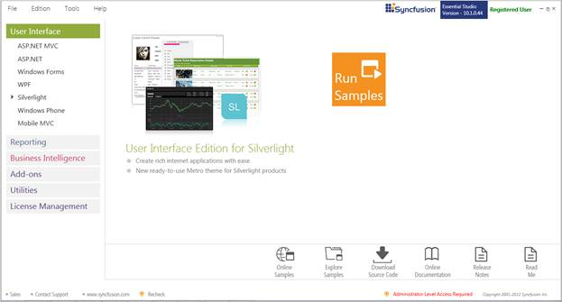
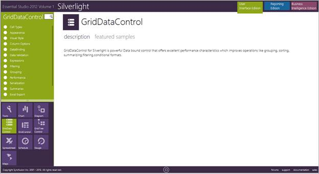
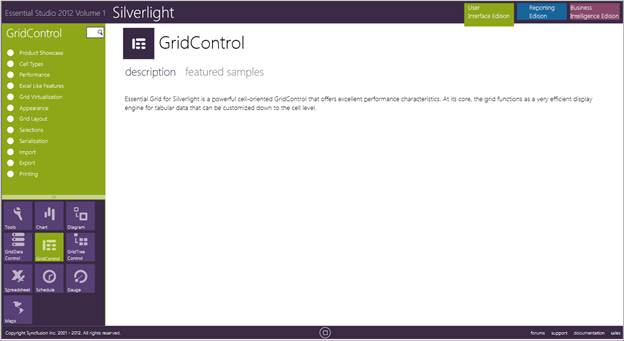
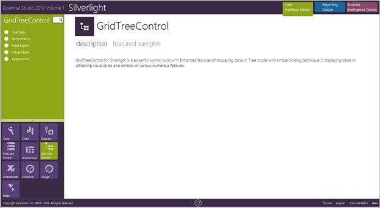

::: {style="DISPLAY: none"}
{#d2h_url_template}{#d2h_package_url style="WIDTH: 0px; DISPLAY: none; HEIGHT: 0px"}
:::

::::: {#nsbanner .d2h_main_nsbanner style="BORDER-BOTTOM: #999999 1px solid; POSITION: relative; PADDING-BOTTOM: 0px; BACKGROUND-COLOR: transparent; PADDING-LEFT: 0px; PADDING-RIGHT: 0px; DISPLAY: none; BORDER-TOP: #999999 1px solid; PADDING-TOP: 0px; LEFT: 0px"}
:::: {#TitleRow .d2h_main_titlerow style="PADDING-BOTTOM: 4px; BACKGROUND-COLOR: transparent; PADDING-LEFT: 22px; WIDTH: 100%; PADDING-RIGHT: 10px; DISPLAY: none; PADDING-TOP: 4px"}
::: {#ienav .d2h_main_ienav style="DISPLAY: none"}
{#D2HPrevious .D2HPreviousEnabled}  {#D2HNext .D2HNextEnabled}
:::
::::
:::::

:::: {#nstext .d2h_main_nstext style="PADDING-BOTTOM: 10px; BACKGROUND-COLOR: transparent; PADDING-LEFT: 22px; PADDING-RIGHT: 10px; HEIGHT: 100%; OVERFLOW: auto; PADDING-TOP: 5px" hasuserbackground="true" valign="bottom"}
::: {#d2h_breadcrumbs .d2h_breadcrumbs}
[Essential Studio User Guide Documentation](ms-xhelp:///?Id=12457748-09e3-4d74-a240-8e049cedf030){.d2h_breadcrumbsNormal}[ \> ]{.d2h_breadcrumbsLinkSeparator}[User Interface Edition](ms-xhelp:///?Id=c29296b7-531c-413b-a0ec-488ca1f7f669){.d2h_breadcrumbsNormal}[ \> ]{.d2h_breadcrumbsLinkSeparator}[Essential Silverlight](ms-xhelp:///?Id=66221bd1-ba2e-43c2-94a7-618f50e01d24){.d2h_breadcrumbsNormal}[ \> ]{.d2h_breadcrumbsLinkSeparator}[Essential Grid]{.d2h_breadcrumbsContentsOnly}[ \> ]{.d2h_breadcrumbsLinkSeparator}[Installation and Deployment](ms-xhelp:///?Id=ef406e77-e3fa-4466-b243-9d9843c4da22){.d2h_breadcrumbsNormal}
:::

## Sample and Location {#sample-and-location style="tab-stops: 0pt"}

[]{style="FONT-FAMILY: 'Trebuchet MS','sans-serif'; COLOR: #15428b; FONT-SIZE: 9pt"} 

This section covers the location of the installed samples and describes the procedure to run the samples through the sample browser and online. It also lists the location of utilities, assemblies and source code.

[]{style="FONT-FAMILY: 'Trebuchet MS','sans-serif'; COLOR: #15428b; FONT-SIZE: 9pt"} 

Sample Installation Location

[]{style="FONT-FAMILY: 'Trebuchet MS','sans-serif'; COLOR: #15428b; FONT-SIZE: 9pt"} 

The Essential Grid Silverlight samples are installed under the following location, locally on the disk:

**** 

***\<Install Location\>\\Syncfusion\\EssentialStudio\\\<Version Number\>\\Silverlight\\GridData.Silverlight\\Samples***

**** 

***\<Install Location\>\\Syncfusion\\EssentialStudio\\\<Version Number\>\\Silverlight\\GridControl.Silverlight\\Samples***

**** 

***\<Install Location\>\\Syncfusion\\EssentialStudio\\\<Version Number\>\\Silverlight\\GridTree.Silverlight\\Samples***

***[]{style="FONT-FAMILY: 'Trebuchet MS','sans-serif'; COLOR: #15428b; FONT-SIZE: 9pt"}*** 

Viewing Samples

**[]{style="FONT-FAMILY: 'Trebuchet MS','sans-serif'; COLOR: #15428b"}** 

Following are the steps to view the samples:

 

1.   Click Start\--\>All Programs\--\>Syncfusion\--\>Essential Studio \<v9.4.0.62\> \--\>Dashboard. Syncfusion Essential Studio Dashboard \<v9.4.0.62\> window is displayed.

{border="0"}

 

2.   Click **Run Samples** link. Essential Studio Silverlight Edition sample browser is displayed.

{border="0"}

[]{style="FONT-FAMILY: 'Arial','sans-serif'"} 

3.   Click the GridDataControl to view GridDataControl samples.

[]{style="FONT-FAMILY: 'Arial','sans-serif'"} 

{border="0"}

[]{style="FONT-FAMILY: 'Arial','sans-serif'"} 

 

4.   Click the GridControl to view GridControl samples.

[]{style="FONT-FAMILY: 'Arial','sans-serif'"} 

{border="0"}

[]{style="FONT-FAMILY: 'Arial','sans-serif'"} 

5.   Click the GridTreeControl to view GridTreeControl samples.

{border="0"}

 

6.   Select any sample and browse through the features.

[]{style="FONT-FAMILY: 'Trebuchet MS','sans-serif'; COLOR: #15428b; FONT-SIZE: 9pt"} 

Source Code Location

[]{style="FONT-FAMILY: 'Trebuchet MS','sans-serif'; COLOR: #15428b; FONT-SIZE: 9pt"} 

The default location of the Essential Grid Silverlight source code is:

**** 

***\[System Drive\]:\\Program Files\\Syncfusion\\Essential Studio\\\<Version Number\>\\Silverlight\\Grid.silverlight\\Src***

[]{#p7} 

[]{#related-topics}
::::
