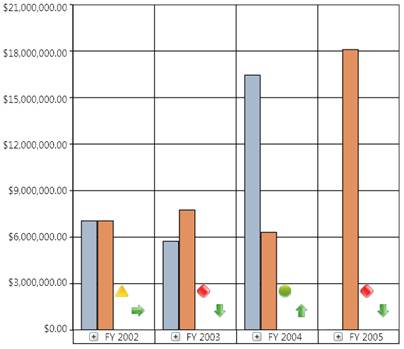

::: {style="DISPLAY: none"}
{#d2h_url_template}{#d2h_package_url style="WIDTH: 0px; DISPLAY: none; HEIGHT: 0px"}
:::

::: {.d2h_secondary_topic style="PADDING-BOTTOM: 10pt; MARGIN: 0pt; PADDING-LEFT: 0pt; PADDING-RIGHT: 0pt; PADDING-TOP: 0pt"}
##### Sample Report {#sample-report style="tab-stops: 0pt"}

[]{style="FONT-FAMILY: 'Calibri','sans-serif'; FONT-SIZE: 11pt"} 

The KPI Elements can be defined in the OlapReport in the following way:

[]{style="FONT-FAMILY: 'Calibri','sans-serif'; FONT-SIZE: 11pt"} 

+-------------------------------------------------------------------------------------------------------------------------------------------------------+
| **\[C#\]**                                                                                                                                            |
|                                                                                                                                                       |
|                                                                                                                                                       |
|                                                                                                                                                       |
|         [///]{style="COLOR: gray"}[ ]{style="COLOR: green"}[\<summary\>]{style="COLOR: gray"}                                                         |
|                                                                                                                                                       |
|         [///]{style="COLOR: gray"}[ OlapReport with KPI Elements]{style="COLOR: green"}                                                               |
|                                                                                                                                                       |
|         [///]{style="COLOR: gray"}[ ]{style="COLOR: green"}[\</summary\>]{style="COLOR: gray"}                                                        |
|                                                                                                                                                       |
|         [///]{style="COLOR: gray"}[ ]{style="COLOR: green"}[\<returns\>\</returns\>]{style="COLOR: gray"}                                             |
|                                                                                                                                                       |
|         [private]{style="COLOR: blue"} [OlapReport]{style="COLOR: #2b91af"} LoadBasicKPI()                                                            |
|                                                                                                                                                       |
|         {                                                                                                                                             |
|                                                                                                                                                       |
|             [OlapReport]{style="COLOR: #2b91af"} olapReport = [new]{style="COLOR: blue"} [OlapReport]{style="COLOR: #2b91af"}();                      |
|                                                                                                                                                       |
|                                                                                                                                                       |
|                                                                                                                                                       |
|             [// Selecting the Cube]{style="COLOR: green"}                                                                                             |
|                                                                                                                                                       |
|             olapReport.CurrentCubeName = [\"Adventure Works\"]{style="COLOR: #a31515"};                                                               |
|                                                                                                                                                       |
|                                                                                                                                                       |
|                                                                                                                                                       |
|             [KpiElements]{style="COLOR: #2b91af"} kpiElement = [new]{style="COLOR: blue"} [KpiElements]{style="COLOR: #2b91af"}();                    |
|                                                                                                                                                       |
|                                                                                                                                                       |
|                                                                                                                                                       |
|             [// Specifying the KPI Element name and configuring its Indicators]{style="COLOR: green"}                                                 |
|                                                                                                                                                       |
|             kpiElement.Elements.Add([new]{style="COLOR: blue"} [KpiElement]{style="COLOR: #2b91af"}                                                   |
|                                                                                                                                                       |
|             {                                                                                                                                         |
|                                                                                                                                                       |
|                 Name = [\"Internet Revenue\"]{style="COLOR: #a31515"},                                                                                |
|                                                                                                                                                       |
|                 ShowKPIGoal = [true]{style="COLOR: blue"},                                                                                            |
|                                                                                                                                                       |
|                 ShowKPIStatus = [true]{style="COLOR: blue"},                                                                                          |
|                                                                                                                                                       |
|                 ShowKPIValue = [true]{style="COLOR: blue"},                                                                                           |
|                                                                                                                                                       |
|                 ShowKPITrend = [true]{style="COLOR: blue"}                                                                                            |
|                                                                                                                                                       |
|             });                                                                                                                                       |
|                                                                                                                                                       |
|                                                                                                                                                       |
|                                                                                                                                                       |
|             [DimensionElement]{style="COLOR: #2b91af"} dimensionElementRow = [new]{style="COLOR: blue"} [DimensionElement]{style="COLOR: #2b91af"}(); |
|                                                                                                                                                       |
|                                                                                                                                                       |
|                                                                                                                                                       |
|             [// Specifying the Name for Row Dimension Element]{style="COLOR: green"}                                                                  |
|                                                                                                                                                       |
|             dimensionElementRow.Name = [\"Date\"]{style="COLOR: #a31515"};                                                                            |
|                                                                                                                                                       |
|                                                                                                                                                       |
|                                                                                                                                                       |
|             [// Specifying the Level element]{style="COLOR: green"}                                                                                   |
|                                                                                                                                                       |
|             dimensionElementRow.AddLevel([\"Fiscal\"]{style="COLOR: #a31515"}, [\"Fiscal Year\"]{style="COLOR: #a31515"});                            |
|                                                                                                                                                       |
|                                                                                                                                                       |
|                                                                                                                                                       |
|             [// Adding Row Elements]{style="COLOR: green"}                                                                                            |
|                                                                                                                                                       |
|             olapReport.SeriesElements.Add(dimensionElementRow);                                                                                       |
|                                                                                                                                                       |
|                                                                                                                                                       |
|                                                                                                                                                       |
|             [// Adding Column Elements]{style="COLOR: green"}                                                                                         |
|                                                                                                                                                       |
|             olapReport.CategoricalElements.Add(kpiElement);                                                                                           |
|                                                                                                                                                       |
|                                                                                                                                                       |
|                                                                                                                                                       |
|             [return]{style="COLOR: blue"} olapReport;                                                                                                 |
|                                                                                                                                                       |
|         }                                                                                                                                             |
|                                                                                                                                                       |
|                                                                                                                                                       |
+-------------------------------------------------------------------------------------------------------------------------------------------------------+

[]{style="FONT-FAMILY: 'Calibri','sans-serif'; FONT-SIZE: 11pt"} 

+------------------------------------------------------------------------------------------------------------------------------+
| **\[VB\]**                                                                                                                   |
|                                                                                                                              |
|                                                                                                                              |
|                                                                                                                              |
|     [\'\'\' \<summary\>]{style="COLOR: green"}                                                                               |
|                                                                                                                              |
|     [\'\'\' OlapReport with KPI Elements]{style="COLOR: green"}                                                              |
|                                                                                                                              |
|     [\'\'\' \</summary\>]{style="COLOR: green"}                                                                              |
|                                                                                                                              |
|     [\'\'\' \<returns\>\</returns\>]{style="COLOR: green"}                                                                   |
|                                                                                                                              |
|     [Private]{style="COLOR: blue"} [Function]{style="COLOR: blue"} LoadBasicKPI() [As]{style="COLOR: blue"} OlapReport       |
|                                                                                                                              |
|       [Dim]{style="COLOR: blue"} olapReport [As]{style="COLOR: blue"} [New]{style="COLOR: blue"} OlapReport()                |
|                                                                                                                              |
|                                                                                                                              |
|                                                                                                                              |
|       [\' Selecting the Cube]{style="COLOR: green"}                                                                          |
|                                                                                                                              |
|       olapReport.CurrentCubeName = [\"Adventure Works\"]{style="COLOR: #a31515"}                                             |
|                                                                                                                              |
| []{style="COLOR: #a31515"}                                                                                                   |
|                                                                                                                              |
|       [Dim]{style="COLOR: blue"} kpiElement [As]{style="COLOR: blue"} [New]{style="COLOR: blue"} KpiElements()               |
|                                                                                                                              |
|                                                                                                                              |
|                                                                                                                              |
|       [\' Specifying the KPI Element name and configuring its Indicators]{style="COLOR: green"}                              |
|                                                                                                                              |
|       kpiElement.Elements.Add([New]{style="COLOR: blue"} KpiElement())                                                       |
|                                                                                                                              |
|                                                                                                                              |
|                                                                                                                              |
|       [Dim]{style="COLOR: blue"} dimensionElementRow [As]{style="COLOR: blue"} [New]{style="COLOR: blue"} DimensionElement() |
|                                                                                                                              |
|                                                                                                                              |
|                                                                                                                              |
|       [\' Specifying the Name for Row Dimension Element]{style="COLOR: green"}                                               |
|                                                                                                                              |
|       dimensionElementRow.Name = [\"Date\"]{style="COLOR: #a31515"}                                                          |
|                                                                                                                              |
| []{style="COLOR: #a31515"}                                                                                                   |
|                                                                                                                              |
|       [\' Specifying the Level element]{style="COLOR: green"}                                                                |
|                                                                                                                              |
|       dimensionElementRow.AddLevel([\"Fiscal\"]{style="COLOR: #a31515"}, [\"Fiscal Year\"]{style="COLOR: #a31515"})          |
|                                                                                                                              |
|                                                                                                                              |
|                                                                                                                              |
|       [\' Adding Row Elements]{style="COLOR: green"}                                                                         |
|                                                                                                                              |
|       olapReport.SeriesElements.Add(dimensionElementRow)                                                                     |
|                                                                                                                              |
|                                                                                                                              |
|                                                                                                                              |
|       [\' Adding Column Elements]{style="COLOR: green"}                                                                      |
|                                                                                                                              |
|       olapReport.CategoricalElements.Add(kpiElement)                                                                         |
|                                                                                                                              |
|                                                                                                                              |
|                                                                                                                              |
|       [Return]{style="COLOR: blue"} olapReport                                                                               |
|                                                                                                                              |
|     [End]{style="COLOR: blue"} [Function]{style="COLOR: blue"}                                                               |
|                                                                                                                              |
|                                                                                                                              |
+------------------------------------------------------------------------------------------------------------------------------+

[]{style="FONT-FAMILY: 'Calibri','sans-serif'; FONT-SIZE: 11pt"} 

[]{style="FONT-FAMILY: 'Calibri','sans-serif'; FONT-SIZE: 11pt"} 

{border="0"}

Figure 64: OlapChart with Key Performance Indicators[]{style="FONT-FAMILY: 'Calibri','sans-serif'; FONT-SIZE: 11pt"}

[]{style="FONT-FAMILY: 'Calibri','sans-serif'; FONT-SIZE: 11pt"} 

[]{#related-topics}
:::
