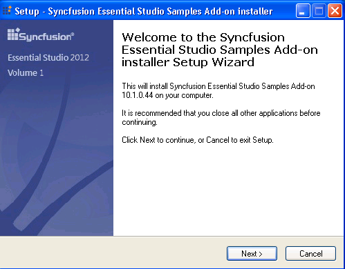
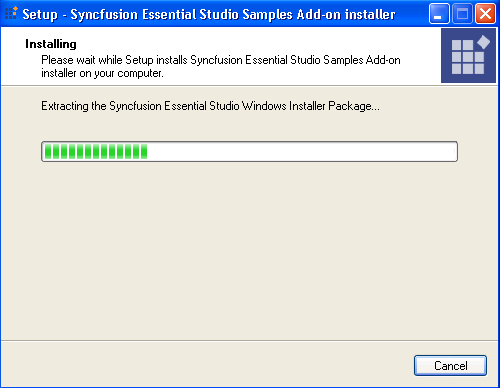
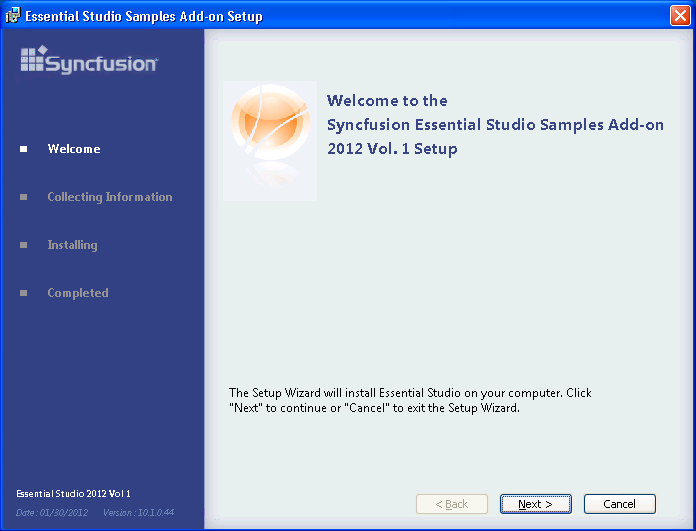
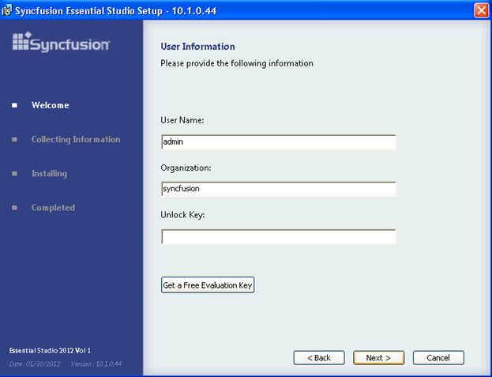
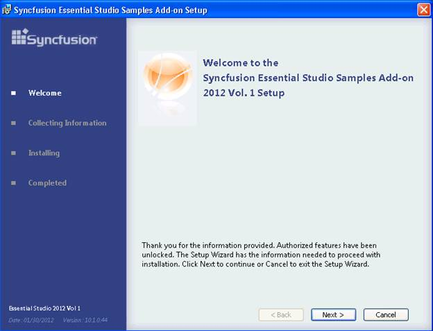
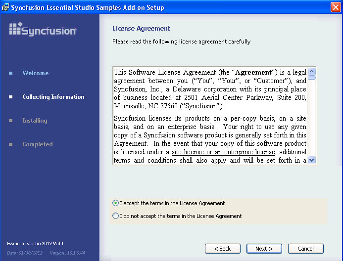
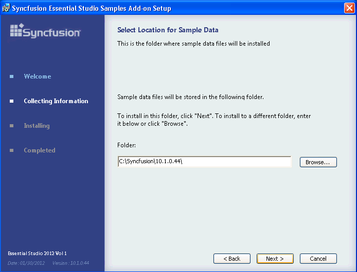
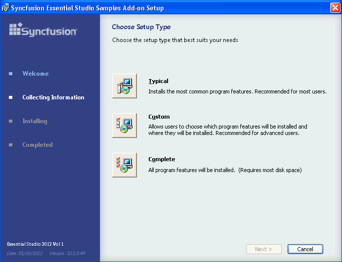
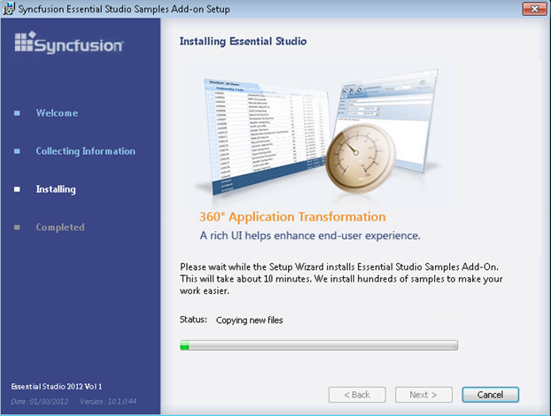
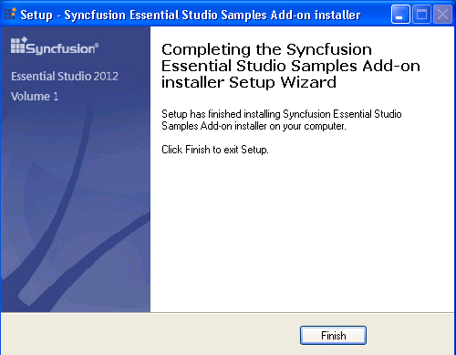

::: {style="DISPLAY: none"}
{#d2h_url_template}{#d2h_package_url style="WIDTH: 0px; DISPLAY: none; HEIGHT: 0px"}
:::

::::: {#nsbanner .d2h_main_nsbanner style="BORDER-BOTTOM: #999999 1px solid; POSITION: relative; PADDING-BOTTOM: 0px; BACKGROUND-COLOR: transparent; PADDING-LEFT: 0px; PADDING-RIGHT: 0px; DISPLAY: none; BORDER-TOP: #999999 1px solid; PADDING-TOP: 0px; LEFT: 0px"}
:::: {#TitleRow .d2h_main_titlerow style="PADDING-BOTTOM: 4px; BACKGROUND-COLOR: transparent; PADDING-LEFT: 22px; WIDTH: 100%; PADDING-RIGHT: 10px; DISPLAY: none; PADDING-TOP: 4px"}
::: {#ienav .d2h_main_ienav style="DISPLAY: none"}
{#D2HPrevious .D2HPreviousEnabled}  {#D2HNext .D2HNextEnabled}
:::
::::
:::::

:::::::: {#nstext .d2h_main_nstext style="PADDING-BOTTOM: 10px; BACKGROUND-COLOR: transparent; PADDING-LEFT: 22px; PADDING-RIGHT: 10px; HEIGHT: 100%; OVERFLOW: auto; PADDING-TOP: 5px" hasuserbackground="true" valign="bottom"}
::: {#d2h_breadcrumbs .d2h_breadcrumbs}
[Essential Studio User Guide Documentation](ms-xhelp:///?Id=12457748-09e3-4d74-a240-8e049cedf030){.d2h_breadcrumbsNormal}[ \> ]{.d2h_breadcrumbsLinkSeparator}[Essential Common](ms-xhelp:///?Id=2bfe10b6-fac1-4f91-a173-04db314f10c3){.d2h_breadcrumbsNormal}[ \> ]{.d2h_breadcrumbsLinkSeparator}[Installation and Deployment](ms-xhelp:///?Id=edacfc75-68a5-4518-870d-ce716c583177){.d2h_breadcrumbsNormal}
:::

## Samples Add-on {#samples-add-on style="tab-stops: 0pt"}

From the Essential Studio v10.1.0.44, Installer provides an option to choose whether samples need to be installed along with the application or using a separate setup. You can access the **Essential Studio Samples Add-on Setup** from the **Product Downloads and Keys** page using your support account in Direct Trac.

 

The following are the steps to install the Essential Studio samples:

1.   Double-click the **Syncfusion Essential Studio Samples Add on installer Setup** file. The **Syncfusion Essential Studio Unified Installer** wizard opens.

[]{style="FONT-FAMILY: 'Trebuchet MS','sans-serif'; COLOR: #15428b; FONT-SIZE: 9pt"} 

 

{border="0"}

Figure 27: Unified Installer

 

 

2.   Click **Next**.

::: {style="BORDER-BOTTOM: windowtext 1pt solid; BORDER-LEFT: medium none; PADDING-BOTTOM: 1pt; MARGIN-TOP: 9pt; PADDING-LEFT: 0pt; PADDING-RIGHT: 0pt; MARGIN-BOTTOM: 9pt; BORDER-TOP: windowtext 1pt solid; BORDER-RIGHT: medium none; PADDING-TOP: 1pt"}
{border="0"}Note: Inno extracts the syncfusionessentialstudiosamplesaddoninstallersetup.exe dialog, displaying the unzip operation of the package.
:::

 

{border="0"}

Figure 28: Installing

 

On completion of unzip operation, the **Setup - Syncfusion Essential Studio Source Code Add-on Installer** dialog box opens.

 

{border="0"}

Figure 29: Setup Wizard

 

3.   Click **Next**. The **User Information** screen opens.

 

{border="0"}

Figure 30: User Information

 

4.   Enter User Name, Organization and Unlock Key in the corresponding text boxes provided.

5.   Click **Next**.

 

::: {style="BORDER-BOTTOM: windowtext 1pt solid; BORDER-LEFT: medium none; PADDING-BOTTOM: 1pt; MARGIN-TOP: 9pt; PADDING-LEFT: 0pt; PADDING-RIGHT: 0pt; MARGIN-BOTTOM: 9pt; BORDER-TOP: windowtext 1pt solid; BORDER-RIGHT: medium none; PADDING-TOP: 1pt"}
{border="0"}Note: The unlock key is validated and the preceding Welcome screen opens.

 
:::

{border="0"}

Figure 31: Welcome screen

::: {style="BORDER-BOTTOM: windowtext 1pt solid; BORDER-LEFT: medium none; PADDING-BOTTOM: 1pt; MARGIN-TOP: 9pt; PADDING-LEFT: 0pt; PADDING-RIGHT: 0pt; MARGIN-BOTTOM: 9pt; BORDER-TOP: windowtext 1pt solid; BORDER-RIGHT: medium none; PADDING-TOP: 1pt"}
 
:::

6.   Click **Next**. The **License Agreement** screen opens.

 

{border="0"}

Figure 32: License details

 

 

7.   On accepting the terms, click **I accept the terms in the License Agreement** option.

8.   Click **Next**. The [**[Select]{style="FONT-STYLE: normal; COLOR: windowtext"}**]{.MsoSubtleEmphasis} **the Installation Folder** screen opens.

9.   To install in the default location it displays, click **Next**.

 

***[{border="0"}]{style="FONT-SIZE: 9pt"}**[Note:]{style="LAYOUT-GRID-MODE: line; FONT-SIZE: 9pt"}**[ You can also browse to choose a location clicking Browse.]{style="LAYOUT-GRID-MODE: line; FONT-SIZE: 9pt"}***

 

{border="0"}

Figure 33: Select the Installation Folder screen

 

The **Choose Setup Type** screen opens.

 

{border="0"}

Figure 34: Choose Setup Type screen

 

10.  Select the suitable type by clicking. For example, to install the complete setup, click Complete.

11.  Click **Next**. The **Ready to Install** dialog opens.

 

 

{border="0"}

Figure 35: Installing

 

12.  Click **Finish** to exit the Setup Wizard. This will initiate the installation of **Syncfusion Essential Studio Unified Installer** on your computer.

 

::: {style="BORDER-BOTTOM: windowtext 1pt solid; BORDER-LEFT: medium none; PADDING-BOTTOM: 1pt; MARGIN-TOP: 9pt; PADDING-LEFT: 0pt; PADDING-RIGHT: 0pt; MARGIN-BOTTOM: 9pt; BORDER-TOP: windowtext 1pt solid; BORDER-RIGHT: medium none; PADDING-TOP: 1pt"}
{border="0"}Note: The Syncfusion Essential Studio Unified Installer will be installed on your computer, and you will be informed with a dialog box when the installation is completed
:::

 

 

{border="0"}

Figure 36: Completed installing

 

 

[]{#related-topics}
::::::::
