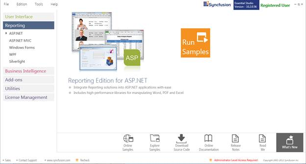
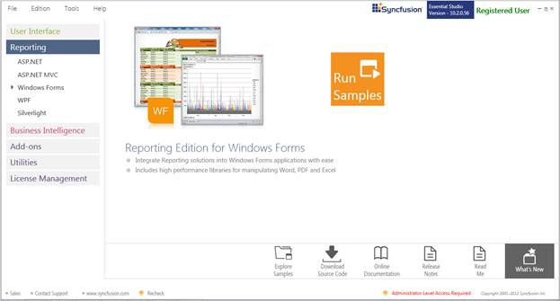
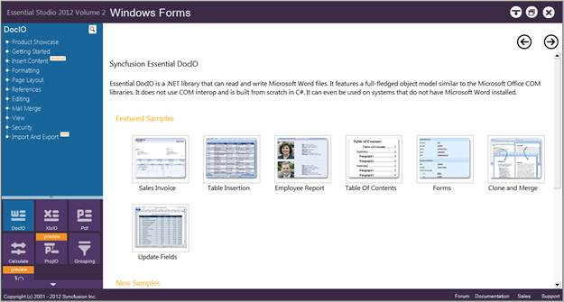
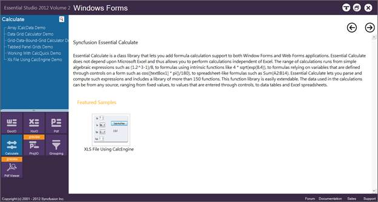
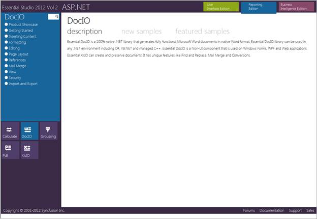
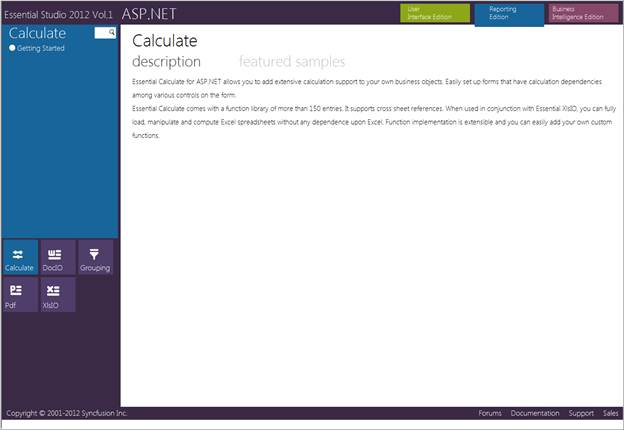

::: {style="DISPLAY: none"}
{#d2h_url_template}{#d2h_package_url style="WIDTH: 0px; DISPLAY: none; HEIGHT: 0px"}
:::

::::: {#nsbanner .d2h_main_nsbanner style="BORDER-BOTTOM: #999999 1px solid; POSITION: relative; PADDING-BOTTOM: 0px; BACKGROUND-COLOR: transparent; PADDING-LEFT: 0px; PADDING-RIGHT: 0px; DISPLAY: none; BORDER-TOP: #999999 1px solid; PADDING-TOP: 0px; LEFT: 0px"}
:::: {#TitleRow .d2h_main_titlerow style="PADDING-BOTTOM: 4px; BACKGROUND-COLOR: transparent; PADDING-LEFT: 22px; WIDTH: 100%; PADDING-RIGHT: 10px; DISPLAY: none; PADDING-TOP: 4px"}
::: {#ienav .d2h_main_ienav style="DISPLAY: none"}
{#D2HPrevious .D2HPreviousEnabled}  {#D2HNext .D2HNextEnabled}
:::
::::
:::::

:::::: {#nstext .d2h_main_nstext style="PADDING-BOTTOM: 10px; BACKGROUND-COLOR: transparent; PADDING-LEFT: 22px; PADDING-RIGHT: 10px; HEIGHT: 100%; OVERFLOW: auto; PADDING-TOP: 5px" hasuserbackground="true" valign="bottom"}
::: {#d2h_breadcrumbs .d2h_breadcrumbs}
[Essential Studio User Guide Documentation](ms-xhelp:///?Id=12457748-09e3-4d74-a240-8e049cedf030){.d2h_breadcrumbsNormal}[ \> ]{.d2h_breadcrumbsLinkSeparator}[Reporting Edition](ms-xhelp:///?Id=027aa5b6-6676-4f93-ad23-c20e8c45792e){.d2h_breadcrumbsNormal}[ \> ]{.d2h_breadcrumbsLinkSeparator}[Essential Calculate](ms-xhelp:///?Id=2ea52c7f-a332-43bd-9ca7-2ea0898ff54e){.d2h_breadcrumbsNormal}[ \> ]{.d2h_breadcrumbsLinkSeparator}[Installation and Deployment](ms-xhelp:///?Id=3bd0a42b-7f09-45c5-a53e-95de0392967b){.d2h_breadcrumbsNormal}
:::

## Samples and Installation {#samples-and-installation style="tab-stops: 0pt"}

 

Where to Find Samples?

This section covers the location of the installed samples and describes the procedure to run the samples through the sample browser and online. It also lists the location of utilities, assemblies, and source code.

 

Sample Installation Location

The Windows Forms Calculate samples are installed in the following location, locally on the disk:

**\[Install Location\]:\\\...\\Syncfusion\\Essential Studio\\\[Version Number\]\\Windows\\Calculate.Windows\\Samples\\2.0**

 

The Calculate Web samples are installed in the following location, locally on the disk:

**\[Install Location\]:\\\...\\Syncfusion\\Essential Studio\\\[Version Number\]\\Web\\Calculate.Web\\Samples\\3.5**

 

Viewing Samples

To view the samples:

1.   Click **Start** [à]{style="FONT-FAMILY: Wingdings"} **All Programs** [à]{style="FONT-FAMILY: Wingdings"} **Syncfusion** [à]{style="FONT-FAMILY: Wingdings"} **Essential Studio \<version number\>** [à]{style="FONT-FAMILY: Wingdings"} **Dashboard**.

[]{style="FONT-FAMILY: 'Trebuchet MS','sans-serif'; COLOR: #15428b; FONT-SIZE: 9pt"} 

Essential Studio UI Edition Samples are listed by default.

 

{border="0"}

 

Figure 2: Syncfusion Essential Studio Dashboard

2.   Select **Reporting** edition.

 

{border="0"}

Figure 3: Syncfusion Essential Reporting Samples

 

3.   The steps to view the **Calculate** samples in various platforms are discussed below:

 

Windows Forms

1.   In the **Dashboard** window, click **Run Samples for Windows Forms** under **Reporting Edition** panel.

::: {style="BORDER-BOTTOM: windowtext 1pt solid; BORDER-LEFT: medium none; PADDING-BOTTOM: 1pt; MARGIN-TOP: 9pt; PADDING-LEFT: 0pt; PADDING-RIGHT: 0pt; MARGIN-BOTTOM: 9pt; BORDER-TOP: windowtext 1pt solid; BORDER-RIGHT: medium none; PADDING-TOP: 1pt"}
 

{border="0"} Note: You can view the samples in any of the following three ways:
:::

[·      ]{style="FONT-FAMILY: Symbol"}**Run Samples** -- Click to view the locally installed samples.

[·      ]{style="FONT-FAMILY: Symbol"}**Online Samples** -- Click to view online samples.

[·      ]{style="FONT-FAMILY: Symbol"}**Explore Samples --** Explore Windows Forms samples on disk.

 

{border="0"}

Figure 4: View Options Displayed for Samples

The **Windows Forms** Sample Browser window is displayed.

{border="0"}

Figure 5: Calculate Samples displayed on the Contents Pane

[]{style="FONT-FAMILY: 'Trebuchet MS','sans-serif'; COLOR: #15428b; FONT-SIZE: 9pt"} 

2.   Click **Calculate** in the **Contents** tab on the bottom-left pane.  The **Calculate** samples are displayed.

{border="0"}

Figure 6: Calculate samples displayed in the Windows Forms Sample Browser

[]{style="FONT-FAMILY: 'Trebuchet MS','sans-serif'; COLOR: #15428b; FONT-SIZE: 9pt"} 

3.   Select any sample and browse through the features.

 

[]{style="FONT-FAMILY: 'Trebuchet MS','sans-serif'; COLOR: #15428b; FONT-SIZE: 9pt"} 

ASP.NET

**[]{style="FONT-FAMILY: 'Trebuchet MS','sans-serif'; COLOR: #15428b; FONT-SIZE: 9pt"}** 

1.   In the **Dashboard** window, click **Run Samples for ASP.NET** under **Reporting** Edition panel. The **ASP.NET** Sample Browser window is displayed.

[]{style="FONT-FAMILY: 'Trebuchet MS','sans-serif'; COLOR: #15428b; FONT-SIZE: 9pt"} 

::: {style="BORDER-BOTTOM: windowtext 1pt solid; BORDER-LEFT: medium none; PADDING-BOTTOM: 1pt; MARGIN-TOP: 9pt; PADDING-LEFT: 0pt; PADDING-RIGHT: 0pt; MARGIN-BOTTOM: 9pt; BORDER-TOP: windowtext 1pt solid; BORDER-RIGHT: medium none; PADDING-TOP: 1pt"}
{border="0"} Note: You can view the samples in any of the three options displayed.
:::

[]{style="FONT-FAMILY: 'Trebuchet MS','sans-serif'; COLOR: #15428b; FONT-SIZE: 9pt"} 

{border="0"}[]{style="FONT-FAMILY: 'Trebuchet MS','sans-serif'; COLOR: #15428b; FONT-SIZE: 9pt"}

Figure 7: ASP.NET Sample Browser

[]{style="FONT-FAMILY: 'Trebuchet MS','sans-serif'; COLOR: #15428b; FONT-SIZE: 9pt"} 

2.   Click **Calculate** from the bottom-left pane**.** The Calculate samples are displayed.

[]{style="LINE-HEIGHT: 115%; FONT-FAMILY: 'Trebuchet MS','sans-serif'; COLOR: #15428b; FONT-SIZE: 9pt"} 

{border="0"}

Figure 8: Calculate samples displayed in the ASP.NET Sample Browser

[]{style="LINE-HEIGHT: 115%; FONT-FAMILY: 'Trebuchet MS','sans-serif'; COLOR: #15428b; FONT-SIZE: 9pt"} 

3.   Select any sample and browse through the features.

[]{style="FONT-FAMILY: 'Trebuchet MS','sans-serif'; COLOR: #15428b; FONT-SIZE: 9pt"} 

[]{style="FONT-FAMILY: 'Trebuchet MS','sans-serif'; COLOR: #15428b; FONT-SIZE: 9pt"} 

Source Code Location

**Windows Forms Source Code**

The default location of the Windows Forms Calculate source code is:

**\[System Drive\]:\\Program Files\\Syncfusion\\Essential Studio\\\[Version Number\]\\Windows\\Calculate.Windows\\Src**

 

**ASP.NET Source Code**

The default location of the ASP.NET Calculate source code is:

**\[System Drive\]:\\Program Files\\Syncfusion\\Essential Studio\\\[Version Number\]\\Web\\Calculate.Web\\Src**

 

[]{#related-topics}
::::::
