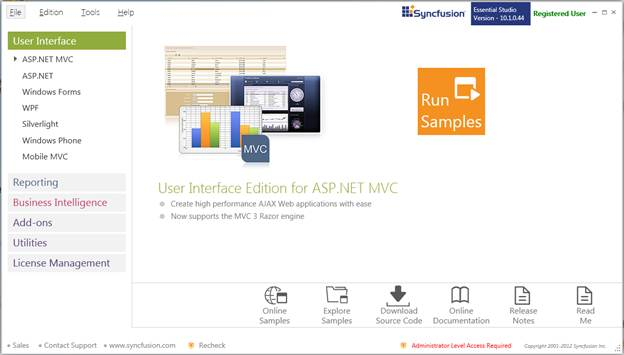
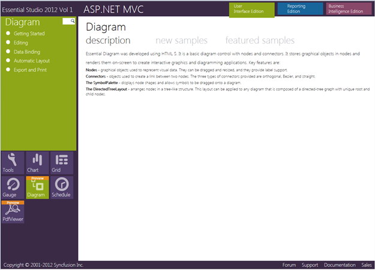

::: {style="DISPLAY: none"}
{#d2h_url_template}{#d2h_package_url style="WIDTH: 0px; DISPLAY: none; HEIGHT: 0px"}
:::

::::: {#nsbanner .d2h_main_nsbanner style="BORDER-BOTTOM: #999999 1px solid; POSITION: relative; PADDING-BOTTOM: 0px; BACKGROUND-COLOR: transparent; PADDING-LEFT: 0px; PADDING-RIGHT: 0px; DISPLAY: none; BORDER-TOP: #999999 1px solid; PADDING-TOP: 0px; LEFT: 0px"}
:::: {#TitleRow .d2h_main_titlerow style="PADDING-BOTTOM: 4px; BACKGROUND-COLOR: transparent; PADDING-LEFT: 22px; WIDTH: 100%; PADDING-RIGHT: 10px; DISPLAY: none; PADDING-TOP: 4px"}
::: {#ienav .d2h_main_ienav style="DISPLAY: none"}
{#D2HPrevious .D2HPreviousEnabled}  {#D2HNext .D2HNextEnabled}
:::
::::
:::::

:::: {#nstext .d2h_main_nstext style="PADDING-BOTTOM: 10px; BACKGROUND-COLOR: transparent; PADDING-LEFT: 22px; PADDING-RIGHT: 10px; HEIGHT: 100%; OVERFLOW: auto; PADDING-TOP: 5px" hasuserbackground="true" valign="bottom"}
::: {#d2h_breadcrumbs .d2h_breadcrumbs}
[Essential Studio User Guide Documentation](ms-xhelp:///?Id=12457748-09e3-4d74-a240-8e049cedf030){.d2h_breadcrumbsNormal}[ \> ]{.d2h_breadcrumbsLinkSeparator}[User Interface Edition](ms-xhelp:///?Id=c29296b7-531c-413b-a0ec-488ca1f7f669){.d2h_breadcrumbsNormal}[ \> ]{.d2h_breadcrumbsLinkSeparator}[Essential ASP.NET MVC](ms-xhelp:///?Id=4b14e7d1-65c4-4f67-b1aa-2c37709905a5){.d2h_breadcrumbsNormal}[ \> ]{.d2h_breadcrumbsLinkSeparator}[Essential Diagram]{.d2h_breadcrumbsContentsOnly}[ \> ]{.d2h_breadcrumbsLinkSeparator}[Installation and Deployment](ms-xhelp:///?Id=3536d6a2-18cc-45ee-af6d-81a609437a10){.d2h_breadcrumbsNormal}
:::

## Samples and Location {#samples-and-location style="tab-stops: 0pt"}

This section covers the location of the installed samples and describes the procedure to run the samples through the sample browser and online. It also provides the location of the source code. 

Sample Installation Location 

The Essential Diagram MVC samples are installed in the following location on your local disk drive:

***[\<Install Location\>\\Syncfusion\\EssentialStudio\\\<Version Number\>\\MVC\\Diagram.MVC\\Samples\\3.5]{style="COLOR: black"}**** *

Viewing Samples

To view the samples, follow the steps given below:

1.   Click **Start** \> **All Programs** \> **Syncfusion** \> **Essential Studio \<version number\>** \> **Dashboard**. The **Syncfusion Essential Studio Dashboard \<version number\>** window is displayed.

 

{border="0"}

Figure 3: Syncfusion Essential Studio Dashboard

 

2.   In the **Dashboard** window, click **Run Samples for ASP.NET MVC** in the **User Interface Edition** panel. The **ASP.NET MVC Sample Browser** window is displayed.

 

 

{border="0"}

Figure 4: MVC Edition Sample Browser

 

3.   Essential Tools samples are displayed by default. Click the **Diagram** object in the fish-eye panel provided at the bottom of the window. The Essential Diagram samples are displayed.

 

{border="0"}

Figure 5: Essential Diagram MVC Sample 

4.  [Select any sample given in the **Featured Samples** section and browse through the features. ]{style="FONT-FAMILY: 'Arial','sans-serif'"}

Source Code Location 

The default location of the Essential Diagram for MVC source code is: 

***\[System Drive\]:\\Program Files\\Syncfusion\\Essential Studio\\\<Version Number\>\\MVC\\Diagram.Mvc\\Src***

[]{#related-topics}
::::
