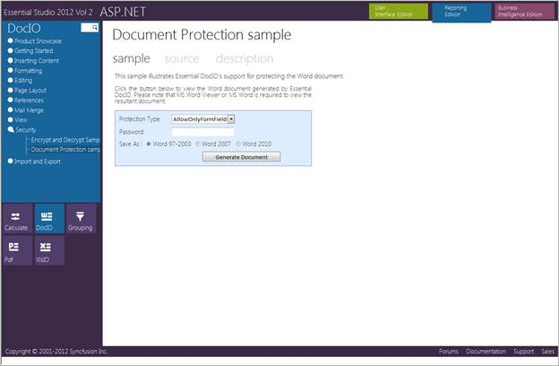
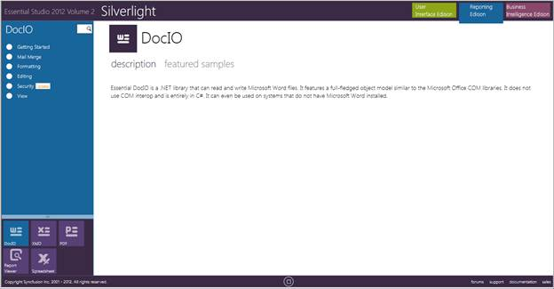

::: {style="DISPLAY: none"}
{#d2h_url_template}{#d2h_package_url style="WIDTH: 0px; DISPLAY: none; HEIGHT: 0px"}
:::

::::: {#nsbanner .d2h_main_nsbanner style="BORDER-BOTTOM: #999999 1px solid; POSITION: relative; PADDING-BOTTOM: 0px; BACKGROUND-COLOR: transparent; PADDING-LEFT: 0px; PADDING-RIGHT: 0px; DISPLAY: none; BORDER-TOP: #999999 1px solid; PADDING-TOP: 0px; LEFT: 0px"}
:::: {#TitleRow .d2h_main_titlerow style="PADDING-BOTTOM: 4px; BACKGROUND-COLOR: transparent; PADDING-LEFT: 22px; WIDTH: 100%; PADDING-RIGHT: 10px; DISPLAY: none; PADDING-TOP: 4px"}
::: {#ienav .d2h_main_ienav style="DISPLAY: none"}
{#D2HPrevious .D2HPreviousEnabled}  {#D2HNext .D2HNextEnabled}
:::
::::
:::::

::::::::: {#nstext .d2h_main_nstext style="PADDING-BOTTOM: 10px; BACKGROUND-COLOR: transparent; PADDING-LEFT: 22px; PADDING-RIGHT: 10px; HEIGHT: 100%; OVERFLOW: auto; PADDING-TOP: 5px" hasuserbackground="true" valign="bottom"}
::: {#d2h_breadcrumbs .d2h_breadcrumbs}
[Essential Studio User Guide Documentation](ms-xhelp:///?Id=12457748-09e3-4d74-a240-8e049cedf030){.d2h_breadcrumbsNormal}[ \> ]{.d2h_breadcrumbsLinkSeparator}[Reporting Edition](ms-xhelp:///?Id=027aa5b6-6676-4f93-ad23-c20e8c45792e){.d2h_breadcrumbsNormal}[ \> ]{.d2h_breadcrumbsLinkSeparator}[Essential DocIO](ms-xhelp:///?Id=b88d77b3-4c51-460f-a761-d2ef6d5b0ca6){.d2h_breadcrumbsNormal}[ \> ]{.d2h_breadcrumbsLinkSeparator}[Installation and Deployment](ms-xhelp:///?Id=5ad3423d-98df-46d7-8e7f-4d6f048bbb98){.d2h_breadcrumbsNormal}
:::

## Samples and Location {#samples-and-location style="tab-stops: 0pt"}

 

This section covers the location of the installed samples and describes the procedure to run the samples through the sample browser and online. It also lists the location of source code.

 

Sample Installation Locations

 

Sample install locations for different platforms are listed below:

 

[·      ]{style="FONT-FAMILY: Symbol"}**Windows Forms-**The Windows Forms samples are installed in the following location:

 

***\...\\My Documents\\Syncfusion\\EssentialStudio\\Version Number\\Windows\\DocIO.Windows\\Samples\\2.0***

*[]{style="COLOR: black"}* 

[·      ]{style="FONT-FAMILY: Symbol"}**ASP.NET-**The ASP.NET samples are installed in the following location:

 

***\...\\My Documents\\Syncfusion\\EssentialStudio\\Version Number\\Web\\DocIO.Web\\Samples\\2.0***

*[]{style="COLOR: black"}* 

[·      ]{style="FONT-FAMILY: Symbol"}**WPF-**The WPF samples are installed in the following location:

 

***\...\\My Documents\\Syncfusion\\EssentialStudio\\Version Number\\WPF\\DocIO.WPF\\Samples\\3.5***

**** 

[·      ]{style="FONT-FAMILY: Symbol"}**Silverlight-**The Silverlight samples are installed in the following location:

**** 

***\...\\My Documents\\Syncfusion\\EssentialStudio\\Version Number\\Silverlight\\DocIO.Silverlight\\Samples\\3.5***

**** 

[·      ]{style="FONT-FAMILY: Symbol"}**ASP.NET MVC-**The ASP.NET MVC samples are installed in the following location:

**** 

***\...\\My Documents\\Syncfusion\\EssentialStudio\\\<Version Number\>\\MVC\\dociomvc\\samples\\3.5***

 

Viewing Samples

 

To view the samples, follow the steps below:

 

1.   Click **Start** -\> **All Programs**-\> **Syncfusion** -\> **Essential Studio \<x.x.x.x\>** -\> **Dashboard**. The UI samples are displayed by default.[]{style="COLOR: red"}

2.   Select **Reporting**.[]{style="COLOR: red"}

 

{border="0"}

Figure 2: Syncfusion Essential Studio Reporting Dashboard

 

The steps to view the DocIO samples in various platforms are discussed below:

 

Windows

 

1.   In the Dashboard window, click **Run Samples** for **Windows Forms** under **Reporting** Edition panel. The **Windows Forms** Sample Browser window is displayed.

{border="0"}

Figure 3: Reporting Edition Windows Forms Sample Browser

::: {style="BORDER-BOTTOM: windowtext 1pt solid; BORDER-LEFT: medium none; PADDING-BOTTOM: 1pt; MARGIN-TOP: 9pt; PADDING-LEFT: 0pt; PADDING-RIGHT: 0pt; MARGIN-BOTTOM: 9pt; BORDER-TOP: windowtext 1pt solid; BORDER-RIGHT: medium none; PADDING-TOP: 1pt"}
{border="0"}Note: You can view the samples in any of the following three ways:
:::

 

[·      ]{style="FONT-FAMILY: Symbol"}**Run Samples**-Click to view the locally installed samples.

[·      ]{style="FONT-FAMILY: Symbol"}**Online Samples**-Click to view online samples.

[·      ]{style="FONT-FAMILY: Symbol"}**Explore Samples**-Explore Windows Forms samples on disk.

 

 

2.   Click **DocIO** from bottom-left pane. The DocIO samples are displayed.

 

{border="0"}

Figure 4: DocIO Samples Displayed in the Windows Forms Sample Browser

 

3.   Select any sample and browse through the features.

 

ASP.NET

 

1.   In the Dashboard window, click **Run Samples** for **ASP.NET** under **Reporting Edition** panel. The **ASP.NET** Sample Browser window is displayed.

 

::: {style="BORDER-BOTTOM: windowtext 1pt solid; BORDER-LEFT: medium none; PADDING-BOTTOM: 1pt; MARGIN-TOP: 9pt; PADDING-LEFT: 0pt; PADDING-RIGHT: 0pt; MARGIN-BOTTOM: 9pt; BORDER-TOP: windowtext 1pt solid; BORDER-RIGHT: medium none; PADDING-TOP: 1pt"}
{border="0"}Note: You can view the samples in any one of the three options displayed:
:::

 

{border="0"}

Figure 5: ASP.NET Sample Browser

 

2.   Select any **DocIO** sample and browse through the features.

 

{border="0"}

Figure 6: Documentation protection sample

 

**WPF**

 

1.   In the Dashboard window, click **Run Samples** for **WPF** under **Reporting Edition** panel. The **WPF Sample Browser** window is displayed.

 

::: {style="BORDER-BOTTOM: windowtext 1pt solid; BORDER-LEFT: medium none; PADDING-BOTTOM: 1pt; MARGIN-TOP: 9pt; PADDING-LEFT: 0pt; PADDING-RIGHT: 0pt; MARGIN-BOTTOM: 9pt; BORDER-TOP: windowtext 1pt solid; BORDER-RIGHT: medium none; PADDING-TOP: 1pt"}
{border="0"}Note: You can view the samples in any one of the three options displayed:
:::

 

{border="0"}

Figure 7: DocIO Samples Displayed in the WPF Sample Browser

 

2.   Select any DocIO sample that is displayed on the left pane and browse through the features.

 

Silverlight

 

1.   In the **Dashboard** window, click **Run Samples for Silverlight** under **Reporting** edition panel. The **Silverlight** Sample Browser window is displayed.

 

::: {style="BORDER-BOTTOM: windowtext 1pt solid; BORDER-LEFT: medium none; PADDING-BOTTOM: 1pt; MARGIN-TOP: 9pt; PADDING-LEFT: 0pt; PADDING-RIGHT: 0pt; MARGIN-BOTTOM: 9pt; BORDER-TOP: windowtext 1pt solid; BORDER-RIGHT: medium none; PADDING-TOP: 1pt"}
{border="0"}Note: You can view the samples in any one of the three options displayed:
:::

*[]{style="COLOR: red"}* 

{border="0"}

Figure 8: Silverlight Sample Browser

 

2.   Select any DocIO sample that is displayed on the right pane and browse through the features.

 

**ASP.NET MVC**

 

1.   In the Dashboard window, click **Run Samples** for ASP.NET MVC under **Reporting** Edition panel. The **ASP.NET MVC** Sample Browser window is displayed.

 

::: {style="BORDER-BOTTOM: windowtext 1pt solid; BORDER-LEFT: medium none; PADDING-BOTTOM: 1pt; MARGIN-TOP: 9pt; PADDING-LEFT: 0pt; PADDING-RIGHT: 0pt; MARGIN-BOTTOM: 9pt; BORDER-TOP: windowtext 1pt solid; BORDER-RIGHT: medium none; PADDING-TOP: 1pt"}
{border="0"}Note: You can view the samples in any one of the three options displayed:
:::

{border="0"}

Figure 9: DocIO Samples Displayed in the ASP.NET MVC Sample Browser

 

2.   Select any DocIO sample and browse through the features.

 

Source Code Location

 

The source code for DocIO under different platforms is available at the following default locations:

 

[·      ]{style="FONT-FAMILY: Symbol"}***Windows-\[System Drive\]:\\Program Files\\Syncfusion\\Essential Studio\\\[Version Number\]\\Windows\\DocIO.Windows\\Src***

[·      ]{style="FONT-FAMILY: Symbol"}***ASP.NET-\[System Drive\]:\\Program Files\\Syncfusion\\Essential Studio\\\[Version Number\]\\Web\\DocIO.Web\\Src***

[·      ]{style="FONT-FAMILY: Symbol"}***WPF-\[System Drive\]:\\Program Files\\Syncfusion\\Essential Studio\\\[Version Number\]\\WPF\\DocIO.WPF\\Src***

[·      ]{style="FONT-FAMILY: Symbol"}***ASP.NET MVC-\[System Drive\]:\\Program Files\\Syncfusion\\Essential Studio\\\[Version Number\]\\MVC\\DocIO.MVC\\Src***

**** 

[]{#related-topics}
:::::::::
