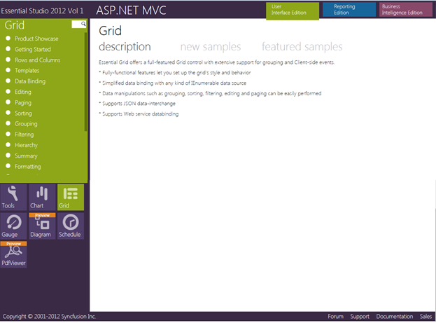

::: {style="DISPLAY: none"}
{#d2h_url_template}{#d2h_package_url style="WIDTH: 0px; DISPLAY: none; HEIGHT: 0px"}
:::

::::: {#nsbanner .d2h_main_nsbanner style="BORDER-BOTTOM: #999999 1px solid; POSITION: relative; PADDING-BOTTOM: 0px; BACKGROUND-COLOR: transparent; PADDING-LEFT: 0px; PADDING-RIGHT: 0px; DISPLAY: none; BORDER-TOP: #999999 1px solid; PADDING-TOP: 0px; LEFT: 0px"}
:::: {#TitleRow .d2h_main_titlerow style="PADDING-BOTTOM: 4px; BACKGROUND-COLOR: transparent; PADDING-LEFT: 22px; WIDTH: 100%; PADDING-RIGHT: 10px; DISPLAY: none; PADDING-TOP: 4px"}
::: {#ienav .d2h_main_ienav style="DISPLAY: none"}
{#D2HPrevious .D2HPreviousEnabled}  {#D2HNext .D2HNextEnabled}
:::
::::
:::::

::::: {#nstext .d2h_main_nstext style="PADDING-BOTTOM: 10px; BACKGROUND-COLOR: transparent; PADDING-LEFT: 22px; PADDING-RIGHT: 10px; HEIGHT: 100%; OVERFLOW: auto; PADDING-TOP: 5px" hasuserbackground="true" valign="bottom"}
::: {#d2h_breadcrumbs .d2h_breadcrumbs}
[Essential Studio User Guide Documentation](ms-xhelp:///?Id=12457748-09e3-4d74-a240-8e049cedf030){.d2h_breadcrumbsNormal}[ \> ]{.d2h_breadcrumbsLinkSeparator}[User Interface Edition](ms-xhelp:///?Id=c29296b7-531c-413b-a0ec-488ca1f7f669){.d2h_breadcrumbsNormal}[ \> ]{.d2h_breadcrumbsLinkSeparator}[Essential ASP.NET MVC](ms-xhelp:///?Id=4b14e7d1-65c4-4f67-b1aa-2c37709905a5){.d2h_breadcrumbsNormal}[ \> ]{.d2h_breadcrumbsLinkSeparator}[Essential Grid]{.d2h_breadcrumbsContentsOnly}[ \> ]{.d2h_breadcrumbsLinkSeparator}[Installation and Deployment](ms-xhelp:///?Id=e0d8eb50-bc9c-49ef-9156-be9160532ba2){.d2h_breadcrumbsNormal}
:::

## Samples and Location {#samples-and-location style="tab-stops: 0pt"}

 

This section covers the location of the installed samples and describes the procedure to run the samples through the sample browser and online. It also provides the location of the source code.

[]{style="FONT-FAMILY: 'Calibri','sans-serif'; COLOR: black"} 

Samples Installation Location

[                ]{style="FONT-FAMILY: 'Calibri','sans-serif'; COLOR: black"}

[The Grid MVC samples are installed in the following location, locally on the disk:]{style="COLOR: black"}

[]{style="FONT-FAMILY: 'Calibri','sans-serif'; COLOR: black"} 

***\<Install Location\>\\Syncfusion\\EssentialStudio\\\<Version Number\>\\MVC\\gridmvc\\samples\\3.5***

[]{style="FONT-FAMILY: 'Calibri','sans-serif'; COLOR: black"} 

Viewing Samples

[]{style="FONT-FAMILY: 'Calibri','sans-serif'; COLOR: black"} 

To view the samples, follow the steps below:

[]{style="FONT-FAMILY: 'Calibri','sans-serif'; COLOR: black"} 

1.   Click **Start**\>**All Programs**\>**Syncfusion**\>**Essential Studio** **\<version number\>** \>**Dashboard**. The **Syncfusion Essential Studio Dashboard \<version number\>** window is displayed.

 

[]{style="FONT-FAMILY: 'Calibri','sans-serif'; COLOR: black"} 

{border="0"}

Figure 2: Syncfusion Essential Studio Dashboard

[]{style="FONT-FAMILY: 'Calibri','sans-serif'; COLOR: black"} 

2.   In the **Dashboard** window, click **ASP.NET MVC** in the **User Interface** panel and click **Run Samples**. The **ASP.NET MVC Sample Browser** window is displayed.

[]{style="FONT-FAMILY: 'Calibri','sans-serif'; COLOR: black"} 

::: {style="BORDER-BOTTOM: windowtext 1pt solid; BORDER-LEFT: medium none; PADDING-BOTTOM: 1pt; MARGIN-TOP: 9pt; PADDING-LEFT: 0pt; PADDING-RIGHT: 0pt; MARGIN-BOTTOM: 9pt; BORDER-TOP: windowtext 1pt solid; BORDER-RIGHT: medium none; PADDING-TOP: 1pt"}
{border="0"}Note: You can view the samples in any of the following three ways:
:::

[]{style="FONT-FAMILY: 'Calibri','sans-serif'; COLOR: black"} 

[·      ]{style="FONT-FAMILY: Symbol"}**Run Samples**---Click to view the locally installed samples.

[·      ]{style="FONT-FAMILY: Symbol"}**Online Samples**---Click to view online samples.

[·      ]{style="FONT-FAMILY: Symbol"}**Explore Samples**---Explore ASP.NET MVC samples on disk.

[]{style="FONT-FAMILY: 'Calibri','sans-serif'; COLOR: black"} 

{border="0"}

Figure 3: ASP.NET MVC Sample Browser

 

3.   Click **Grid** in the bottom-left of the browser where other ASP.NET MVC products are displayed. The Grid samples are displayed.

[]{style="FONT-FAMILY: 'Calibri','sans-serif'; COLOR: black"} 

{border="0"}

Figure 4: Grid Samples Displayed in the ASP.NET MVC Sample Browser

 

4.   Select any sample and browse through its features.

[]{style="FONT-FAMILY: 'Calibri','sans-serif'; COLOR: black"} 

Source Code Location

[]{style="FONT-FAMILY: 'Calibri','sans-serif'; COLOR: black"} 

The default location of the Essential Grid for MVC source code is:

 

**\[System Drive\]:\\Program Files\\Syncfusion\\Essential Studio\\\[Version Number\]\\MVC\\Grid.MVC\\Src**

[]{#related-topics}
:::::
