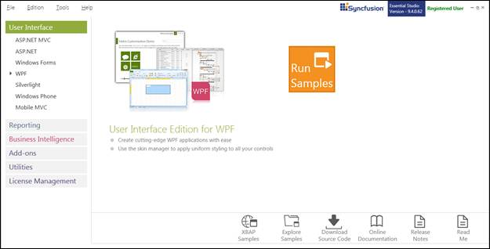
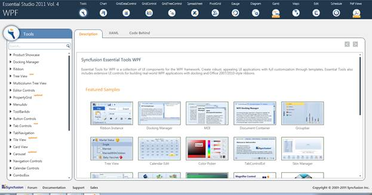
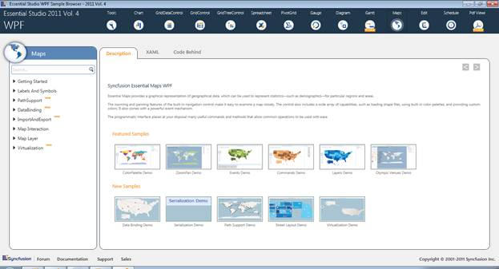

::: {style="DISPLAY: none"}
{#d2h_url_template}{#d2h_package_url style="WIDTH: 0px; DISPLAY: none; HEIGHT: 0px"}
:::

::::: {#nsbanner .d2h_main_nsbanner style="BORDER-BOTTOM: #999999 1px solid; POSITION: relative; PADDING-BOTTOM: 0px; BACKGROUND-COLOR: transparent; PADDING-LEFT: 0px; PADDING-RIGHT: 0px; DISPLAY: none; BORDER-TOP: #999999 1px solid; PADDING-TOP: 0px; LEFT: 0px"}
:::: {#TitleRow .d2h_main_titlerow style="PADDING-BOTTOM: 4px; BACKGROUND-COLOR: transparent; PADDING-LEFT: 22px; WIDTH: 100%; PADDING-RIGHT: 10px; DISPLAY: none; PADDING-TOP: 4px"}
::: {#ienav .d2h_main_ienav style="DISPLAY: none"}
{#D2HPrevious .D2HPreviousEnabled}  {#D2HNext .D2HNextEnabled}
:::
::::
:::::

:::: {#nstext .d2h_main_nstext style="PADDING-BOTTOM: 10px; BACKGROUND-COLOR: transparent; PADDING-LEFT: 22px; PADDING-RIGHT: 10px; HEIGHT: 100%; OVERFLOW: auto; PADDING-TOP: 5px" hasuserbackground="true" valign="bottom"}
::: {#d2h_breadcrumbs .d2h_breadcrumbs}
[Essential Studio User Guide Documentation](ms-xhelp:///?Id=12457748-09e3-4d74-a240-8e049cedf030){.d2h_breadcrumbsNormal}[ \> ]{.d2h_breadcrumbsLinkSeparator}[User Interface Edition](ms-xhelp:///?Id=c29296b7-531c-413b-a0ec-488ca1f7f669){.d2h_breadcrumbsNormal}[ \> ]{.d2h_breadcrumbsLinkSeparator}[Essential WPF](ms-xhelp:///?Id=7f4f82c5-151c-4262-94d0-75c4626c77bc){.d2h_breadcrumbsNormal}[ \> ]{.d2h_breadcrumbsLinkSeparator}[Essential Maps]{.d2h_breadcrumbsContentsOnly}[ \> ]{.d2h_breadcrumbsLinkSeparator}[Installation and Deployment](ms-xhelp:///?Id=e7e409ba-7ec5-4ae2-b082-a689cbe91396){.d2h_breadcrumbsNormal}
:::

## Samples and Location {#samples-and-location style="tab-stops: 0pt"}

Sample Installation Location

Essential Maps for WPF samples are installed under the following location

 

C:\\Syncfusion\\EssentialStudio\\\<Version Number\>\\WPF\\Maps.WPF\\Samples

 

Viewing Samples

To view the samples:

 

1.   Click Start\--\>All Programs\--\>Syncfusion\--\>Essential Studio \< v9.4.0.62\> \--\>Dashboard.

 

The **Essential Studio Enterprise Edition** window is displayed.

 

{border="0"}

Figure 2: Essential Studio Dashboard

[]{style="FONT-SIZE: 9pt"} 

        The User Interface Edition panel is displayed by default.  

2.   Click the **RunSamples** link. The Essential Studio WPF Edition sample browser is displayed.

 

{border="0"}

Figure 3: WPF Edition Sample Browser

[]{style="FONT-SIZE: 9pt"} 

3.   Tools WPF sample browser will be displayed by default. Select Maps from the Panel displayed at the top of the page.

 

{border="0"}

Figure 4: Essential Maps for WPF Sample Browser

 

4.   Select any sample from the samples provided and browse through the features.

 

Source Code Location

The default location of the Essential Maps WPF source code is:

 

\[System Drive\]:\\Program Files\\Syncfusion\\Essential Studio\\\[Version Number\]\\WPF\\Maps.WPF\\Src

[]{#related-topics}
::::
