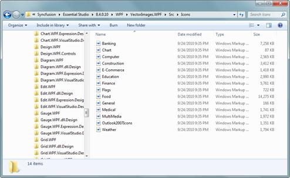
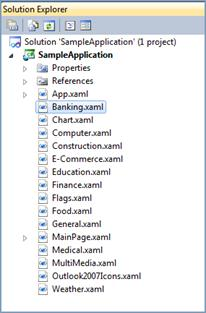

::: {style="DISPLAY: none"}
{#d2h_url_template}{#d2h_package_url style="WIDTH: 0px; DISPLAY: none; HEIGHT: 0px"}
:::

::: {.d2h_secondary_topic style="PADDING-BOTTOM: 10pt; MARGIN: 0pt; PADDING-LEFT: 0pt; PADDING-RIGHT: 0pt; PADDING-TOP: 0pt"}
#### Samples and Source location {#samples-and-source-location style="tab-stops: 0pt"}

 

The Essential Tools WPF samples are installed under the following location, locally on the disk.

 

\\Syncfusion\\EssentialStudio\\\<Version Number\>\\WPF\\Tools.WPF\\Samples\\3.5

 

The Vector Image source will shipped along with your Essential Studio installation, which can be find under the following location,

\\Syncfusion\\EssentialStudio\\\<Version Number\>\\WPF\\VectorImages.WPF\\Src\\Icons

[]{style="FONT-FAMILY: 'Trebuchet MS','sans-serif'; COLOR: #15428b; FONT-SIZE: 9pt"} 

{border="0"}

Figure 1176: Vector Image Source

 

 

You can directly merge the xaml files into the application to make use of the Vector Images in your application.

 

{border="0"}

Figure 1177: Vector Image Resource dictionaries added into a sample application

 

[]{#related-topics}
:::
