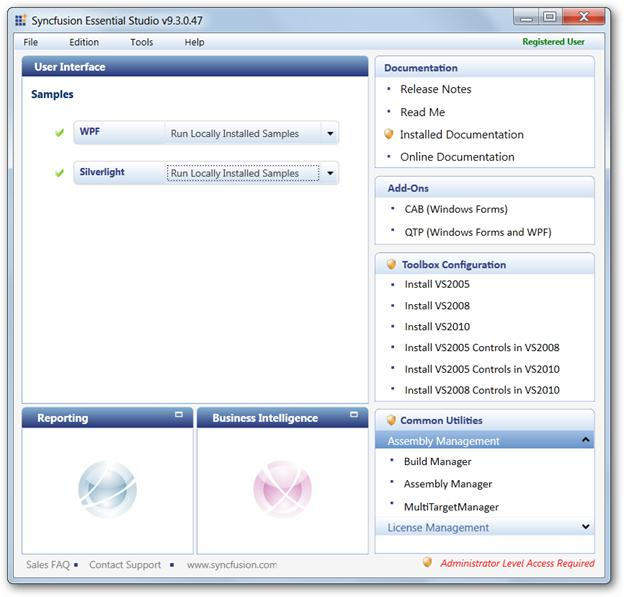
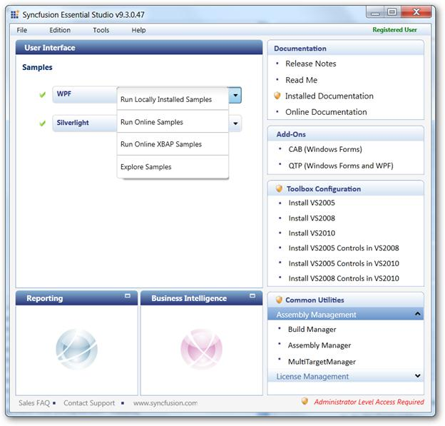
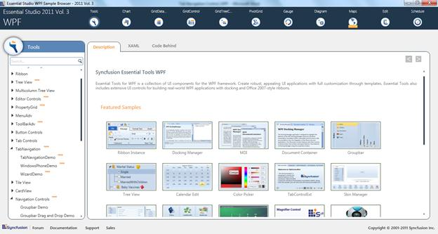

::: {style="DISPLAY: none"}
{#d2h_url_template}{#d2h_package_url style="WIDTH: 0px; DISPLAY: none; HEIGHT: 0px"}
:::

::::: {#nsbanner .d2h_main_nsbanner style="BORDER-BOTTOM: #999999 1px solid; POSITION: relative; PADDING-BOTTOM: 0px; BACKGROUND-COLOR: transparent; PADDING-LEFT: 0px; PADDING-RIGHT: 0px; DISPLAY: none; BORDER-TOP: #999999 1px solid; PADDING-TOP: 0px; LEFT: 0px"}
:::: {#TitleRow .d2h_main_titlerow style="PADDING-BOTTOM: 4px; BACKGROUND-COLOR: transparent; PADDING-LEFT: 22px; WIDTH: 100%; PADDING-RIGHT: 10px; DISPLAY: none; PADDING-TOP: 4px"}
::: {#ienav .d2h_main_ienav style="DISPLAY: none"}
{#D2HPrevious .D2HPreviousEnabled}  {#D2HNext .D2HNextEnabled}
:::
::::
:::::

:::: {#nstext .d2h_main_nstext style="PADDING-BOTTOM: 10px; BACKGROUND-COLOR: transparent; PADDING-LEFT: 22px; PADDING-RIGHT: 10px; HEIGHT: 100%; OVERFLOW: auto; PADDING-TOP: 5px" hasuserbackground="true" valign="bottom"}
::: {#d2h_breadcrumbs .d2h_breadcrumbs}
[Essential Studio User Guide Documentation](ms-xhelp:///?Id=12457748-09e3-4d74-a240-8e049cedf030){.d2h_breadcrumbsNormal}[ \> ]{.d2h_breadcrumbsLinkSeparator}[User Interface Edition](ms-xhelp:///?Id=c29296b7-531c-413b-a0ec-488ca1f7f669){.d2h_breadcrumbsNormal}[ \> ]{.d2h_breadcrumbsLinkSeparator}[Essential WPF](ms-xhelp:///?Id=7f4f82c5-151c-4262-94d0-75c4626c77bc){.d2h_breadcrumbsNormal}[ \> ]{.d2h_breadcrumbsLinkSeparator}[Essential Tools]{.d2h_breadcrumbsContentsOnly}[ \> ]{.d2h_breadcrumbsLinkSeparator}[Tools WPF Controls](ms-xhelp:///?Id=2ea58a12-9426-4a63-96b4-89eb80232c2c){.d2h_breadcrumbsNormal}[ \> ]{.d2h_breadcrumbsLinkSeparator}[Tab Navigation](ms-xhelp:///?Id=cd3740b5-4a59-46a8-b818-cb541bf97211){.d2h_breadcrumbsNormal}
:::

### Samples Link {#samples-link style="tab-stops: 0pt"}

[]{style="COLOR: #c00000"} 

To view samples:

1.   Click **Start**\--\>**All Programs**\--\>**Syncfusion\--\>Essential Studio \<version number\>** \--\>**Dashboard**.

 

The **Essential Studio Enterprise Edition** window is displayed.

{border="0"}

Figure 1030: Essential Studio Dashboard

The **User Interface** edition panel is displayed by default.

2.   Select **WPF** from the samples listed. The following options will be displayed. You can view the samples in the following three ways:

[·      ]{style="FONT-FAMILY: Symbol"}**Run Locally Installed Samples**-View the locally installed Tools samples for  WPF using the sample browser

[·      ]{style="FONT-FAMILY: Symbol"}**Run Online Samples**-View the online samples for  WPF

[·      ]{style="FONT-FAMILY: Symbol"}Run Online XBAP Samples -- View the online XBAP samples  for WPF

[·      ]{style="FONT-FAMILY: Symbol"}**Explore Samples**-Locate the  WPF samples on the disk

[]{style="COLOR: #c00000"} 

{border="0"}

Figure 1031: Essential Studio DashboardDisplaying options

 

3.   Click **Run Locally Installed Samples**. The WPF Sample Browser displays.

{border="0"}

Figure 1032: Essential Studio Tools Dashboard

4.   On the left pane, go to **Tab Navigation** -\>**Tab Navigation Demo**.

 

[]{#related-topics}
::::
