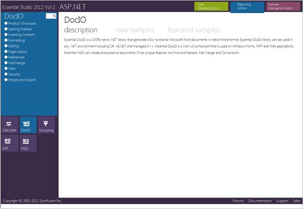
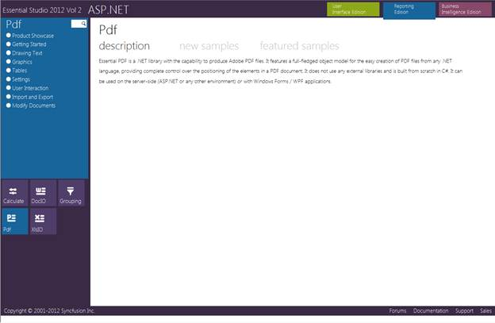
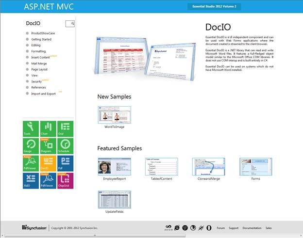
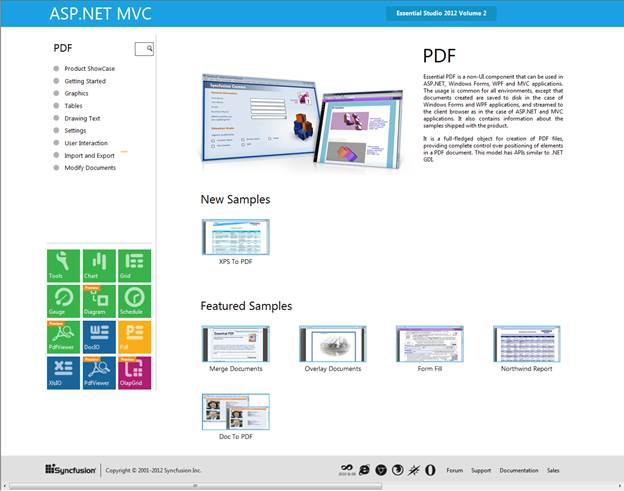
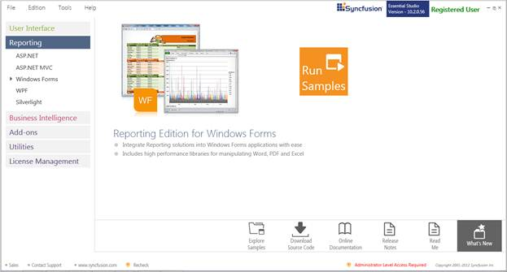
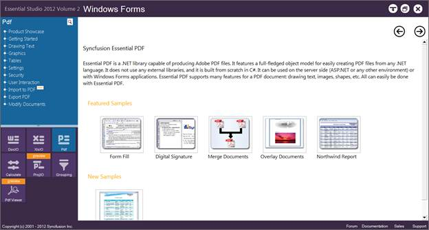
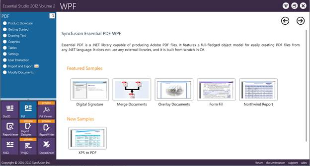
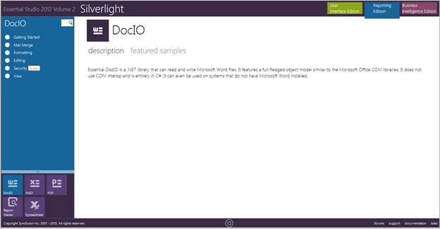
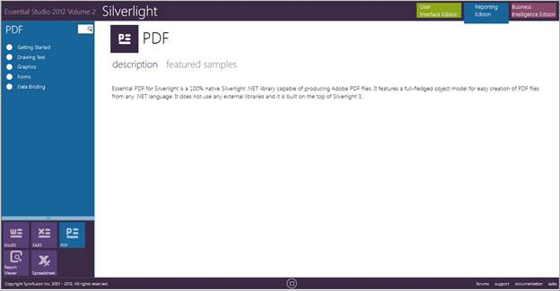

::: {style="DISPLAY: none"}
{#d2h_url_template}{#d2h_package_url style="WIDTH: 0px; DISPLAY: none; HEIGHT: 0px"}
:::

::::: {#nsbanner .d2h_main_nsbanner style="BORDER-BOTTOM: #999999 1px solid; POSITION: relative; PADDING-BOTTOM: 0px; BACKGROUND-COLOR: transparent; PADDING-LEFT: 0px; PADDING-RIGHT: 0px; DISPLAY: none; BORDER-TOP: #999999 1px solid; PADDING-TOP: 0px; LEFT: 0px"}
:::: {#TitleRow .d2h_main_titlerow style="PADDING-BOTTOM: 4px; BACKGROUND-COLOR: transparent; PADDING-LEFT: 22px; WIDTH: 100%; PADDING-RIGHT: 10px; DISPLAY: none; PADDING-TOP: 4px"}
::: {#ienav .d2h_main_ienav style="DISPLAY: none"}
{#D2HPrevious .D2HPreviousEnabled}  {#D2HNext .D2HNextEnabled}
:::
::::
:::::

::::::: {#nstext .d2h_main_nstext style="PADDING-BOTTOM: 10px; BACKGROUND-COLOR: transparent; PADDING-LEFT: 22px; PADDING-RIGHT: 10px; HEIGHT: 100%; OVERFLOW: auto; PADDING-TOP: 5px" hasuserbackground="true" valign="bottom"}
::: {#d2h_breadcrumbs .d2h_breadcrumbs}
[Essential Studio User Guide Documentation](ms-xhelp:///?Id=12457748-09e3-4d74-a240-8e049cedf030){.d2h_breadcrumbsNormal}[ \> ]{.d2h_breadcrumbsLinkSeparator}[Reporting Edition](ms-xhelp:///?Id=027aa5b6-6676-4f93-ad23-c20e8c45792e){.d2h_breadcrumbsNormal}[ \> ]{.d2h_breadcrumbsLinkSeparator}[Essential Pdf](ms-xhelp:///?Id=22756092-3da5-4797-9514-dab0617c6902){.d2h_breadcrumbsNormal}[ \> ]{.d2h_breadcrumbsLinkSeparator}[Installation and Deployment](ms-xhelp:///?Id=35112f6d-24b4-4034-acbe-0ca336e68481){.d2h_breadcrumbsNormal}
:::

## Samples Location {#samples-location style="tab-stops: 0pt"}

 

This section covers the location of the installed samples and describes the procedure to run the samples through the sample browser and online. It also lists the location of source code.

 

Sample installation locations

 

Sample install locations for different platforms are listed below:

 

[·      ]{style="FONT-FAMILY: Symbol"}**ASP.NET-**The ASP.NET samples are installed in the following location:

 

***\...\\My Documents\\Syncfusion\\EssentialStudio\\Version Number\\Web\\pdf.web\\Samples\\2.0***

***[]{style="COLOR: black"}*** 

[·      ]{style="FONT-FAMILY: Symbol"}**ASP.NET MVC-**The ASP.NET MVC samples are installed in the following location:

**** 

***\...\\My Documents\\Syncfusion\\EssentialStudio\\\<Version Number\>\\MVC\\pdfmvc\\samples\\3.5***

**** 

[·      ]{style="FONT-FAMILY: Symbol"}**Windows Forms-**The Windows Forms samples are installed in the following location:

 

***\...\\My Documents\\Syncfusion\\EssentialStudio\\Version Number\\Windows\\PDF.Windows\\Samples\\2.0***

**** 

[·      ]{style="FONT-FAMILY: Symbol"}**WPF-**The WPF samples are installed in the following location:

 

***\...\\My Documents\\Syncfusion\\EssentialStudio\\Version Number\\WPF\\pdf.WPF\\Samples\\3.5***

**** 

[·      ]{style="FONT-FAMILY: Symbol"}**Silverlight-**The Silverlight samples are installed in the following location:

**** 

***\...\\My Documents\\Syncfusion\\EssentialStudio\\Version Number\\Silverlight\\pdf.Silverlight\\Samples\\3.5***

**** 

Viewing Samples

 

To view the samples:

 

1.   Click **Start** -\> **All Programs** -\> **Syncfusion** -\> **Essential Studio \<x.x.x.x\>** -\> **Dashboard** -\> **Reporting** Edition.

[]{style="FONT-FAMILY: 'Trebuchet MS','sans-serif'; COLOR: #15428b; FONT-SIZE: 9pt"} 

{border="0"}

Figure 2: Syncfusion Essential Studio Dashboard Reporting Edition

 

The steps to view the pdf samples in various platforms are discussed below:

 

ASP.NET

**[]{style="FONT-FAMILY: 'Trebuchet MS','sans-serif'; COLOR: #15428b; FONT-SIZE: 9pt"}** 

1.   Click the drop-down button of the **ASP.NET** platform. The following options are displayed and You can view the samples in the following three ways:

[]{style="FONT-FAMILY: 'Trebuchet MS','sans-serif'; COLOR: #15428b; FONT-SIZE: 9pt"} 

[·      ]{style="FONT-FAMILY: Symbol"}**Run Samples** - View the locally installed PDF samples for ASP.NET using the sample browser

[·      ]{style="FONT-FAMILY: Symbol"}**Online Samples** - View the online PDF samples for .NET

[·      ]{style="FONT-FAMILY: Symbol"}**Explore Samples** - Locate the samples for PDF on the disk

[]{style="FONT-FAMILY: 'Trebuchet MS','sans-serif'; COLOR: #15428b; FONT-SIZE: 9pt"} 

2.   Click **Run Samples** link. Essential Studio ASP.NET - Reporting Edition sample browser is displayed.

[]{style="FONT-FAMILY: 'Trebuchet MS','sans-serif'; COLOR: #15428b; FONT-SIZE: 9pt"} 

{border="0"}

Figure 3: ASP.NET Sample Browser

::: {style="BORDER-BOTTOM: windowtext 1pt solid; BORDER-LEFT: medium none; PADDING-BOTTOM: 1pt; MARGIN-TOP: 9pt; PADDING-LEFT: 0pt; PADDING-RIGHT: 0pt; MARGIN-BOTTOM: 9pt; BORDER-TOP: windowtext 1pt solid; BORDER-RIGHT: medium none; PADDING-TOP: 1pt"}
{border="0"}Note: By default, the samples of Essential DocIO are displayed.
:::

[]{style="FONT-FAMILY: 'Trebuchet MS','sans-serif'; COLOR: #15428b; FONT-SIZE: 9pt"} 

3.   Click **Pdf** from the bottom-left pane.

**[]{style="FONT-FAMILY: 'Trebuchet MS','sans-serif'; COLOR: #15428b; FONT-SIZE: 9pt"}** 

{border="0"}**[]{style="FONT-FAMILY: 'Trebuchet MS','sans-serif'; COLOR: #15428b; FONT-SIZE: 9pt"}**

Figure 4: ASP.NET Sample Browser Showing PDF Samples

**[]{style="FONT-FAMILY: 'Trebuchet MS','sans-serif'; COLOR: #15428b; FONT-SIZE: 9pt"}** 

The samples will be displayed.

4.   Select any sample and browse through the features.

[]{style="FONT-FAMILY: 'Trebuchet MS','sans-serif'; COLOR: #15428b; FONT-SIZE: 9pt"} 

ASP.NET MVC

 

To view the samples:

 

1.   Click the drop-down button of the **ASP.NET MVC** platform. You can view the samples in any of the three options that get displayed.[]{style="FONT-FAMILY: 'Trebuchet MS','sans-serif'; COLOR: #15428b; FONT-SIZE: 9pt"}

[]{style="FONT-FAMILY: 'Trebuchet MS','sans-serif'; COLOR: #15428b; FONT-SIZE: 9pt"} 

2.   Click **Run Samples** link. Essential Studio **ASP.NET MVC - Reporting** Edition sample browser is displayed.

[]{style="FONT-FAMILY: 'Trebuchet MS','sans-serif'; COLOR: #15428b; FONT-SIZE: 9pt"} 

{border="0"}

Figure 5: ASP.NET MVC Sample Browser

::: {style="BORDER-BOTTOM: windowtext 1pt solid; BORDER-LEFT: medium none; PADDING-BOTTOM: 1pt; MARGIN-TOP: 9pt; PADDING-LEFT: 0pt; PADDING-RIGHT: 0pt; MARGIN-BOTTOM: 9pt; BORDER-TOP: windowtext 1pt solid; BORDER-RIGHT: medium none; PADDING-TOP: 1pt"}
{border="0"}Note: By default, the samples of Essential DocIO are displayed.
:::

[]{style="FONT-FAMILY: 'Trebuchet MS','sans-serif'; COLOR: #15428b; FONT-SIZE: 9pt"} 

3.   Click **Pdf** from the bottom-left pane.

[]{style="FONT-FAMILY: 'Trebuchet MS','sans-serif'; COLOR: #15428b; FONT-SIZE: 9pt"} 

{border="0"}

Figure 6: ASP.NET MVC Sample Browser Showing PDF Samples

[]{style="FONT-FAMILY: 'Trebuchet MS','sans-serif'; COLOR: #15428b; FONT-SIZE: 9pt"} 

4.   Select any sample and browse through the features.

[]{style="FONT-FAMILY: 'Trebuchet MS','sans-serif'; COLOR: #15428b; FONT-SIZE: 9pt"} 

Windows Forms

**[]{style="FONT-FAMILY: 'Trebuchet MS','sans-serif'; COLOR: #15428b; FONT-SIZE: 9pt"}** 

1.   Click the drop-down button of the **Windows** platform. You can view the samples in any of the three options that get displayed.[]{style="FONT-FAMILY: 'Trebuchet MS','sans-serif'; COLOR: #15428b; FONT-SIZE: 9pt"}

{border="0"}

Figure 7: Windows Forms Sample browser

 

2.   Click **Run Samples** link. Essential Studio Reporting Edition Windows Forms sample browser is displayed.

[]{style="FONT-FAMILY: 'Trebuchet MS','sans-serif'; COLOR: #15428b; FONT-SIZE: 9pt"} 

{border="0"}

Figure 8: Windows Forms Sample browser

[]{style="FONT-FAMILY: 'Trebuchet MS','sans-serif'; COLOR: #15428b; FONT-SIZE: 9pt"} 

3.   Click **Pdf** form bottom-left pane. []{style="FONT-FAMILY: 'Trebuchet MS','sans-serif'; COLOR: #15428b; FONT-SIZE: 9pt"}

 

{border="0"}

Figure 9: Windows Forms Sample Browser Displaying PDF Samples

[]{style="FONT-FAMILY: 'Trebuchet MS','sans-serif'; COLOR: #15428b; FONT-SIZE: 9pt"} 

A list of samples will be displayed on the left pane.

4.   Select any sample and browse through the features.

[]{style="FONT-FAMILY: 'Trebuchet MS','sans-serif'; COLOR: #15428b; FONT-SIZE: 9pt"} 

WPF

[]{style="FONT-FAMILY: 'Trebuchet MS','sans-serif'; COLOR: #15428b; FONT-SIZE: 9pt"} 

1.   Click the drop-down button of the **WPF** platform. You can view the samples in any of the three ways displayed.[]{style="FONT-FAMILY: 'Trebuchet MS','sans-serif'; COLOR: #15428b; FONT-SIZE: 9pt"}

[]{style="FONT-FAMILY: 'Trebuchet MS','sans-serif'; COLOR: #15428b; FONT-SIZE: 9pt"} 

2.   Click **Run Samples** link. The Essential Studio - Reporting Edition sample browser is displayed.

[]{style="FONT-FAMILY: 'Trebuchet MS','sans-serif'; COLOR: #15428b; FONT-SIZE: 9pt"} 

{border="0"}

Figure 10: WPF Sample Browser

[]{style="FONT-FAMILY: 'Trebuchet MS','sans-serif'; COLOR: #15428b; FONT-SIZE: 9pt"} 

3.   Click **Pdf** from the bottom-left pane.

[]{style="FONT-FAMILY: 'Trebuchet MS','sans-serif'; COLOR: #15428b; FONT-SIZE: 9pt"} 

{border="0"}

Figure 11: PDF Samples for WPF

[]{style="FONT-FAMILY: 'Trebuchet MS','sans-serif'; COLOR: #15428b; FONT-SIZE: 9pt"} 

4.   A list of samples will be displayed on the left pane.

5.   Select any sample and click **Run Sample** to browse through the sample features.

[]{style="FONT-FAMILY: 'Trebuchet MS','sans-serif'; COLOR: #15428b; FONT-SIZE: 9pt"} 

Silverlight

**[]{style="FONT-FAMILY: 'Trebuchet MS','sans-serif'; COLOR: #15428b; FONT-SIZE: 9pt"}** 

1.   Click the drop-down button of the **Silverlight** platform. The following options are displayed and you can view the samples in any of the three ways displayed.

2.   Click **Run Samples** link. The Essential Studio Reporting Silverlight Edition sample browser is displayed.

[]{style="FONT-FAMILY: 'Trebuchet MS','sans-serif'; COLOR: #15428b; FONT-SIZE: 9pt"} 

{border="0"}

Figure 12: Silverlight Sample Browser

 

::: {style="BORDER-BOTTOM: windowtext 1pt solid; BORDER-LEFT: medium none; PADDING-BOTTOM: 1pt; MARGIN-TOP: 9pt; PADDING-LEFT: 0pt; PADDING-RIGHT: 0pt; MARGIN-BOTTOM: 9pt; BORDER-TOP: windowtext 1pt solid; BORDER-RIGHT: medium none; PADDING-TOP: 1pt"}
{border="0"}Note: By default, the samples of Essential DocIO are displayed.
:::

**[]{style="FONT-FAMILY: 'Trebuchet MS','sans-serif'; COLOR: #15428b; FONT-SIZE: 9pt"}** 

3.   Select **Pdf** from the bottom-left pane. []{style="FONT-FAMILY: 'Trebuchet MS','sans-serif'; COLOR: #15428b; FONT-SIZE: 9pt"}

[]{style="FONT-FAMILY: 'Trebuchet MS','sans-serif'; COLOR: #15428b; FONT-SIZE: 9pt"} 

{border="0"}

Figure 13: Silverlight Sample Browser Showing PDF Samples

[]{style="FONT-FAMILY: 'Trebuchet MS','sans-serif'; COLOR: #15428b; FONT-SIZE: 9pt"} 

4.   Select any sample and browse through the features.

[]{style="FONT-FAMILY: 'Trebuchet MS','sans-serif'; COLOR: #15428b; FONT-SIZE: 9pt"} 

Source Code Location

 

The source code for PDF under different platforms is available at the following default locations:

 

[·      ]{style="FONT-FAMILY: Symbol"}***Windows-\[System Drive\]:\\Program Files\\Syncfusion\\Essential Studio\\\[Version Number\]\\Windows\\PDF.Windows\\Src***

[·      ]{style="FONT-FAMILY: Symbol"}***ASP.NET-\[System Drive\]:\\Program Files\\Syncfusion\\Essential Studio\\\[Version Number\]\\Web\\Pdf.Web\\Src***

[·      ]{style="FONT-FAMILY: Symbol"}***WPF-\[System Drive\]:\\Program Files\\Syncfusion\\Essential Studio\\\[Version Number\]\\WPF\\Pdf.WPF\\Src***

[·      ]{style="FONT-FAMILY: Symbol"}***ASP.NET*** ***MVC-\[System Drive\]:\\Program Files\\Syncfusion\\Essential Studio\\\[Version Number\]\\MVC\\Pdf.MVC\\Src***

 

[]{#related-topics}
:::::::
