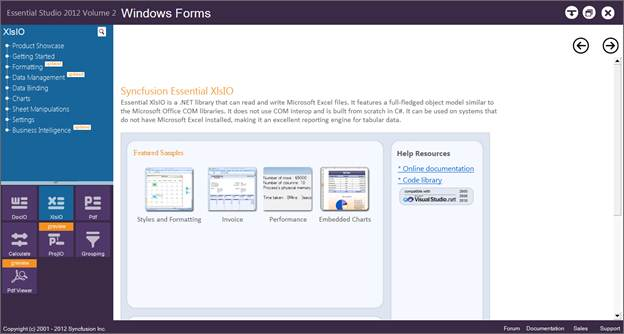
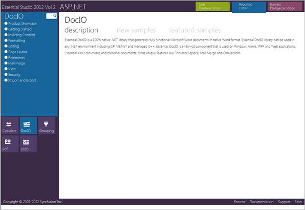
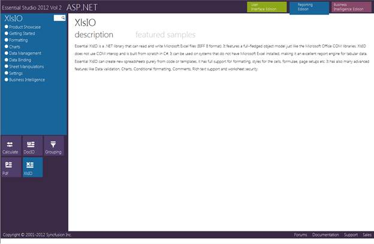
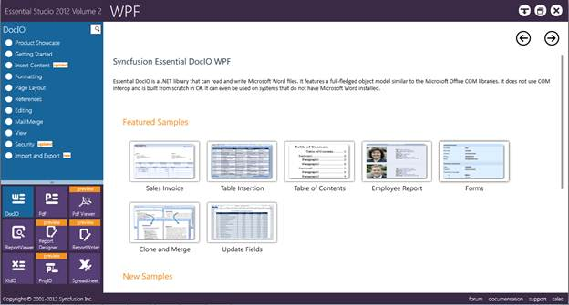
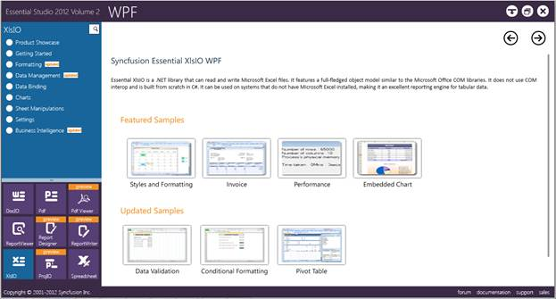
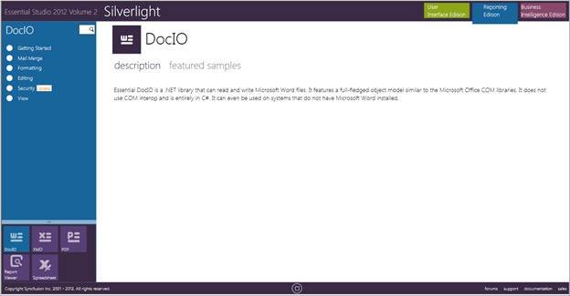
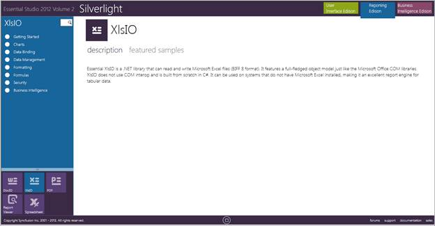
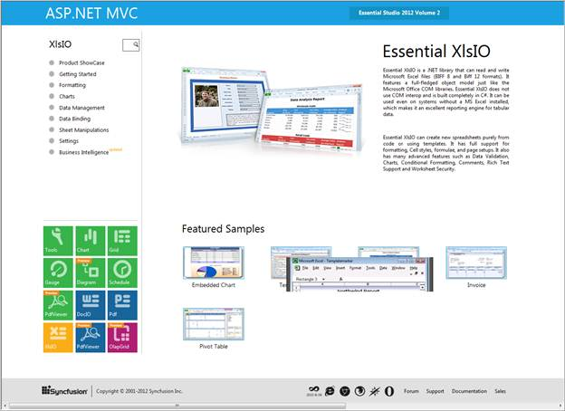

::: {style="DISPLAY: none"}
{#d2h_url_template}{#d2h_package_url style="WIDTH: 0px; DISPLAY: none; HEIGHT: 0px"}
:::

::::: {#nsbanner .d2h_main_nsbanner style="BORDER-BOTTOM: #999999 1px solid; POSITION: relative; PADDING-BOTTOM: 0px; BACKGROUND-COLOR: transparent; PADDING-LEFT: 0px; PADDING-RIGHT: 0px; DISPLAY: none; BORDER-TOP: #999999 1px solid; PADDING-TOP: 0px; LEFT: 0px"}
:::: {#TitleRow .d2h_main_titlerow style="PADDING-BOTTOM: 4px; BACKGROUND-COLOR: transparent; PADDING-LEFT: 22px; WIDTH: 100%; PADDING-RIGHT: 10px; DISPLAY: none; PADDING-TOP: 4px"}
::: {#ienav .d2h_main_ienav style="DISPLAY: none"}
{#D2HPrevious .D2HPreviousEnabled}  {#D2HNext .D2HNextEnabled}
:::
::::
:::::

:::::::::: {#nstext .d2h_main_nstext style="PADDING-BOTTOM: 10px; BACKGROUND-COLOR: transparent; PADDING-LEFT: 22px; PADDING-RIGHT: 10px; HEIGHT: 100%; OVERFLOW: auto; PADDING-TOP: 5px" hasuserbackground="true" valign="bottom"}
::: {#d2h_breadcrumbs .d2h_breadcrumbs}
[Essential Studio User Guide Documentation](ms-xhelp:///?Id=12457748-09e3-4d74-a240-8e049cedf030){.d2h_breadcrumbsNormal}[ \> ]{.d2h_breadcrumbsLinkSeparator}[Reporting Edition](ms-xhelp:///?Id=027aa5b6-6676-4f93-ad23-c20e8c45792e){.d2h_breadcrumbsNormal}[ \> ]{.d2h_breadcrumbsLinkSeparator}[Essential XlsIO](ms-xhelp:///?Id=b01a1b50-1d7d-40c0-bc83-af67e57c9005){.d2h_breadcrumbsNormal}[ \> ]{.d2h_breadcrumbsLinkSeparator}[Installation and Deployment](ms-xhelp:///?Id=d0af9123-dd30-4e7e-8849-b0edb2474feb){.d2h_breadcrumbsNormal}
:::

## Samples Location {#samples-location style="tab-stops: 0pt"}

 

This section covers the location of the installed samples and describes the procedure to run the samples through the sample browser and online.

 

**Sample Installation Locations**

 

Various locations of samples for Essential XlsIO corresponding to each platform are given below:

 

[·      ]{style="FONT-FAMILY: Symbol"}**Windows Forms Samples**-The Windows Forms samples are installed under the following location.

 

***\...\\My Documents\\Syncfusion\\EssentialStudio\\Version Number\\Windows\\XlsIO.Windows\\Samples\\2.0***

 

[·      ]{style="FONT-FAMILY: Symbol"}**ASP.NET Samples**-The ASP.NET samples are installed under the following location.

 

***\...\\My Documents\\Syncfusion\\EssentialStudio\\Version Number\\Web\\xlsio.web\\Samples\\2.0***

 

[·      ]{style="FONT-FAMILY: Symbol"}**WPF Samples**-The WPF samples are installed under the following location.

 

***\...\\My Documents\\Syncfusion\\EssentialStudio\\Version Number\\WPF\\XlsIO.WPF\\Samples\\3.5***

 

[·      ]{style="FONT-FAMILY: Symbol"}**Silverlight Samples**-The Silverlight samples are installed under the following location.

 

***\...\\My Documents\\Syncfusion\\EssentialStudio\\Version Number\\Silverlight\\XlsIO.Silverlight\\Samples\\3.5***

 

[·      ]{style="FONT-FAMILY: Symbol"}**ASP.NET MVC Samples**-The ASP.NET MVC samples are installed under the following location.

 

***\...\\My Documents\\Syncfusion\\EssentialStudio\\\<Version Number\>\\MVC***

 

::: {style="BORDER-BOTTOM: windowtext 1pt solid; BORDER-LEFT: medium none; PADDING-BOTTOM: 1pt; MARGIN-TOP: 9pt; PADDING-LEFT: 0pt; PADDING-RIGHT: 0pt; MARGIN-BOTTOM: 9pt; BORDER-TOP: windowtext 1pt solid; BORDER-RIGHT: medium none; PADDING-TOP: 1pt"}
{border="0"}Note: Essential XlsIO does not provide direct support for Silverlight and cannot generate documents in client side. It is only possible to generate the documents in server side and view it in client interface. Samples in the sample browser use web services and generate the documents in the server side.
:::

 

Viewing Samples

 

To view the samples:

 

1.   Click **Start**\--\>**All Programs**\--\>**Syncfusion** \--\>**Essential Studio \<version number\>** \--\>**Dashboard**.

2.   Click **Reporting** Edition.

[]{style="FONT-FAMILY: 'Trebuchet MS','sans-serif'; COLOR: #15428b; FONT-SIZE: 9pt"} 

 

{border="0"}

Figure 2: Syncfusion Essential Studio Reporting Dashboard[]{style="FONT-FAMILY: 'Trebuchet MS','sans-serif'; COLOR: #15428b"}

***[]{style="FONT-FAMILY: 'Trebuchet MS','sans-serif'; COLOR: #15428b; FONT-SIZE: 9pt"}*** 

The steps to view the XlsIO samples in various platforms are discussed below:

 

Windows Forms

 

1.   In the dashboard window, click **Run Samples** for **Windows Forms** under **Reporting** Edition panel. The **Windows Forms** Sample Browser window is displayed.

[]{style="FONT-FAMILY: 'Trebuchet MS','sans-serif'; COLOR: #15428b; FONT-SIZE: 9pt"} 

::: {style="BORDER-BOTTOM: windowtext 1pt solid; BORDER-LEFT: medium none; PADDING-BOTTOM: 1pt; MARGIN-TOP: 9pt; PADDING-LEFT: 0pt; PADDING-RIGHT: 0pt; MARGIN-BOTTOM: 9pt; BORDER-TOP: windowtext 1pt solid; BORDER-RIGHT: medium none; PADDING-TOP: 1pt"}
{border="0"}Note: You can view the samples in any of the following three ways:
:::

[]{style="FONT-FAMILY: 'Trebuchet MS','sans-serif'; COLOR: #15428b; FONT-SIZE: 9pt"} 

[·      ]{style="FONT-FAMILY: Symbol"}**Run Samples** - Click to view the locally installed samples.

[·      ]{style="FONT-FAMILY: Symbol"}**Online Samples** - Click to view online samples.

[·      ]{style="FONT-FAMILY: Symbol"}**Explore Samples** - Explore Windows Forms samples on disk.

[]{style="FONT-FAMILY: 'Trebuchet MS','sans-serif'; COLOR: #15428b; FONT-SIZE: 9pt"} 

{border="0"}

Figure 3: Windows Forms Sample Browser

**[]{style="FONT-FAMILY: 'Trebuchet MS','sans-serif'; COLOR: #15428b; FONT-SIZE: 9pt"}** 

2.   Click **XlsIO** form the bottom-left pane. The XlsIO samples are displayed.

[]{style="FONT-FAMILY: 'Trebuchet MS','sans-serif'; COLOR: #15428b; FONT-SIZE: 9pt"} 

{border="0"}

Figure 4: XlsIO Samples Displayed in the Windows Forms Sample Browser[]{style="FONT-FAMILY: 'Trebuchet MS','sans-serif'; COLOR: #15428b"}

***[]{style="FONT-FAMILY: 'Trebuchet MS','sans-serif'; COLOR: #15428b; FONT-SIZE: 9pt"}*** 

***[]{style="FONT-FAMILY: 'Trebuchet MS','sans-serif'; COLOR: #15428b; FONT-SIZE: 9pt"}*** 

3.   Select any sample and browse through the features.

 

ASP.NET

 

1.   In the dashboard window, click **Run Samples** for **ASP.NET** under **Reporting Edition** panel. The **ASP.NET Sample Browser** window is displayed.

 

::: {style="BORDER-BOTTOM: windowtext 1pt solid; BORDER-LEFT: medium none; PADDING-BOTTOM: 1pt; MARGIN-TOP: 9pt; PADDING-LEFT: 0pt; PADDING-RIGHT: 0pt; MARGIN-BOTTOM: 9pt; BORDER-TOP: windowtext 1pt solid; BORDER-RIGHT: medium none; PADDING-TOP: 1pt"}
{border="0"}Note: You can view the samples in any of the three ways displayed.
:::

 

{border="0"}

Figure 5: ASP.NET Sample Browser[]{style="FONT-FAMILY: 'Trebuchet MS','sans-serif'; COLOR: #15428b"}

***[]{style="FONT-FAMILY: 'Trebuchet MS','sans-serif'; COLOR: #15428b; FONT-SIZE: 9pt"}*** 

2.   Click **XlsIO** from the bottom-left pane. The XlsIO samples are displayed.

[]{style="FONT-FAMILY: 'Trebuchet MS','sans-serif'; COLOR: #15428b; FONT-SIZE: 9pt"} 

{border="0"}

Figure 6: XlsIO Samples Displayed in the ASP.NET Sample Browser

**[]{style="FONT-STYLE: normal; FONT-FAMILY: 'Trebuchet MS','sans-serif'; COLOR: #15428b"}** 

3.   Select any sample and browse through the features.

 

WPF

 

1.   In the dashboard window, click **Run Samples** for **WPF** under **Reporting** Edition panel. The **WPF** Sample Browser window is displayed.

::: {style="BORDER-BOTTOM: windowtext 1pt solid; BORDER-LEFT: medium none; PADDING-BOTTOM: 1pt; MARGIN-TOP: 9pt; PADDING-LEFT: 0pt; PADDING-RIGHT: 0pt; MARGIN-BOTTOM: 9pt; BORDER-TOP: windowtext 1pt solid; BORDER-RIGHT: medium none; PADDING-TOP: 1pt"}
{border="0"}Note: You can view the samples in any of the three ways displayed.
:::

[]{style="FONT-FAMILY: 'Trebuchet MS','sans-serif'; COLOR: #15428b; FONT-SIZE: 9pt"} 

{border="0"}

Figure 7: WPF Sample Browser[]{style="FONT-FAMILY: 'Trebuchet MS','sans-serif'; COLOR: #15428b"}

[]{style="FONT-FAMILY: 'Trebuchet MS','sans-serif'; COLOR: #15428b; FONT-SIZE: 9pt"} 

2.   Click **XlsIO** from the bottom-left pane. The XlsIO samples are displayed.

[]{style="FONT-FAMILY: 'Trebuchet MS','sans-serif'; COLOR: #15428b; FONT-SIZE: 9pt"} 

 

{border="0"}

Figure 8: XlsIO Samples Displayed in the WPF Sample Browser

[]{style="FONT-FAMILY: 'Trebuchet MS','sans-serif'; COLOR: #15428b"} 

3.   Select any sample and browse through the features.

 

Silverlight

 

1.   In the dashboard window, click **Run Samples** for Silverlight under **Reporting** Edition panel. The **Silverlight** Sample Browser window is displayed.

 

::: {style="BORDER-BOTTOM: windowtext 1pt solid; BORDER-LEFT: medium none; PADDING-BOTTOM: 1pt; MARGIN-TOP: 9pt; PADDING-LEFT: 0pt; PADDING-RIGHT: 0pt; MARGIN-BOTTOM: 9pt; BORDER-TOP: windowtext 1pt solid; BORDER-RIGHT: medium none; PADDING-TOP: 1pt"}
{border="0"}Note: You can view the samples in any of the three ways displayed.
:::

{border="0"}

Figure 9: Silverlight Sample Browser

 

2.   Click the **XlsIO** drop-down on the right pane. The XlsIO samples are displayed.

[]{style="FONT-FAMILY: 'Trebuchet MS','sans-serif'; COLOR: #15428b; FONT-SIZE: 9pt"} 

{border="0"}

Figure 10: XlsIO Samples Displayed in the Silverlight Sample Browser[]{style="FONT-FAMILY: 'Trebuchet MS','sans-serif'; COLOR: #15428b"}

[]{style="FONT-FAMILY: 'Trebuchet MS','sans-serif'; COLOR: #15428b; FONT-SIZE: 9pt"} 

3.   Select any sample and browse through the features.

 

ASP.NET MVC

 

1.   In the dashboard window, click **Run Samples** for ASP.NET MVC under **Reporting** Edition panel. The **ASP.NET MVC** Sample Browser window is displayed.

[]{style="FONT-FAMILY: 'Trebuchet MS','sans-serif'; COLOR: #15428b; FONT-SIZE: 9pt"} 

::: {style="BORDER-BOTTOM: windowtext 1pt solid; BORDER-LEFT: medium none; PADDING-BOTTOM: 1pt; MARGIN-TOP: 9pt; PADDING-LEFT: 0pt; PADDING-RIGHT: 0pt; MARGIN-BOTTOM: 9pt; BORDER-TOP: windowtext 1pt solid; BORDER-RIGHT: medium none; PADDING-TOP: 1pt"}
{border="0"}Note: You can view the samples in any of the three ways displayed.
:::

 

 

{border="0"}

Figure 11: ASP.NET MVC Sample Browser**[]{style="FONT-FAMILY: 'Trebuchet MS','sans-serif'; COLOR: #15428b"}**

 

2.   Click **XlsIO** from the bottom-left pane. The XlsIO samples are displayed.

[]{style="FONT-FAMILY: 'Trebuchet MS','sans-serif'; COLOR: #15428b; FONT-SIZE: 9pt"} 

{border="0"}

Figure 12: XlsIO Samples Displayed in the ASP.NET MVC Sample Browser**[]{style="FONT-STYLE: normal; FONT-FAMILY: 'Trebuchet MS','sans-serif'; COLOR: #15428b"}**

[]{style="FONT-FAMILY: 'Trebuchet MS','sans-serif'; COLOR: #15428b; FONT-SIZE: 9pt"} 

3.   Select any sample and browse through the features.

 

Source Code Location

 

The default locations of the source code for Essential XlsIO corresponding to each platform are given below:

 

[·      ]{style="FONT-FAMILY: Symbol"}**Windows**-The source code for Windows platform is located at the following location.

 

**\[System Drive\]:\\Program Files\\Syncfusion\\Essential Studio\\\[Version Number\]\\Base\\XlsIO.Windows\\Src**

 

[·      ]{style="FONT-FAMILY: Symbol"}**WPF**-The source code for WPF platform is located at the following location.

 

**\[System Drive\]:\\Program Files\\Syncfusion\\Essential Studio\\\[Version Number\]\\Base\\XlsIO.WPF\\Src**

 

[·      ]{style="FONT-FAMILY: Symbol"}**MVC**-The source code for MVC platform is located at the following location.

 

***\[System Drive\]:\\Program Files\\Syncfusion\\Essential Studio\\\[Version Number\]\\MVC\\XlsIO.MVC\\Src***

 

[·      ]{style="FONT-FAMILY: Symbol"}**Web**-The source code for ASP.NET platform is located at the following location.

 

***\[System Drive\]:\\Program Files\\Syncfusion\\Essential Studio\\\[Version Number\]\\Web\\XlsIO.Web\\Src***

 

[]{#related-topics}
::::::::::
