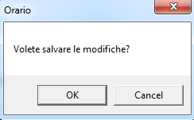

::: {style="DISPLAY: none"}
{#d2h_url_template}{#d2h_package_url style="WIDTH: 0px; DISPLAY: none; HEIGHT: 0px"}
:::

:::: {.d2h_secondary_topic style="PADDING-BOTTOM: 10pt; MARGIN: 0pt; PADDING-LEFT: 0pt; PADDING-RIGHT: 0pt; PADDING-TOP: 0pt"}
##### "Save Changes" Message Box {#save-changes-message-box style="tab-stops: 0pt"}

 

Table 8: Save Changes

::: {align="center"}
  ----------------------------------------- ----------------------------------
  Names in Resource File                    Values
  AppointmentSaveChangesMessageBoxContent   Do you want to save the changes?
  AppointmentSaveChangesMessageBoxHeader    Schedule
  ----------------------------------------- ----------------------------------
:::

 

{border="0"}

Figure 34: Save Changes

[]{#related-topics}
::::
