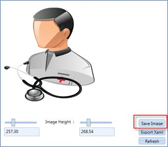
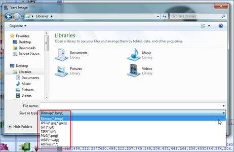

::: {style="DISPLAY: none"}
{#d2h_url_template}{#d2h_package_url style="WIDTH: 0px; DISPLAY: none; HEIGHT: 0px"}
:::

::: {.d2h_secondary_topic style="PADDING-BOTTOM: 10pt; MARGIN: 0pt; PADDING-LEFT: 0pt; PADDING-RIGHT: 0pt; PADDING-TOP: 0pt"}
#### Save Vector images as various formats {#save-vector-images-as-various-formats style="tab-stops: 0pt"}

[]{style="FONT-FAMILY: 'Trebuchet MS','sans-serif'; COLOR: #15428b; FONT-SIZE: 9pt"} 

With the help of Vector Image utility demo, the selected image can be exported to various image formats.

[·      ]{style="FONT-FAMILY: Symbol"}Bitmap

[·      ]{style="FONT-FAMILY: Symbol"}JPEG

[·      ]{style="FONT-FAMILY: Symbol"}GIF

[·      ]{style="FONT-FAMILY: Symbol"}TIF

[·      ]{style="FONT-FAMILY: Symbol"}PNG

[·      ]{style="FONT-FAMILY: Symbol"}WDP

[]{style="FONT-FAMILY: 'Trebuchet MS','sans-serif'; COLOR: #15428b; FONT-SIZE: 9pt"} 

Selected Image can be saved by clicking the Save Image button as shown below.

[]{style="FONT-FAMILY: 'Trebuchet MS','sans-serif'; COLOR: #15428b; FONT-SIZE: 9pt"} 

{border="0"}

Figure 1184: Save Image

[]{style="FONT-FAMILY: 'Trebuchet MS','sans-serif'; COLOR: #15428b; FONT-SIZE: 9pt"} 

On clicking the Save Image button you will be prompted for a location to save. You can then choose the image format as shown below.

[]{style="FONT-FAMILY: 'Trebuchet MS','sans-serif'; COLOR: #15428b; FONT-SIZE: 9pt"} 

{border="0"}

Figure 1185: Export to various formats

 

 

[]{#related-topics}
:::
