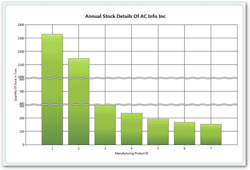
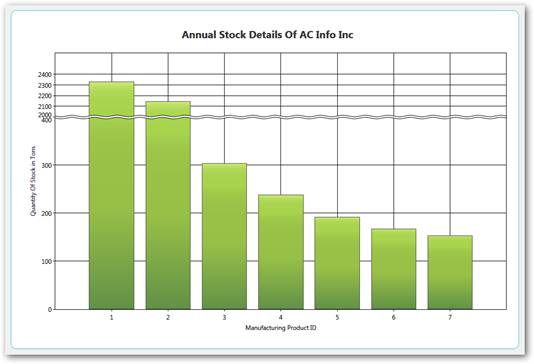
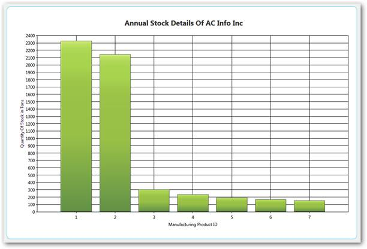

::: {style="DISPLAY: none"}
{#d2h_url_template}{#d2h_package_url style="WIDTH: 0px; DISPLAY: none; HEIGHT: 0px"}
:::

::::: {.d2h_secondary_topic style="PADDING-BOTTOM: 10pt; MARGIN: 0pt; PADDING-LEFT: 0pt; PADDING-RIGHT: 0pt; PADDING-TOP: 0pt"}
##### Scale Break Support {#scale-break-support style="tab-stops: 0pt"}

Breaks are very useful if you add points with too large difference in values. To enable breaks, you need to set the EnableBreaks property to true and set the break mode (BreaksMode property). A scale break is a line drawn across the plotting area of a chart to denote a break in continuity between the highest and lowest values on a value axis. A Scale Break displays two distinct ranges in the same chart area.

There are three possible modes. They are,

[·      ]{style="FONT-FAMILY: Symbol"}ChartBreaksModes.Manual (default): If this value is set, you can manually set the breaks ranges.

[·      ]{style="FONT-FAMILY: Symbol"}ChartAxis.BreakRanges.Union: to add a new break range

[·      ]{style="FONT-FAMILY: Symbol"}ChartAxis.BreakRanges.Exclude: to remove the break range

[·      ]{style="FONT-FAMILY: Symbol"}ChartAxis.BreakRanges.Clear: to remove all break ranges

 

[·      ]{style="FONT-FAMILY: Symbol"}ChartBreaksMode**.Auto:** If this mode is enabled, chart will compute the breaks ranges automatically.

[·      ]{style="FONT-FAMILY: Symbol"}This mode has several exclusions

[·      ]{style="FONT-FAMILY: Symbol"}Breaks are computed only for actual y-axis of series

[·      ]{style="FONT-FAMILY: Symbol"}Breaks don\'t work with zooming

[·      ]{style="FONT-FAMILY: Symbol"}Breaks don\'t work with stacking

[·      ]{style="FONT-FAMILY: Symbol"}All breaks work only with decart axes

[·      ]{style="FONT-FAMILY: Symbol"}**ChartBreaksModes.None:** If this value is set, breaks are not used.

 

 

 

{border="0"}

Figure 199: Manual

 

 

 

{border="0"}

Figure 200: Auto

 

 

{border="0"}

Figure 201: None

 

Properties and Methods Tables

Properties

::: {align="center"}
+------------------+----------------------------------------------------------------+---------------------+-----------------+
| Property         | Description                                                    | Type                | Reference links |
+------------------+----------------------------------------------------------------+---------------------+-----------------+
| **EnableBreaks** | To enable break ranges                                         | bool                | NA              |
+------------------+----------------------------------------------------------------+---------------------+-----------------+
| **BreaksMode**   | 3 types: Manual, Auto and None                                 | ChartBreaksModes    | NA              |
+------------------+----------------------------------------------------------------+---------------------+-----------------+
| **LineType**     | Straight line, wave and randomize                              | ChartBreakLineTypes | NA              |
|                  |                                                                |                     |                 |
|                  |                                                                |                     |                 |
+------------------+----------------------------------------------------------------+---------------------+-----------------+
| **LineColor**    | Different types of colors for the line                         | Brush               | NA              |
+------------------+----------------------------------------------------------------+---------------------+-----------------+
| **LineWidth**    | Values from 1 to 10                                            | Double              | NA              |
+------------------+----------------------------------------------------------------+---------------------+-----------------+
| **Linestyle**    | Dash Line, DashDodDot Line ,DashDot Line, Dot Line, Solid Line | DashStyle           | NA              |
|                  |                                                                |                     |                 |
|                  |                                                                |                     |                 |
+------------------+----------------------------------------------------------------+---------------------+-----------------+
| **SpacingColor** | Different types of colors for the line                         | Brush               | NA              |
|                  |                                                                |                     |                 |
|                  |                                                                |                     |                 |
+------------------+----------------------------------------------------------------+---------------------+-----------------+
| **SpacingWidth** | Values from 1 to 10                                            | Double              | NA              |
|                  |                                                                |                     |                 |
|                  |                                                                |                     |                 |
+------------------+----------------------------------------------------------------+---------------------+-----------------+
:::

 

Methods

 

::: {align="center"}
+-------------+-------------------------------------+---------------------+-------------+-----------------+
| Method      | Description                         | Parameters          | Return Type | Reference links |
+-------------+-------------------------------------+---------------------+-------------+-----------------+
| Union       | To add a particular break range     | DoubleRange         | void        | NA              |
|             |                                     |                     |             |                 |
|             |                                     | ChartBreakRangeInfo |             |                 |
+-------------+-------------------------------------+---------------------+-------------+-----------------+
| Exclude     | To delete the specified break range | DoubleRange         | void        | NA              |
+-------------+-------------------------------------+---------------------+-------------+-----------------+
| Clear       | Clear all existing break ranges     | NA                  | void        | NA              |
+-------------+-------------------------------------+---------------------+-------------+-----------------+
:::

 

[]{#related-topics}
:::::
