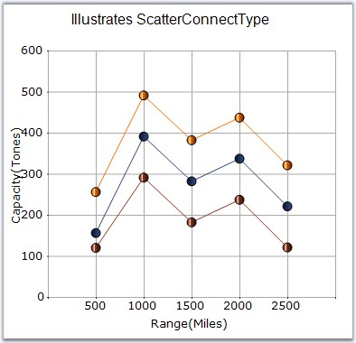
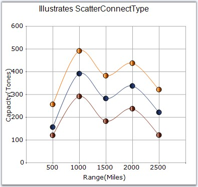

::: {style="DISPLAY: none"}
{#d2h_url_template}{#d2h_package_url style="WIDTH: 0px; DISPLAY: none; HEIGHT: 0px"}
:::

:::: {.d2h_secondary_topic style="PADDING-BOTTOM: 10pt; MARGIN: 0pt; PADDING-LEFT: 0pt; PADDING-RIGHT: 0pt; PADDING-TOP: 0pt"}
#### ScatterConnectType {#scatterconnecttype style="tab-stops: 0pt"}

**[]{style="FONT-FAMILY: 'Trebuchet MS','sans-serif'; FONT-SIZE: 9pt"}** 

Specifies the connection type of the Scatter Charts.

[]{style="FONT-FAMILY: 'Trebuchet MS','sans-serif'; FONT-SIZE: 9pt"} 

::: {align="center"}
+---------------------------------------+-----------------------------------------------+
| **[]{style="FONT-FAMILY: 'Trebuchet MS','sans-serif'; FONT-SIZE: 9pt"}**              |
|                                                                                       |
| Details                                                                               |
+---------------------------------------+-----------------------------------------------+
| Possible Values                       | None - Scatter Connect Type will be none.     |
|                                       |                                               |
|                                       | Line - Scatter Connect Type will be Line.     |
|                                       |                                               |
|                                       | Spline - Scatter Connect Type will be spline. |
+---------------------------------------+-----------------------------------------------+
| Default Value                         | None                                          |
+---------------------------------------+-----------------------------------------------+
| 2D / 3D Limitations                   | No                                            |
+---------------------------------------+-----------------------------------------------+
| Applies to Chart Element              | All series                                    |
+---------------------------------------+-----------------------------------------------+
| Applies to Chart Types                | Scatter Chart                                 |
+---------------------------------------+-----------------------------------------------+
:::

**[]{style="FONT-FAMILY: 'Trebuchet MS','sans-serif'; FONT-SIZE: 9pt"}** 

**[]{style="FONT-FAMILY: 'Trebuchet MS','sans-serif'; FONT-SIZE: 9pt"}** 

Scatter Line Chart

**[]{style="FONT-FAMILY: 'Trebuchet MS','sans-serif'; FONT-SIZE: 9pt"}** 

Optionally, you can connect the points in the series through straight lines using the **ScatterConnectType** property as shown below.

[]{style="FONT-FAMILY: 'Trebuchet MS','sans-serif'; FONT-SIZE: 9pt"} 

+-------------------------------------------------------------------------------------------------------------------+
| **[\[C#\]]{style="FONT-FAMILY: 'Courier New'; COLOR: black"}**                                                    |
|                                                                                                                   |
| **[]{style="FONT-FAMILY: 'Courier New'; COLOR: black"}**                                                          |
|                                                                                                                   |
| [series.ScatterConnectType = [ScatterConnectType]{style="COLOR: teal"}.Line;]{style="FONT-FAMILY: 'Courier New'"} |
+-------------------------------------------------------------------------------------------------------------------+

[]{style="FONT-FAMILY: 'Trebuchet MS','sans-serif'; FONT-SIZE: 9pt"} 

+------------------------------------------------------------------------------------------------------------------+
| **[\[VB.NET\]]{style="FONT-FAMILY: 'Courier New'; COLOR: black"}**                                               |
|                                                                                                                  |
| **[]{style="FONT-FAMILY: 'Courier New'; COLOR: black"}**                                                         |
|                                                                                                                  |
| [series.ScatterConnectType = [ScatterConnectType]{style="COLOR: teal"}.Line]{style="FONT-FAMILY: 'Courier New'"} |
+------------------------------------------------------------------------------------------------------------------+

[]{style="FONT-FAMILY: 'Trebuchet MS','sans-serif'; FONT-SIZE: 9pt"} 

{border="0"}

**[]{style="FONT-FAMILY: 'Trebuchet MS','sans-serif'; FONT-SIZE: 9pt"}** 

Figure 183: Scatter Line Chart

[]{style="FONT-FAMILY: 'Trebuchet MS','sans-serif'; FONT-SIZE: 9pt"} 

Scatter Spline Chart

**[]{style="FONT-FAMILY: 'Trebuchet MS','sans-serif'; FONT-SIZE: 9pt"}** 

Alternatively, you can connect the points in the series through splines using the **ScatterConnectType** property as shown below.

[]{style="FONT-FAMILY: 'Trebuchet MS','sans-serif'; FONT-SIZE: 9pt"} 

+---------------------------------------------------------------------------------------------------------------------+
| **[\[C#\]]{style="FONT-FAMILY: 'Courier New'; COLOR: black"}**                                                      |
|                                                                                                                     |
| **[]{style="FONT-FAMILY: 'Courier New'; COLOR: black"}**                                                            |
|                                                                                                                     |
| [series.ScatterConnectType = [ScatterConnectType]{style="COLOR: teal"}.Spline;]{style="FONT-FAMILY: 'Courier New'"} |
|                                                                                                                     |
| [series.ScatterSplineTension = 1; [// Default is 0]{style="COLOR: green"}]{style="FONT-FAMILY: 'Courier New'"}      |
+---------------------------------------------------------------------------------------------------------------------+

[]{style="FONT-FAMILY: 'Trebuchet MS','sans-serif'; FONT-SIZE: 9pt"} 

+--------------------------------------------------------------------------------------------------------------------+
| **[\[VB.NET\]]{style="FONT-FAMILY: 'Courier New'; COLOR: black"}**                                                 |
|                                                                                                                    |
| **[]{style="FONT-FAMILY: 'Courier New'; COLOR: black"}**                                                           |
|                                                                                                                    |
| [series.ScatterConnectType = [ScatterConnectType]{style="COLOR: teal"}.Spline]{style="FONT-FAMILY: 'Courier New'"} |
|                                                                                                                    |
| [series.ScatterSplineTension = 1 \'[ Default is 0]{style="COLOR: green"}]{style="FONT-FAMILY: 'Courier New'"}      |
+--------------------------------------------------------------------------------------------------------------------+

**[]{style="FONT-FAMILY: 'Trebuchet MS','sans-serif'; FONT-SIZE: 9pt"}** 

{border="0"}

**[]{style="FONT-FAMILY: 'Trebuchet MS','sans-serif'; FONT-SIZE: 9pt"}** 

Figure 184: Scatter Spline Chart

**[]{style="FONT-FAMILY: 'Trebuchet MS','sans-serif'; FONT-SIZE: 9pt"}** 

See Also

[]{style="FONT-FAMILY: 'Trebuchet MS','sans-serif'; FONT-SIZE: 9pt"} 

[Scatter Chart]{.UGHyperlink}[]{.UGHyperlink}

[]{#p142} 

[]{#related-topics}
::::
