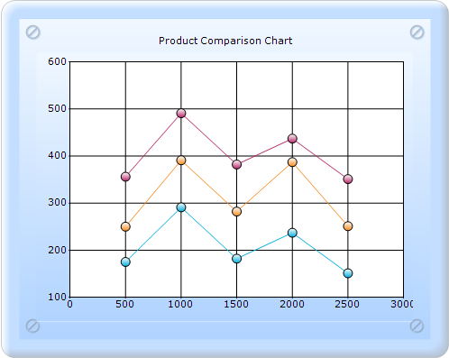

::: {style="DISPLAY: none"}
{#d2h_url_template}{#d2h_package_url style="WIDTH: 0px; DISPLAY: none; HEIGHT: 0px"}
:::

:::: {.d2h_secondary_topic style="PADDING-BOTTOM: 10pt; MARGIN: 0pt; PADDING-LEFT: 0pt; PADDING-RIGHT: 0pt; PADDING-TOP: 0pt"}
##### ScatterConnectType {#scatterconnecttype style="tab-stops: 0pt"}

ScatterConnectType specifies the connection type of the Scatter charts.

 

::: {align="center"}
+-------------------------------------+---------------------------------------------------+
| Details                                                                                 |
+-------------------------------------+---------------------------------------------------+
| Possible values                     | **None** - Scatter Connect Type will be none.     |
|                                     |                                                   |
|                                     | **Line** - Scatter Connect Type will be line.     |
|                                     |                                                   |
|                                     | **Spline** - Scatter Connect Type will be spline. |
+-------------------------------------+---------------------------------------------------+
| Default value                       | None                                              |
+-------------------------------------+---------------------------------------------------+
| 2D/3D limitations                   | No                                                |
+-------------------------------------+---------------------------------------------------+
| Application to chart element        | All series                                        |
+-------------------------------------+---------------------------------------------------+
| Application to chart types          | Scatter chart                                     |
+-------------------------------------+---------------------------------------------------+
:::

 

Scatter Line Chart

Optionally, you can connect the points in the series through straight lines by using the ScatterConnectType property, as shown below.

{border="0"}

Figure 207: Scatter Line chart

Scatter Spline Chart

Alternatively, you can connect the points in the series through splines by using the ScatterConnectType property, as shown below.

{border="0"}

Figure 208: Scatter Spline chart

See also

[Scatter Chart]{style="COLOR: windowtext; TEXT-DECORATION: none; text-underline: none"}

[]{#related-topics}
::::
