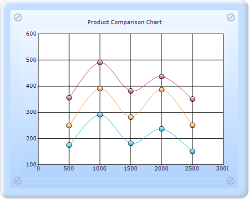
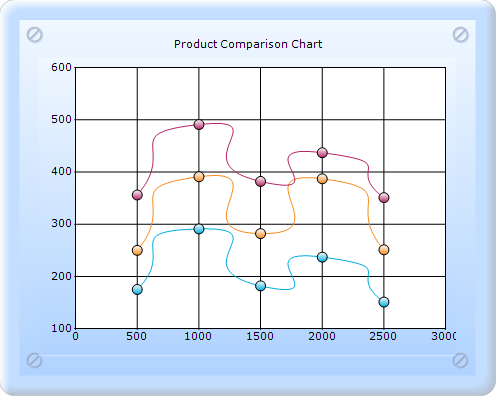

::: {style="DISPLAY: none"}
{#d2h_url_template}{#d2h_package_url style="WIDTH: 0px; DISPLAY: none; HEIGHT: 0px"}
:::

:::: {.d2h_secondary_topic style="PADDING-BOTTOM: 10pt; MARGIN: 0pt; PADDING-LEFT: 0pt; PADDING-RIGHT: 0pt; PADDING-TOP: 0pt"}
##### ScatterSplineTension {#scattersplinetension style="tab-stops: 0pt"}

ScatterSplineTension sets the tension required for the Scatter Spline chart.

::: {align="center"}
+------------------------------+-----------------------------+
| Details                                                    |
+------------------------------+-----------------------------+
| Possible values              | Any possible numeric value. |
+------------------------------+-----------------------------+
| Default value                | 0.5                         |
+------------------------------+-----------------------------+
| 2D/3D limitations            | No                          |
+------------------------------+-----------------------------+
| Application to chart element | All series                  |
+------------------------------+-----------------------------+
| Application to chart types   | Scatter Spline chart        |
+------------------------------+-----------------------------+
:::

[]{style="FONT-FAMILY: 'Calibri','sans-serif'"} 

{border="0"}

Figure 209: Scatter Spline chart with default Spline Tension

[]{style="FONT-FAMILY: 'Calibri','sans-serif'"} 

{border="0"}

Figure 210: Scatter chart with Spline Tension 2

See also

[Scatter Chart]{style="COLOR: windowtext; TEXT-DECORATION: none; text-underline: none"}

[]{#related-topics}
::::
