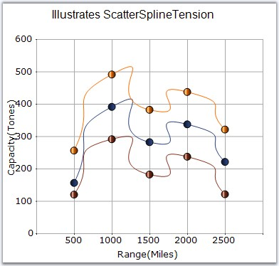

::: {style="DISPLAY: none"}
{#d2h_url_template}{#d2h_package_url style="WIDTH: 0px; DISPLAY: none; HEIGHT: 0px"}
:::

:::: {.d2h_secondary_topic style="PADDING-BOTTOM: 10pt; MARGIN: 0pt; PADDING-LEFT: 0pt; PADDING-RIGHT: 0pt; PADDING-TOP: 0pt"}
#### ScatterSplineTension {#scattersplinetension style="tab-stops: 0pt"}

 

Sets the tension required for the Scatter Spline Chart.

 

::: {align="center"}
+-------------------------------------+-------------------------------------+
|                                                                           |
|                                                                           |
| Details                                                                   |
+-------------------------------------+-------------------------------------+
| **Possible Values**                 | Any Possible Numeric Values         |
+-------------------------------------+-------------------------------------+
| **Default Value    **               | 0.5                                 |
+-------------------------------------+-------------------------------------+
| **2D / 3D Limitations**             | No                                  |
+-------------------------------------+-------------------------------------+
| **Applies to Chart Element**        | All Series                          |
+-------------------------------------+-------------------------------------+
| **Applies to Chart Types**          | ScatterSplineChart                  |
+-------------------------------------+-------------------------------------+
:::

 

Here is some sample code.

 

+-----------------------------------------------------------------------------------------------------------------------------------------------------------------------------------------------------------------------------------------------------------------------------------------------+
| **[\[C#\]]{style="FONT-FAMILY: 'Courier New'; COLOR: black"}**                                                                                                                                                                                                                                |
|                                                                                                                                                                                                                                                                                               |
| **[]{style="FONT-FAMILY: 'Courier New'; COLOR: black"}**                                                                                                                                                                                                                                      |
|                                                                                                                                                                                                                                                                                               |
| [this]{style="FONT-FAMILY: 'Courier New'; COLOR: blue"}[.chartControl1.Series\[i\].ScatterConnectType  = ]{style="FONT-FAMILY: 'Courier New'; COLOR: black"}[ScatterConnectType]{style="FONT-FAMILY: 'Courier New'; COLOR: teal"}[.Spline;]{style="FONT-FAMILY: 'Courier New'; COLOR: black"} |
|                                                                                                                                                                                                                                                                                               |
| [this]{style="FONT-FAMILY: 'Courier New'; COLOR: blue"}[.chartControl1.Series\[i\].ScatterSplineTension =3;]{style="FONT-FAMILY: 'Courier New'; COLOR: black"}                                                                                                                                |
+-----------------------------------------------------------------------------------------------------------------------------------------------------------------------------------------------------------------------------------------------------------------------------------------------+

 

+-------------------------------------------------------------------------------------------------------------------------------------------------------------------------------------------------------------------------------------------------------------------------------------------------+
| **[\[VB.NET\]]{style="FONT-FAMILY: 'Courier New'; COLOR: black"}**                                                                                                                                                                                                                              |
|                                                                                                                                                                                                                                                                                                 |
| **[]{style="FONT-FAMILY: 'Courier New'; COLOR: black"}**                                                                                                                                                                                                                                        |
|                                                                                                                                                                                                                                                                                                 |
| [Private Me]{style="FONT-FAMILY: 'Courier New'; COLOR: blue"}[.chartControl1.Series(i).ScatterConnectType = ]{style="FONT-FAMILY: 'Courier New'; COLOR: black"}[ScatterConnectType]{style="FONT-FAMILY: 'Courier New'; COLOR: teal"}[.Spline]{style="FONT-FAMILY: 'Courier New'; COLOR: black"} |
|                                                                                                                                                                                                                                                                                                 |
| [Private Me]{style="FONT-FAMILY: 'Courier New'; COLOR: blue"}[.chartControl1.Series(i).ScatterSplineTension =3]{style="FONT-FAMILY: 'Courier New'; COLOR: black"}                                                                                                                               |
+-------------------------------------------------------------------------------------------------------------------------------------------------------------------------------------------------------------------------------------------------------------------------------------------------+

 

{border="0"}

 

Figure 191: Scatter Chart with ScatterSplineTension = \"3\"\
\

See Also

 

[Scatter Chart]{.UGHyperlink}[]{.UGHyperlink}

 

[]{#p142} 

 

[]{#related-topics}
::::
