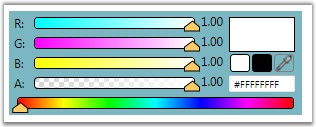

::: {style="DISPLAY: none"}
{#d2h_url_template}{#d2h_package_url style="WIDTH: 0px; DISPLAY: none; HEIGHT: 0px"}
:::

::: {.d2h_secondary_topic style="PADDING-BOTTOM: 10pt; MARGIN: 0pt; PADDING-LEFT: 0pt; PADDING-RIGHT: 0pt; PADDING-TOP: 0pt"}
#### ScRGB Color {#scrgb-color style="tab-stops: 0pt"}

Using the **IsScRGBColor** property, user can set the value indicating whether this instance is ScRGB color. To enable this property use the following code.

 

+-----------------------------------------------------------------------------------------------------------------------------------------------------------------------------------------------------------------------------------------------------------------------------------------------------------------------------------------------------------------------------------------------------------------------------------------------------------------------------------------------------------------------------------------------------------------------------------------------------------------------------+
| **[\[XAML\]]{style="FONT-FAMILY: 'Courier New'; COLOR: black"}**                                                                                                                                                                                                                                                                                                                                                                                                                                                                                                                                                            |
|                                                                                                                                                                                                                                                                                                                                                                                                                                                                                                                                                                                                                             |
| []{style="FONT-FAMILY: 'Courier New'; COLOR: blue"}                                                                                                                                                                                                                                                                                                                                                                                                                                                                                                                                                                         |
|                                                                                                                                                                                                                                                                                                                                                                                                                                                                                                                                                                                                                             |
| [\<!\--]{style="FONT-FAMILY: 'Courier New'; COLOR: blue"}[ Adding ColorEdit ]{style="FONT-FAMILY: 'Courier New'; COLOR: green"}[\--\>]{style="FONT-FAMILY: 'Courier New'; COLOR: blue"}                                                                                                                                                                                                                                                                                                                                                                                                                                     |
|                                                                                                                                                                                                                                                                                                                                                                                                                                                                                                                                                                                                                             |
| [\<]{style="FONT-FAMILY: 'Courier New'; COLOR: blue"}[syncfusion:ColorEdit]{style="FONT-FAMILY: 'Courier New'; COLOR: #a31515"}[ ]{style="FONT-FAMILY: 'Courier New'; COLOR: blue"}[IsScRGBColor]{style="FONT-FAMILY: 'Courier New'; COLOR: red"}[=]{style="FONT-FAMILY: 'Courier New'; COLOR: blue"}[\"[True]{style="COLOR: blue"}\"[ ]{style="COLOR: blue"}[Margin]{style="COLOR: red"}[=]{style="COLOR: blue"}\"[20]{style="COLOR: blue"}\"[ ]{style="COLOR: blue"}[Name]{style="COLOR: red"}[=]{style="COLOR: blue"}\"[colorEdit]{style="COLOR: blue"}\"[/\>]{style="COLOR: blue"}]{style="FONT-FAMILY: 'Courier New'"} |
+-----------------------------------------------------------------------------------------------------------------------------------------------------------------------------------------------------------------------------------------------------------------------------------------------------------------------------------------------------------------------------------------------------------------------------------------------------------------------------------------------------------------------------------------------------------------------------------------------------------------------------+

[]{style="FONT-FAMILY: 'Trebuchet MS','sans-serif'; COLOR: #15428b; FONT-SIZE: 9pt"} 

+--------------------------------------------------------------------------------------------------------------------+
| **[\[C#\]]{style="FONT-FAMILY: 'Courier New'; COLOR: black"}**                                                     |
|                                                                                                                    |
| []{style="FONT-FAMILY: 'Courier New'; COLOR: black"}                                                               |
|                                                                                                                    |
| [//Creating an instance of color edit]{style="FONT-FAMILY: 'Courier New'; COLOR: green"}                           |
|                                                                                                                    |
| [ColorEdit colorEdit = [new]{style="COLOR: blue"} ColorEdit();]{style="FONT-FAMILY: 'Courier New'"}                |
|                                                                                                                    |
| []{style="FONT-FAMILY: 'Courier New'; COLOR: green"}                                                               |
|                                                                                                                    |
| [//Setting ScRGBColor]{style="FONT-FAMILY: 'Courier New'; COLOR: green"}                                           |
|                                                                                                                    |
| [colorEdit.IsScRGBColor = [true]{style="COLOR: blue"};]{style="FONT-FAMILY: 'Courier New'"}                        |
|                                                                                                                    |
| []{style="FONT-FAMILY: 'Courier New'; COLOR: green"}                                                               |
|                                                                                                                    |
| [//Adding control to the window]{style="FONT-FAMILY: 'Courier New'; COLOR: green"}                                 |
|                                                                                                                    |
| [this]{style="FONT-FAMILY: 'Courier New'; COLOR: blue"}[.Content = colorEdit;]{style="FONT-FAMILY: 'Courier New'"} |
+--------------------------------------------------------------------------------------------------------------------+

[]{style="FONT-FAMILY: 'Trebuchet MS','sans-serif'; COLOR: #15428b; FONT-SIZE: 9pt"} 

{border="0"}

Figure 156: IsScRGBColor = \"True\"

 

[]{#related-topics}
:::
