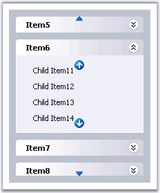

::: {style="DISPLAY: none"}
{#d2h_url_template}{#d2h_package_url style="WIDTH: 0px; DISPLAY: none; HEIGHT: 0px"}
:::

:::::: {.d2h_secondary_topic style="PADDING-BOTTOM: 10pt; MARGIN: 0pt; PADDING-LEFT: 0pt; PADDING-RIGHT: 0pt; PADDING-TOP: 0pt"}
##### ScrollBar Settings {#scrollbar-settings style="tab-stops: 0pt"}

[]{style="FONT-FAMILY: 'Trebuchet MS','sans-serif'; COLOR: #15428b; FONT-SIZE: 9pt"} 

Adding Scrollbars to the control

[]{style="FONT-FAMILY: 'Trebuchet MS','sans-serif'; COLOR: #15428b; FONT-SIZE: 9pt"} 

Scrollbars can be added for the control that allows to traverse through the items when the a large number of items are added to the control. Scroll bars will automatically be added, once the height of the control exceeds the limit specified in the **Height** property.

[]{style="FONT-FAMILY: 'Trebuchet MS','sans-serif'; COLOR: #15428b; FONT-SIZE: 9pt"} 

Adding Scrollbars to the subpanel

[]{style="FONT-FAMILY: 'Trebuchet MS','sans-serif'; COLOR: #15428b; FONT-SIZE: 9pt"} 

To add scroll bars to the subpanel (i.e.) the child items of a parent, set the **ScrollingEnabled** property for the parent item in the Designer dialog. Then set the **ScrollHeight** property so that when the number of items exceeds the given height, scroll bars will appear for the sub-panel.

[]{style="FONT-FAMILY: 'Trebuchet MS','sans-serif'; COLOR: #15428b; FONT-SIZE: 9pt"} 

::: {align="center"}
  ------------------------ -------------------------------------------------------------------------
  GroupBar Item Property   Description
  ScrollingEnabled         Specifies the scroll image to use for the down arrow.
  ScrollHeight             Specifies the height, which when exceeded, scroll bars will be applied.
  ------------------------ -------------------------------------------------------------------------
:::

[]{style="FONT-FAMILY: 'Trebuchet MS','sans-serif'; COLOR: #15428b; FONT-SIZE: 9pt"} 

Customizing Scroll Looks

[]{style="FONT-FAMILY: 'Trebuchet MS','sans-serif'; COLOR: #15428b; FONT-SIZE: 9pt"} 

The default scroll images for the up and down scroll buttons can be changed, by setting the custom image to the **ScrollUpImage** and **ScrollDownImage** properties. Also the images can be changed on mouse over, or the same custom image can be set, for the up and down scroll  button using **ScrollUpImageHover** and **ScrollDownImageHover**, respectively.

 

To customize the scroll buttons for the sub-panel, set these properties for the corresponding parent items in the Designer dialog.

[]{style="FONT-FAMILY: 'Trebuchet MS','sans-serif'; COLOR: #15428b; FONT-SIZE: 9pt"} 

::: {align="center"}
  ---------------------- ----------------------------------------------------------------------
  Property               Description
  ScrollDownImage        Specifies the scroll image to use for the down arrow.
  ScrollDownImageHover   Specifies the scroll image to use for the down arrow on mouse hover.
  ScrollUpImage          Specifies the scroll image to use for the up arrow.
  ScrollUpImageHover     Specifies the scroll image to use for the up arrow on mouse hover.
  ---------------------- ----------------------------------------------------------------------
:::

[]{style="FONT-FAMILY: 'Trebuchet MS','sans-serif'; COLOR: #15428b; FONT-SIZE: 9pt"} 

{border="0"}

**[]{style="FONT-FAMILY: 'Trebuchet MS','sans-serif'; COLOR: #15428b; FONT-SIZE: 9pt"}** 

Figure 328: Menu with custom scroll images for the control and subpanel

[]{style="FONT-FAMILY: 'Trebuchet MS','sans-serif'; COLOR: #15428b; FONT-SIZE: 9pt"} 

Looks can be applied using css styles to the scroll up / down arrows by defining the looks in style sheets and apply it to the up and down arrows, by setting it to the ScrollDownLook and ScrollUpLook as required.

 

Looks for the sub-panel scroll arrows can be set by setting these properties for the parent item in the Designer dialog.

[]{style="FONT-FAMILY: 'Trebuchet MS','sans-serif'; COLOR: #15428b; FONT-SIZE: 9pt"} 

::: {align="center"}
  ---------------- -------------------------------------------------------------------------------
  Property         Description
  ScrollDownLook   Specifies the class name of the css style settings to use for the down arrow.
  ScrollUpLook     Specifies the class name of the style settings to use for the up arrow.
  ---------------- -------------------------------------------------------------------------------
:::

[]{#p438} 

[]{#related-topics}
::::::
