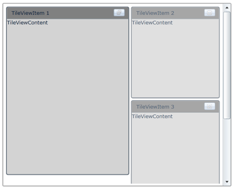
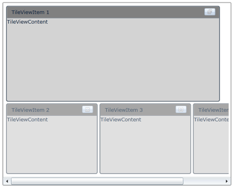

::: {style="DISPLAY: none"}
{#d2h_url_template}{#d2h_package_url style="WIDTH: 0px; DISPLAY: none; HEIGHT: 0px"}
:::

::: {.d2h_secondary_topic style="PADDING-BOTTOM: 10pt; MARGIN: 0pt; PADDING-LEFT: 0pt; PADDING-RIGHT: 0pt; PADDING-TOP: 0pt"}
#### ScrollBar Support {#scrollbar-support style="tab-stops: 0pt"}

The ScrollBar will be visible in the bottom of the TileViewControl, when the width of the Minimized TileViewItem increases and also when MinimizedItemsOrientation of the TileViewControl is set to top or bottom. The ScrollBar will be visible in the right side of the TileViewControl, when the height of the Minimized TileViewItem increases and also when MinimizedItemsOrientation of the TileViewControl is set to right or left.

Use Case Scenarios

ScrollBar support enables you to see all the minimized TileViewItems, if the total height and width of the minimized TileViewItems increases from the actual control height.

[]{style="FONT-FAMILY: 'Trebuchet MS','sans-serif'; COLOR: #15428b; FONT-SIZE: 9pt"} 

Adding ScrollBar Support to an Application

The following code example illustrates how to add the ScrollBar to an application.

 

+-------------------------------------------------------------------------------------------------------------------------------------------------------------------------------------------------------------------------------------------------------------------------------------------------------------------------------------------------------------------------------------------------------------------------------------------------------------------------------------------------------------------------------------------------------------------------------------------------------------------------------------------------------------+
| **[\[XAML\]]{style="FONT-FAMILY: 'Courier New'"}**                                                                                                                                                                                                                                                                                                                                                                                                                                                                                                                                                                                                          |
|                                                                                                                                                                                                                                                                                                                                                                                                                                                                                                                                                                                                                                                             |
| **[]{style="FONT-FAMILY: 'Courier New'"}**                                                                                                                                                                                                                                                                                                                                                                                                                                                                                                                                                                                                                  |
|                                                                                                                                                                                                                                                                                                                                                                                                                                                                                                                                                                                                                                                             |
| [\<]{style="FONT-FAMILY: 'Courier New'; COLOR: blue"}[syncfusion]{style="FONT-FAMILY: 'Courier New'; COLOR: #a31515"}[:]{style="FONT-FAMILY: 'Courier New'; COLOR: blue"}[TileViewControl]{style="FONT-FAMILY: 'Courier New'; COLOR: #a31515"}[ x]{style="FONT-FAMILY: 'Courier New'; COLOR: red"}[:]{style="FONT-FAMILY: 'Courier New'; COLOR: blue"}[Name]{style="FONT-FAMILY: 'Courier New'; COLOR: red"}[=\"TileView1\"]{style="FONT-FAMILY: 'Courier New'; COLOR: blue"}[ Background]{style="FONT-FAMILY: 'Courier New'; COLOR: red"}[=\"White\"\>]{style="FONT-FAMILY: 'Courier New'; COLOR: blue"}[]{style="FONT-FAMILY: 'Courier New'; COLOR: red"} |
|                                                                                                                                                                                                                                                                                                                                                                                                                                                                                                                                                                                                                                                             |
| [       ]{style="FONT-FAMILY: 'Courier New'; COLOR: #a31515"}[\<]{style="FONT-FAMILY: 'Courier New'; COLOR: blue"}[syncfusion]{style="FONT-FAMILY: 'Courier New'; COLOR: #a31515"}[:]{style="FONT-FAMILY: 'Courier New'; COLOR: blue"}[TileViewItem]{style="FONT-FAMILY: 'Courier New'; COLOR: #a31515"}[ BorderThickness]{style="FONT-FAMILY: 'Courier New'; COLOR: red"}[=\"2\"]{style="FONT-FAMILY: 'Courier New'; COLOR: blue"}[ Header]{style="FONT-FAMILY: 'Courier New'; COLOR: red"}[=\"TileViewItem 1\"]{style="FONT-FAMILY: 'Courier New'; COLOR: blue"}[                                         ]{style="FONT-FAMILY: 'Courier New'"}           |
|                                                                                                                                                                                                                                                                                                                                                                                                                                                                                                                                                                                                                                                             |
| [               [Content]{style="COLOR: red"}[=\"TileViewContent\"]{style="COLOR: blue"}[ OnMinimizedHeight]{style="COLOR: red"}[=\"200\"]{style="COLOR: blue"}[ ]{style="COLOR: red"}]{style="FONT-FAMILY: 'Courier New'"}                                                                                                                                                                                                                                                                                                                                                                                                                                 |
|                                                                                                                                                                                                                                                                                                                                                                                                                                                                                                                                                                                                                                                             |
| [               OnMinimizedWidth]{style="FONT-FAMILY: 'Courier New'; COLOR: red"}[=\"200\" ]{style="FONT-FAMILY: 'Courier New'; COLOR: blue"}[Background]{style="FONT-FAMILY: 'Courier New'; COLOR: red"}[=\"LightGray\"]{style="FONT-FAMILY: 'Courier New'; COLOR: blue"}[ ]{style="FONT-FAMILY: 'Courier New'; COLOR: red"}                                                                                                                                                                                                                                                                                                                               |
|                                                                                                                                                                                                                                                                                                                                                                                                                                                                                                                                                                                                                                                             |
| [               HeaderBackground]{style="FONT-FAMILY: 'Courier New'; COLOR: red"}[=\"Gray\"]{style="FONT-FAMILY: 'Courier New'; COLOR: blue"}[ Margin]{style="FONT-FAMILY: 'Courier New'; COLOR: red"}[=\"2\"]{style="FONT-FAMILY: 'Courier New'; COLOR: blue"}[ CornerRadius]{style="FONT-FAMILY: 'Courier New'; COLOR: red"}[=\"3\"/\>]{style="FONT-FAMILY: 'Courier New'; COLOR: blue"}[]{style="FONT-FAMILY: 'Courier New'"}                                                                                                                                                                                                                            |
|                                                                                                                                                                                                                                                                                                                                                                                                                                                                                                                                                                                                                                                             |
| [       ]{style="FONT-FAMILY: 'Courier New'; COLOR: #a31515"}[\<]{style="FONT-FAMILY: 'Courier New'; COLOR: blue"}[syncfusion]{style="FONT-FAMILY: 'Courier New'; COLOR: #a31515"}[:]{style="FONT-FAMILY: 'Courier New'; COLOR: blue"}[TileViewItem]{style="FONT-FAMILY: 'Courier New'; COLOR: #a31515"}[ BorderThickness]{style="FONT-FAMILY: 'Courier New'; COLOR: red"}[=\"2\"]{style="FONT-FAMILY: 'Courier New'; COLOR: blue"}[ Header]{style="FONT-FAMILY: 'Courier New'; COLOR: red"}[=\"TileViewItem 2\"]{style="FONT-FAMILY: 'Courier New'; COLOR: blue"}[                                          ]{style="FONT-FAMILY: 'Courier New'"}          |
|                                                                                                                                                                                                                                                                                                                                                                                                                                                                                                                                                                                                                                                             |
| [               [Content]{style="COLOR: red"}[=\"TileViewContent\"]{style="COLOR: blue"}[ OnMinimizedHeight]{style="COLOR: red"}[=\"200\"]{style="COLOR: blue"}[ ]{style="COLOR: red"}]{style="FONT-FAMILY: 'Courier New'"}                                                                                                                                                                                                                                                                                                                                                                                                                                 |
|                                                                                                                                                                                                                                                                                                                                                                                                                                                                                                                                                                                                                                                             |
| [               OnMinimizedWidth]{style="FONT-FAMILY: 'Courier New'; COLOR: red"}[=\"200\" ]{style="FONT-FAMILY: 'Courier New'; COLOR: blue"}[Background]{style="FONT-FAMILY: 'Courier New'; COLOR: red"}[=\"LightGray\"]{style="FONT-FAMILY: 'Courier New'; COLOR: blue"}[ ]{style="FONT-FAMILY: 'Courier New'; COLOR: red"}                                                                                                                                                                                                                                                                                                                               |
|                                                                                                                                                                                                                                                                                                                                                                                                                                                                                                                                                                                                                                                             |
| [               HeaderBackground]{style="FONT-FAMILY: 'Courier New'; COLOR: red"}[=\"Gray\"]{style="FONT-FAMILY: 'Courier New'; COLOR: blue"}[ Margin]{style="FONT-FAMILY: 'Courier New'; COLOR: red"}[=\"2\"]{style="FONT-FAMILY: 'Courier New'; COLOR: blue"}[ CornerRadius]{style="FONT-FAMILY: 'Courier New'; COLOR: red"}[=\"3\"/\>]{style="FONT-FAMILY: 'Courier New'; COLOR: blue"}[]{style="FONT-FAMILY: 'Courier New'"}                                                                                                                                                                                                                            |
|                                                                                                                                                                                                                                                                                                                                                                                                                                                                                                                                                                                                                                                             |
| [       ]{style="FONT-FAMILY: 'Courier New'; COLOR: #a31515"}[\<]{style="FONT-FAMILY: 'Courier New'; COLOR: blue"}[syncfusion]{style="FONT-FAMILY: 'Courier New'; COLOR: #a31515"}[:]{style="FONT-FAMILY: 'Courier New'; COLOR: blue"}[TileViewItem]{style="FONT-FAMILY: 'Courier New'; COLOR: #a31515"}[ BorderThickness]{style="FONT-FAMILY: 'Courier New'; COLOR: red"}[=\"2\"]{style="FONT-FAMILY: 'Courier New'; COLOR: blue"}[ Header]{style="FONT-FAMILY: 'Courier New'; COLOR: red"}[=\"TileViewItem 3\"]{style="FONT-FAMILY: 'Courier New'; COLOR: blue"}[ ]{style="FONT-FAMILY: 'Courier New'"}                                                   |
|                                                                                                                                                                                                                                                                                                                                                                                                                                                                                                                                                                                                                                                             |
| [               [Content]{style="COLOR: red"}[=\"TileViewContent\"]{style="COLOR: blue"}[ OnMinimizedHeight]{style="COLOR: red"}[=\"200\"]{style="COLOR: blue"}[ ]{style="COLOR: red"}]{style="FONT-FAMILY: 'Courier New'"}                                                                                                                                                                                                                                                                                                                                                                                                                                 |
|                                                                                                                                                                                                                                                                                                                                                                                                                                                                                                                                                                                                                                                             |
| [               OnMinimizedWidth]{style="FONT-FAMILY: 'Courier New'; COLOR: red"}[=\"200\" ]{style="FONT-FAMILY: 'Courier New'; COLOR: blue"}[Background]{style="FONT-FAMILY: 'Courier New'; COLOR: red"}[=\"LightGray\"]{style="FONT-FAMILY: 'Courier New'; COLOR: blue"}[ ]{style="FONT-FAMILY: 'Courier New'; COLOR: red"}                                                                                                                                                                                                                                                                                                                               |
|                                                                                                                                                                                                                                                                                                                                                                                                                                                                                                                                                                                                                                                             |
| [               HeaderBackground]{style="FONT-FAMILY: 'Courier New'; COLOR: red"}[=\"Gray\"]{style="FONT-FAMILY: 'Courier New'; COLOR: blue"}[ Margin]{style="FONT-FAMILY: 'Courier New'; COLOR: red"}[=\"2\"]{style="FONT-FAMILY: 'Courier New'; COLOR: blue"}[ CornerRadius]{style="FONT-FAMILY: 'Courier New'; COLOR: red"}[=\"3\"/\>]{style="FONT-FAMILY: 'Courier New'; COLOR: blue"}[]{style="FONT-FAMILY: 'Courier New'"}                                                                                                                                                                                                                            |
|                                                                                                                                                                                                                                                                                                                                                                                                                                                                                                                                                                                                                                                             |
| [       ]{style="FONT-FAMILY: 'Courier New'; COLOR: #a31515"}[\<]{style="FONT-FAMILY: 'Courier New'; COLOR: blue"}[syncfusion]{style="FONT-FAMILY: 'Courier New'; COLOR: #a31515"}[:]{style="FONT-FAMILY: 'Courier New'; COLOR: blue"}[TileViewItem]{style="FONT-FAMILY: 'Courier New'; COLOR: #a31515"}[ BorderThickness]{style="FONT-FAMILY: 'Courier New'; COLOR: red"}[=\"2\"]{style="FONT-FAMILY: 'Courier New'; COLOR: blue"}[ Header]{style="FONT-FAMILY: 'Courier New'; COLOR: red"}[=\"TileViewItem 4\"]{style="FONT-FAMILY: 'Courier New'; COLOR: blue"}[ ]{style="FONT-FAMILY: 'Courier New'"}                                                   |
|                                                                                                                                                                                                                                                                                                                                                                                                                                                                                                                                                                                                                                                             |
| [               [Content]{style="COLOR: red"}[=\"TileViewContent\"]{style="COLOR: blue"}[ OnMinimizedHeight]{style="COLOR: red"}[=\"200\"]{style="COLOR: blue"}[ ]{style="COLOR: red"}]{style="FONT-FAMILY: 'Courier New'"}                                                                                                                                                                                                                                                                                                                                                                                                                                 |
|                                                                                                                                                                                                                                                                                                                                                                                                                                                                                                                                                                                                                                                             |
| [               OnMinimizedWidth]{style="FONT-FAMILY: 'Courier New'; COLOR: red"}[=\"200\" ]{style="FONT-FAMILY: 'Courier New'; COLOR: blue"}[Background]{style="FONT-FAMILY: 'Courier New'; COLOR: red"}[=\"LightGray\"]{style="FONT-FAMILY: 'Courier New'; COLOR: blue"}[ ]{style="FONT-FAMILY: 'Courier New'; COLOR: red"}                                                                                                                                                                                                                                                                                                                               |
|                                                                                                                                                                                                                                                                                                                                                                                                                                                                                                                                                                                                                                                             |
| [               HeaderBackground]{style="FONT-FAMILY: 'Courier New'; COLOR: red"}[=\"Gray\"]{style="FONT-FAMILY: 'Courier New'; COLOR: blue"}[ Margin]{style="FONT-FAMILY: 'Courier New'; COLOR: red"}[=\"2\"]{style="FONT-FAMILY: 'Courier New'; COLOR: blue"}[ CornerRadius]{style="FONT-FAMILY: 'Courier New'; COLOR: red"}[=\"3\"/\>]{style="FONT-FAMILY: 'Courier New'; COLOR: blue"}[]{style="FONT-FAMILY: 'Courier New'"}                                                                                                                                                                                                                            |
|                                                                                                                                                                                                                                                                                                                                                                                                                                                                                                                                                                                                                                                             |
| [\</]{style="FONT-FAMILY: 'Courier New'; COLOR: blue"}[syncfusion]{style="FONT-FAMILY: 'Courier New'; COLOR: #a31515"}[:]{style="FONT-FAMILY: 'Courier New'; COLOR: blue"}[TileViewControl]{style="FONT-FAMILY: 'Courier New'; COLOR: #a31515"}[\>]{style="FONT-FAMILY: 'Courier New'; COLOR: blue"}                                                                                                                                                                                                                                                                                                                                                        |
+-------------------------------------------------------------------------------------------------------------------------------------------------------------------------------------------------------------------------------------------------------------------------------------------------------------------------------------------------------------------------------------------------------------------------------------------------------------------------------------------------------------------------------------------------------------------------------------------------------------------------------------------------------------+

 

{border="0"}

Figure 1077: Vertical Scroll Bar when the MinimizedItemsOrientation is set to Right[]{style="COLOR: #c00000"}

 

 

{border="0"}

Figure 1078: Horizontal Scroll Bar when the MinimizedItemsOrientation is set to Bottom[]{style="COLOR: #c00000"}

 

Properties

Table 57: OnMinimizedHeight / OnMinimizedWidth Properties Table

  ------------------- -------------------------------------------------------------------------------------------------------- -------------------- ----------- ---------------------------------------------------------------------------------------
  Property            Description                                                                                              Type                 Data Type   Reference links
  OnMinimizedHeight   Specifies the Height of the MinimizedTileViewItem when the MinimizedItemsOrientation is Right or Left.   DependencyProperty   0           
  OnMinimizedWidth    Specifies the Width of the MinimizedTileViewItem when the MinimizedItemsOrientation is Top or Bottom.    DependencyProperty   0           []{style="FONT-FAMILY: 'Trebuchet MS','sans-serif'; COLOR: #15428b; FONT-SIZE: 9pt"} 
  ------------------- -------------------------------------------------------------------------------------------------------- -------------------- ----------- ---------------------------------------------------------------------------------------

**[]{style="FONT-FAMILY: 'Trebuchet MS','sans-serif'; COLOR: #15428b; FONT-SIZE: 9pt"}** 

Sample Link

To view samples:

[]{style="FONT-FAMILY: 'Trebuchet MS','sans-serif'; COLOR: #15428b; FONT-SIZE: 9pt"} 

1.   Select Start -\> Programs -\> Syncfusion -\> Essential Studio x.x.xx -\> Dashboard.

2.   Select   Run Locally Installed Samples in WPF Button.

3.   Now expand the DragAndDropManagerDemo tree-view item in the Sample Browser.

4.   Choose any one of the samples listed under it to launch.

[]{style="FONT-FAMILY: 'Trebuchet MS','sans-serif'; COLOR: #15428b; FONT-SIZE: 9pt"} 

[]{#related-topics}
:::
