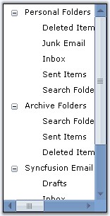
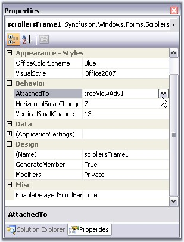

::: {style="DISPLAY: none"}
{#d2h_url_template}{#d2h_package_url style="WIDTH: 0px; DISPLAY: none; HEIGHT: 0px"}
:::

:::: {.d2h_secondary_topic style="PADDING-BOTTOM: 10pt; MARGIN: 0pt; PADDING-LEFT: 0pt; PADDING-RIGHT: 0pt; PADDING-TOP: 0pt"}
#### ScrollersFrame {#scrollersframe style="tab-stops: 0pt"}

[]{style="COLOR: #15428b"} 

The ScrollersFrame control attaches Office2007 Style scrollbars to any scrollable control or container.

[]{style="COLOR: #15428b"} 

{border="0"}

[]{style="COLOR: #15428b"} 

Figure 1411: Office2007Style ScrollBars Attached to TreeViewControl

 

Attaching Scrollbar to a Control

 

To the Windows form, add a control, which should be attached with the Office2007Style scrollbars. Select the control in the ScrollersFrame.AttachedTo property.

[]{style="COLOR: #15428b"} 

{border="0"}

[]{style="COLOR: #15428b"} 

***[]{style="COLOR: #15428b"}*** 

Figure 1412: Selecting the TreeViewAdv control through AttachedTo Property

[]{style="COLOR: #15428b"} 

+------------------------------------------------------------------------------------------------------------------------------------------------------------------------------------------------------------+
| **[\[C#\]]{style="FONT-FAMILY: 'Courier New'; COLOR: black"}**                                                                                                                                             |
|                                                                                                                                                                                                            |
| []{style="FONT-FAMILY: 'Courier New'; COLOR: blue"}                                                                                                                                                        |
|                                                                                                                                                                                                            |
| [//Attaching Scrolls using AttachedTo property]{style="FONT-FAMILY: 'Courier New'; COLOR: green"}                                                                                                          |
|                                                                                                                                                                                                            |
| [this]{style="FONT-FAMILY: 'Courier New'; COLOR: blue"}[.scrollersFrame1.AttachedTo = [this]{style="COLOR: blue"}.treeViewAdv1;]{style="FONT-FAMILY: 'Courier New'"}[]{style="FONT-FAMILY: 'Courier New'"} |
+------------------------------------------------------------------------------------------------------------------------------------------------------------------------------------------------------------+

[]{style="COLOR: #15428b"} 

+-------------------------------------------------------------------------------------------------------------------------------------------------------------------------------------------------------+
| **[\[VB.NET\]]{style="FONT-FAMILY: 'Courier New'; COLOR: black"}**                                                                                                                                    |
|                                                                                                                                                                                                       |
| []{style="FONT-FAMILY: 'Courier New'; COLOR: black"}                                                                                                                                                  |
|                                                                                                                                                                                                       |
| [\'Attaching Scrolls using AttachedTo property]{style="FONT-FAMILY: 'Courier New'; COLOR: green"}                                                                                                     |
|                                                                                                                                                                                                       |
| [Me]{style="FONT-FAMILY: 'Courier New'; COLOR: blue"}[.scrollersFrame1.AttachedTo = [Me]{style="COLOR: blue"}.treeViewAdv1]{style="FONT-FAMILY: 'Courier New'"}[]{style="FONT-FAMILY: 'Courier New'"} |
+-------------------------------------------------------------------------------------------------------------------------------------------------------------------------------------------------------+

[]{style="COLOR: #15428b"} 

::: {style="BORDER-BOTTOM: windowtext 1pt solid; BORDER-LEFT: medium none; PADDING-BOTTOM: 1pt; MARGIN: 9pt 0pt 9pt 18pt; PADDING-LEFT: 0pt; PADDING-RIGHT: 0pt; BORDER-TOP: windowtext 1pt solid; BORDER-RIGHT: medium none; PADDING-TOP: 1pt"}
{border="0"} Note: This property lists all the controls that are added to the form. User can the select any one control, for which scrolls needs to be attached.
:::

[]{style="COLOR: #15428b"} 

See Also

[]{style="COLOR: #15428b"} 

[[Adding Controls to the ScrollBar]{.UGHyperlink}](../../../../../../../../Documents%20and%20Settings/sylviap/Desktop/Tools%20-%20Part%202.docx#_Adding_Controls_to_1)[, ]{.UGHyperlink}[[Scroll Settings]{.UGHyperlink}](../../../../../../../../Documents%20and%20Settings/sylviap/Desktop/Tools%20-%20Part%202.docx#_Scroll_Settings_in)[, ]{.UGHyperlink}[[Visual Styles]{.UGHyperlink}](../../../../../../../../Documents%20and%20Settings/sylviap/Desktop/Tools%20-%20Part%202.docx#_Visual_Styles_1)[]{.UGHyperlink}

 

 

More:

[ ]{#related-topics}

[{border="0" align="absMiddle"}Adding Controls to the ScrollBar](ms-xhelp:///?Id=ed426b4e-3309-44b6-9e71-39ead8d8cb2b){style="TEXT-DECORATION: none"}

[{border="0" align="absMiddle"}Scroll Settings in ScrollersFrame](ms-xhelp:///?Id=1981d9a1-4c5e-497a-8cde-ce8d35ade77e){style="TEXT-DECORATION: none"}

[{border="0" align="absMiddle"}Visual Styles](ms-xhelp:///?Id=8dbb61d9-c434-4d17-b8d9-d138675c9585){style="TEXT-DECORATION: none"}
::::
