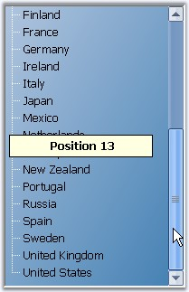
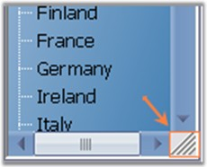

::: {style="DISPLAY: none"}
{#d2h_url_template}{#d2h_package_url style="WIDTH: 0px; DISPLAY: none; HEIGHT: 0px"}
:::

::::::: {.d2h_secondary_topic style="PADDING-BOTTOM: 10pt; MARGIN: 0pt; PADDING-LEFT: 0pt; PADDING-RIGHT: 0pt; PADDING-TOP: 0pt"}
##### Scrolling {#scrolling style="MARGIN-LEFT: 18pt; tab-stops: 18.0pt"}

[]{style="COLOR: #15428b"} 

TreeViewAdv control provides scrollbar support to show additional content that is available but not visible by default. The following properties are supported by treeview scrolling.

 

**Displaying ScrollTips**

 

The text of the ScrollTip can be set through **ScrollTipFormat** property. It lets you identify the scroll position.

[]{style="COLOR: #15428b"} 

::: {align="center"}
  ------------------------ ---------------------------------------------------------------------------------------------------------------------------
  TreeViewAdv Properties   Description
  HorizontalScrollTips     Specifies if the control should display scrolltip when the user is dragging a horizontal scrollbar thumb.
  VerticalScrollTips       Specifies if the control should display scrolltip when the user is dragging a vertical scrollbar thumb.
  HorizontalThumbTrack     Specifies if the control should scroll together with scrollbar, when the user is dragging a horizontal scrollbar thumb.
  VerticalThumbTrack       Specifies if the control should scroll together with the scrollbar, when the user is dragging a vertical scrollbar thumb.
  ------------------------ ---------------------------------------------------------------------------------------------------------------------------
:::

[]{#p977}[]{style="COLOR: #15428b"} 

+--------------------------------------------------------------------------------------------------------------------------------------------------------------------------------------+
| **[\[C#\]]{style="FONT-FAMILY: 'Courier New'; COLOR: black"}**                                                                                                                       |
|                                                                                                                                                                                      |
| **[]{style="FONT-FAMILY: 'Courier New'; COLOR: black"}**                                                                                                                             |
|                                                                                                                                                                                      |
| [this]{style="FONT-FAMILY: 'Courier New'; COLOR: blue"}[.treeViewAdv1.ScrollTipFormat = \"Position {0}\";]{style="FONT-FAMILY: 'Courier New'"}[]{style="FONT-FAMILY: 'Courier New'"} |
+--------------------------------------------------------------------------------------------------------------------------------------------------------------------------------------+

[]{style="COLOR: #15428b"} 

+-----------------------------------------------------------------------------------------------------------------------------------------------------------------------------------+
| **[\[VB.NET\]]{style="FONT-FAMILY: 'Courier New'; COLOR: black"}**                                                                                                                |
|                                                                                                                                                                                   |
| **[]{style="FONT-FAMILY: 'Courier New'; COLOR: black"}**                                                                                                                          |
|                                                                                                                                                                                   |
| [Me]{style="FONT-FAMILY: 'Courier New'; COLOR: blue"}[.treeViewAdv1.ScrollTipFormat = \"Position {0}\"]{style="FONT-FAMILY: 'Courier New'"}[]{style="FONT-FAMILY: 'Courier New'"} |
+-----------------------------------------------------------------------------------------------------------------------------------------------------------------------------------+

**[]{style="COLOR: #15428b"}** 

{border="0"}

[]{style="COLOR: #15428b"} 

Figure 1139: Scroll tip displaying Scroll Position

[]{style="COLOR: #15428b"} 

Scrolling using Mouse

**[]{style="COLOR: #15428b"}** 

The following properties support scrolling using mouse wheel.

[]{style="COLOR: #15428b"} 

::: {align="center"}
+-----------------------------------+------------------------------------------------------------------------------------------------------------------------+
| TreeViewAdv Properties            | Description                                                                                                            |
+-----------------------------------+------------------------------------------------------------------------------------------------------------------------+
| SmoothMouseWheelScrolling         | Lets you control the scrolling behavior when the user rolls the mouse wheel.                                           |
+-----------------------------------+------------------------------------------------------------------------------------------------------------------------+
| MouseWheelScrollLine              | Specifies the value which controls the scrolling behavior, when the user rolls the mouse wheel. Default value is 3.    |
+-----------------------------------+------------------------------------------------------------------------------------------------------------------------+
| EnableIntelliMouse                | Specifies whether scrolling is allowed using middle mouse button.                                                      |
+-----------------------------------+------------------------------------------------------------------------------------------------------------------------+
| AccelerateScrolling               | Specifies the acceleration behavior for scrollbars.                                                                    |
|                                   |                                                                                                                        |
|                                   |                                                                                                                        |
|                                   |                                                                                                                        |
|                                   | [·      ]{style="FONT-FAMILY: Symbol"}Fast                                                                             |
|                                   |                                                                                                                        |
|                                   | [·      ]{style="FONT-FAMILY: Symbol"}Immediate                                                                        |
|                                   |                                                                                                                        |
|                                   | [·      ]{style="FONT-FAMILY: Symbol"}None                                                                             |
|                                   |                                                                                                                        |
|                                   | [·      ]{style="FONT-FAMILY: Symbol"}Default                                                                          |
+-----------------------------------+------------------------------------------------------------------------------------------------------------------------+
| AllowIncreaseSmallChange          | When set to true, the scroll control can increase the scrollbar.smallchange property when doing accelerated scrolling. |
+-----------------------------------+------------------------------------------------------------------------------------------------------------------------+
:::

[]{style="COLOR: #15428b"} 

Sizing Grip for the Scrollbars

[]{style="COLOR: #15428b"} 

Setting the value for the **SizeGripStyle** property, will display a sizing grip at the bottom right corner of the control when both the scrollbars are visible. The options available are Show, which will show the sizing grip; Auto, which will automatically show the sizing grip whenever needed; Hide, which will hide the sizing grip.

[]{style="COLOR: #15428b"} 

::: {align="center"}
+-----------------------------------+----------------------------------------------------------------------------------------------------------------------------+
| TreeViewAdv Properties            | Description                                                                                                                |
+-----------------------------------+----------------------------------------------------------------------------------------------------------------------------+
| SizeGripStyle                     | Specifies if the sizing grip should be drawn at the bottom right corner when both scrollbars are visible. The options are, |
|                                   |                                                                                                                            |
|                                   |                                                                                                                            |
|                                   |                                                                                                                            |
|                                   | [·      ]{style="FONT-FAMILY: Symbol"}*Show* - shows the sizing grip.                                                      |
|                                   |                                                                                                                            |
|                                   | [·      ]{style="FONT-FAMILY: Symbol"}*Auto* - shows the sizing grip whenever needed.                                      |
|                                   |                                                                                                                            |
|                                   | [·      ]{style="FONT-FAMILY: Symbol"}*Hide* - Hides the sizing grip.                                                      |
+-----------------------------------+----------------------------------------------------------------------------------------------------------------------------+
:::

[]{style="COLOR: #15428b"} 

[{border="0"}]{style="COLOR: #15428b"}[]{style="COLOR: #15428b"}

[]{style="COLOR: #15428b"} 

Figure 1140: Scrollbars with Sizing Grip

[]{style="COLOR: #15428b"} 

Office2007 Look and Feel for ScrollBars

[]{style="COLOR: #15428b"} 

TreeViewAdv provides support for Office2007Scrollbars with all three color schemes.

**[]{style="COLOR: #15428b"}** 

{border="0"}

***[]{style="COLOR: #15428b"}*** 

Figure 1141: Office 2007 Scrollbars

[]{style="COLOR: #15428b"} 

Color schemes can be selected using **Office2007ScrollBarsColorScheme** property.

 

When the control is been used under a splitter window and if it is sharing the scrollbars with the parent control or the parent window, then setting **FillSplitterPane** property to true, will toggle support for doing that.

[]{style="COLOR: #15428b"} 

::: {align="center"}
  ------------------------ --------------------------------------------------------------------------------------------------------------------------
  TreeViewAdv Properties   Description
  FillSplitterPane         Provides support for using the control inside dynamic splitter window and sharing the scrollbars with the parent window.
  ------------------------ --------------------------------------------------------------------------------------------------------------------------
:::

[]{style="COLOR: #15428b"} 

+--------------------------------------------------------------------------------------------------------------------------------------------------------------------+
| **[\[C#\]]{style="FONT-FAMILY: 'Courier New'; COLOR: black"}**                                                                                                     |
|                                                                                                                                                                    |
| **[]{style="FONT-FAMILY: 'Courier New'; COLOR: black"}**                                                                                                           |
|                                                                                                                                                                    |
| [this]{style="FONT-FAMILY: 'Courier New'; COLOR: blue"}[.treeViewAdv1.AllowIncreaseSmallChange = [true]{style="COLOR: blue"};]{style="FONT-FAMILY: 'Courier New'"} |
|                                                                                                                                                                    |
| [this]{style="FONT-FAMILY: 'Courier New'; COLOR: blue"}[.treeViewAdv1.FillSplitterPane = [true]{style="COLOR: blue"};]{style="FONT-FAMILY: 'Courier New'"}         |
+--------------------------------------------------------------------------------------------------------------------------------------------------------------------+

[]{style="COLOR: #15428b"} 

+--------------------------------------------------------------------------------------------------------------------------------------------------------------------------------------------------------------------+
| **[\[VB.NET\]]{style="FONT-FAMILY: 'Courier New'; COLOR: black"}**                                                                                                                                                 |
|                                                                                                                                                                                                                    |
| **[]{style="FONT-FAMILY: 'Courier New'; COLOR: black"}**                                                                                                                                                           |
|                                                                                                                                                                                                                    |
| [Me]{style="FONT-FAMILY: 'Courier New'; COLOR: blue"}[.treeViewAdv1.AllowIncreaseSmallChange = [True]{style="COLOR: blue"}]{style="FONT-FAMILY: 'Courier New'"}[]{style="FONT-FAMILY: 'Courier New'; COLOR: blue"} |
|                                                                                                                                                                                                                    |
| [Me]{style="FONT-FAMILY: 'Courier New'; COLOR: blue"}[.treeViewAdv1.FillSplitterPane = [True]{style="COLOR: blue"}]{style="FONT-FAMILY: 'Courier New'"}[]{style="FONT-FAMILY: 'Courier New'; COLOR: blue"}         |
+--------------------------------------------------------------------------------------------------------------------------------------------------------------------------------------------------------------------+

[]{style="COLOR: #15428b"} 

See Also

[]{style="COLOR: #15428b"} 

[[Scrolling Events]{.UGHyperlink}](../../../../../../../../Documents%20and%20Settings/sylviap/Desktop/Tools%20-%20Part%202.docx#_Scrolling_Events)[]{.UGHyperlink}

 

 

 

 

[]{#related-topics}
:::::::
