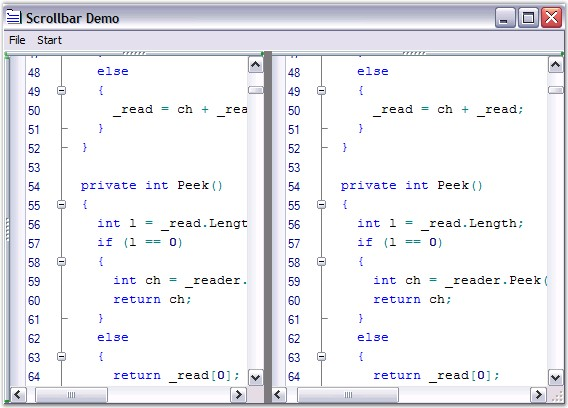

::: {style="DISPLAY: none"}
{#d2h_url_template}{#d2h_package_url style="WIDTH: 0px; DISPLAY: none; HEIGHT: 0px"}
:::

::::: {#nsbanner .d2h_main_nsbanner style="BORDER-BOTTOM: #999999 1px solid; POSITION: relative; PADDING-BOTTOM: 0px; BACKGROUND-COLOR: transparent; PADDING-LEFT: 0px; PADDING-RIGHT: 0px; DISPLAY: none; BORDER-TOP: #999999 1px solid; PADDING-TOP: 0px; LEFT: 0px"}
:::: {#TitleRow .d2h_main_titlerow style="PADDING-BOTTOM: 4px; BACKGROUND-COLOR: transparent; PADDING-LEFT: 22px; WIDTH: 100%; PADDING-RIGHT: 10px; DISPLAY: none; PADDING-TOP: 4px"}
::: {#ienav .d2h_main_ienav style="DISPLAY: none"}
{#D2HPrevious .D2HPreviousEnabled}  {#D2HNext .D2HNextEnabled}
:::
::::
:::::

::::::: {#nstext .d2h_main_nstext style="PADDING-BOTTOM: 10px; BACKGROUND-COLOR: transparent; PADDING-LEFT: 22px; PADDING-RIGHT: 10px; HEIGHT: 100%; OVERFLOW: auto; PADDING-TOP: 5px" hasuserbackground="true" valign="bottom"}
::: {#d2h_breadcrumbs .d2h_breadcrumbs}
[Essential Studio User Guide Documentation](ms-xhelp:///?Id=12457748-09e3-4d74-a240-8e049cedf030){.d2h_breadcrumbsNormal}[ \> ]{.d2h_breadcrumbsLinkSeparator}[User Interface Edition](ms-xhelp:///?Id=c29296b7-531c-413b-a0ec-488ca1f7f669){.d2h_breadcrumbsNormal}[ \> ]{.d2h_breadcrumbsLinkSeparator}[Essential Windows](ms-xhelp:///?Id=e60759d8-47a4-4570-9d7a-16a68d63f2ea){.d2h_breadcrumbsNormal}[ \> ]{.d2h_breadcrumbsLinkSeparator}[Essential Edit]{.d2h_breadcrumbsContentsOnly}[ \> ]{.d2h_breadcrumbsLinkSeparator}[Concepts And Features](ms-xhelp:///?Id=7c39cee6-8434-4711-a18e-efaba8ac85c0){.d2h_breadcrumbsNormal}[ \> ]{.d2h_breadcrumbsLinkSeparator}[Runtime Features](ms-xhelp:///?Id=f0192b3e-71b0-4238-abcc-482a4b1351ed){.d2h_breadcrumbsNormal}
:::

### Scrolling Support {#scrolling-support style="tab-stops: 0pt"}

 

Edit Control offers extremely smooth scrolling behavior using idle-time processing and dynamic scroll area expansion techniques. The scrolling behavior is smooth even when large files are loaded, though the Edit Control scrolls by several hundred lines for a small movement of the scroller.

 

The scrollers in the Edit Control can be optionally shown / hidden by using the below given properties.

 

::: {align="center"}
  ------------------------ ----------------------------------------------------------------------------
  Edit Control Property    Description
  ShowVerticalScroller     Gets / sets value indicating whether the vertical scroller can be shown.
  ShowHorizontalScroller   Gets / sets value indicating whether the horizontal scroller can be shown.
  AlwaysShowScrollers      Gets / sets value indicating whether scrollers should be always visible.
  ------------------------ ----------------------------------------------------------------------------
:::

[]{style="FONT-FAMILY: 'Trebuchet MS','sans-serif'; COLOR: #15428b; FONT-SIZE: 9pt"} 

+------------------------------------------------------------------------------------------------------------------------------------------------------------------+
| **[\[C#\]]{style="FONT-FAMILY: 'Courier New'; COLOR: black"}**                                                                                                   |
|                                                                                                                                                                  |
| []{style="FONT-FAMILY: 'Courier New'; COLOR: black"}                                                                                                             |
|                                                                                                                                                                  |
| [// Display the Horizontal Scroller.]{style="FONT-FAMILY: 'Courier New'; COLOR: green"}                                                                          |
|                                                                                                                                                                  |
| [this]{style="FONT-FAMILY: 'Courier New'; COLOR: blue"}[.editControl1.ShowHorizontalScroller = [true]{style="COLOR: blue"};]{style="FONT-FAMILY: 'Courier New'"} |
|                                                                                                                                                                  |
| []{style="FONT-FAMILY: 'Courier New'; COLOR: green"}                                                                                                             |
|                                                                                                                                                                  |
| [// Display the Vertical Scroller.]{style="FONT-FAMILY: 'Courier New'; COLOR: green"}                                                                            |
|                                                                                                                                                                  |
| [this]{style="FONT-FAMILY: 'Courier New'; COLOR: blue"}[.editControl1.ShowVerticalScroller = [true]{style="COLOR: blue"};]{style="FONT-FAMILY: 'Courier New'"}   |
|                                                                                                                                                                  |
| []{style="FONT-FAMILY: 'Courier New'"}                                                                                                                           |
|                                                                                                                                                                  |
| [this]{style="FONT-FAMILY: 'Courier New'; COLOR: blue"}[.editControl1.AlwaysShowScrollers = [true]{style="COLOR: blue"};]{style="FONT-FAMILY: 'Courier New'"}    |
+------------------------------------------------------------------------------------------------------------------------------------------------------------------+

[]{style="FONT-FAMILY: 'Trebuchet MS','sans-serif'; COLOR: #15428b; FONT-SIZE: 9pt"} 

+---------------------------------------------------------------------------------------------------------------------------------------------------------------+
| **[\[VB.NET\]]{style="FONT-FAMILY: 'Courier New'; COLOR: black"}**                                                                                            |
|                                                                                                                                                               |
| []{style="FONT-FAMILY: 'Courier New'; COLOR: black"}                                                                                                          |
|                                                                                                                                                               |
| [// Display the Horizontal Scroller.]{style="FONT-FAMILY: 'Courier New'; COLOR: green"}                                                                       |
|                                                                                                                                                               |
| [Me]{style="FONT-FAMILY: 'Courier New'; COLOR: blue"}[.editControl1.ShowHorizontalScroller = [True]{style="COLOR: blue"}]{style="FONT-FAMILY: 'Courier New'"} |
|                                                                                                                                                               |
| []{style="FONT-FAMILY: 'Courier New'; COLOR: green"}                                                                                                          |
|                                                                                                                                                               |
| [// Display the Vertical Scroller.]{style="FONT-FAMILY: 'Courier New'; COLOR: green"}                                                                         |
|                                                                                                                                                               |
| [Me]{style="FONT-FAMILY: 'Courier New'; COLOR: blue"}[.editControl1.ShowVerticalScroller = [True]{style="COLOR: blue"}]{style="FONT-FAMILY: 'Courier New'"}   |
|                                                                                                                                                               |
| []{style="FONT-FAMILY: 'Courier New'; COLOR: blue"}                                                                                                           |
|                                                                                                                                                               |
| [Me]{style="FONT-FAMILY: 'Courier New'; COLOR: blue"}[.editControl1.AlwaysShowScrollers = [True]{style="COLOR: blue"}]{style="FONT-FAMILY: 'Courier New'"}    |
+---------------------------------------------------------------------------------------------------------------------------------------------------------------+

 

The Edit Control supports scroller events that are raised when the scroll arrows are clicked. The scroller events are used to synchronize the scrolling of multiple Edit Controls.

 

{border="0"}

Figure 51: Scrolling support in Edit Control

 

**Scroll Bar Buttons**

[]{style="COLOR: #4a5c8c"} 

Buttons can be displayed at the top, bottom, left or right of the scroll bars by using the below given properties.

[]{style="COLOR: #4a5c8c"} 

::: {align="center"}
  ------------------------ ---------------------------------------------------
  Edit Control Property    Description
  ScrollbarBottomButtons   Gets buttons at the bottom of vertical scrollbar.
  ScrollbarLeftButtons     Gets buttons on the left of vertical scrollbar.
  ScrollbarRightButtons    Gets buttons on the right of vertical scrollbar.
  ScrollbarTopButtons      Gets buttons at the top of vertical scrollbar.
  ------------------------ ---------------------------------------------------
:::

[]{style="FONT-FAMILY: 'Trebuchet MS','sans-serif'; COLOR: #15428b; FONT-SIZE: 9pt"} 

+----------------------------------------------------------------------------------------------------------------------------------------------------------------------------------------------------------------------------------------------------------------------------------+
| **[\[C#\]]{style="FONT-FAMILY: 'Courier New'; COLOR: black"}**                                                                                                                                                                                                                   |
|                                                                                                                                                                                                                                                                                  |
| []{style="FONT-FAMILY: 'Courier New'; COLOR: black"}                                                                                                                                                                                                                             |
|                                                                                                                                                                                                                                                                                  |
| [this]{style="FONT-FAMILY: 'Courier New'; COLOR: blue"}[.editControl1.ScrollbarBottomButtons.AddRange([new]{style="COLOR: blue"} System.Windows.Forms.[Control]{style="COLOR: teal"}\[\] { [this]{style="COLOR: blue"}.scrollbarButton1 });]{style="FONT-FAMILY: 'Courier New'"} |
|                                                                                                                                                                                                                                                                                  |
| [this]{style="FONT-FAMILY: 'Courier New'; COLOR: blue"}[.editControl1.ScrollbarLeftButtons.AddRange([new]{style="COLOR: blue"} System.Windows.Forms.[Control]{style="COLOR: teal"}\[\] { [this]{style="COLOR: blue"}.scrollbarButton2 });]{style="FONT-FAMILY: 'Courier New'"}   |
|                                                                                                                                                                                                                                                                                  |
| [this]{style="FONT-FAMILY: 'Courier New'; COLOR: blue"}[.editControl1.ScrollbarRightButtons.AddRange([new]{style="COLOR: blue"} System.Windows.Forms.[Control]{style="COLOR: teal"}\[\] { [this]{style="COLOR: blue"}.scrollbarButton3 });]{style="FONT-FAMILY: 'Courier New'"}  |
|                                                                                                                                                                                                                                                                                  |
| [this]{style="FONT-FAMILY: 'Courier New'; COLOR: blue"}[.editControl1.ScrollbarTopButtons.AddRange([new]{style="COLOR: blue"} System.Windows.Forms.[Control]{style="COLOR: teal"}\[\] { [this]{style="COLOR: blue"}.scrollbarButton4 });]{style="FONT-FAMILY: 'Courier New'"}    |
+----------------------------------------------------------------------------------------------------------------------------------------------------------------------------------------------------------------------------------------------------------------------------------+

[]{style="FONT-FAMILY: 'Trebuchet MS','sans-serif'; COLOR: #15428b; FONT-SIZE: 9pt"} 

+---------------------------------------------------------------------------------------------------------------------------------------------------------------------------------------------------------------------------------------------------+
| **[\[VB.NET\]]{style="FONT-FAMILY: 'Courier New'; COLOR: black"}**                                                                                                                                                                                |
|                                                                                                                                                                                                                                                   |
| []{style="FONT-FAMILY: 'Courier New'; COLOR: black"}                                                                                                                                                                                              |
|                                                                                                                                                                                                                                                   |
| [Me]{style="FONT-FAMILY: 'Courier New'; COLOR: blue"}[.editControl1.ScrollbarBottomButtons.AddRange([New]{style="COLOR: blue"} System.Windows.Forms.Control() {[Me]{style="COLOR: blue"}.scrollbarButton1}) ]{style="FONT-FAMILY: 'Courier New'"} |
|                                                                                                                                                                                                                                                   |
| [Me]{style="FONT-FAMILY: 'Courier New'; COLOR: blue"}[.editControl1.ScrollbarLeftButtons.AddRange([New]{style="COLOR: blue"} System.Windows.Forms.Control() {[Me]{style="COLOR: blue"}.scrollbarButton2}) ]{style="FONT-FAMILY: 'Courier New'"}   |
|                                                                                                                                                                                                                                                   |
| [Me]{style="FONT-FAMILY: 'Courier New'; COLOR: blue"}[.editControl1.ScrollbarRightButtons.AddRange([New]{style="COLOR: blue"} System.Windows.Forms.Control() {[Me]{style="COLOR: blue"}.scrollbarButton3}) ]{style="FONT-FAMILY: 'Courier New'"}  |
|                                                                                                                                                                                                                                                   |
| [Me]{style="FONT-FAMILY: 'Courier New'; COLOR: blue"}[.editControl1.ScrollbarTopButtons.AddRange([New]{style="COLOR: blue"} System.Windows.Forms.Control() {[Me]{style="COLOR: blue"}.scrollbarButton4}) ]{style="FONT-FAMILY: 'Courier New'"}    |
+---------------------------------------------------------------------------------------------------------------------------------------------------------------------------------------------------------------------------------------------------+

 

Scroll Position and Offsets

 

The scroll position and offsets of the Edit Control are set by using the below given properties.

 

::: {align="center"}
  ----------------------- ----------------------------------------------
  Edit Control Property   Description
  ScrollPosition          Gets / sets scroll position of Edit Control.
  ScrollOffsetBottom      Gets / sets the bottom scroll offset.
  ScrollOffsetLeft        Gets / sets the left scroll offset.
  ScrollOffsetRight       Gets / sets the right scroll offset.
  ScrollOffsetTop         Gets / sets the top scroll offset.
  ----------------------- ----------------------------------------------
:::

 

+--------------------------------------------------------------------------------------------------------------------------------------------------------------------------------------------+
| **[\[C#\]]{style="FONT-FAMILY: 'Courier New'; COLOR: black"}**                                                                                                                             |
|                                                                                                                                                                                            |
| []{style="FONT-FAMILY: 'Courier New'; COLOR: black"}                                                                                                                                       |
|                                                                                                                                                                                            |
| [this]{style="FONT-FAMILY: 'Courier New'; COLOR: blue"}[.editControl1.ScrollPosition = [new]{style="COLOR: blue"} [Point]{style="COLOR: teal"}(1, 5);]{style="FONT-FAMILY: 'Courier New'"} |
|                                                                                                                                                                                            |
| []{style="FONT-FAMILY: 'Courier New'"}                                                                                                                                                     |
|                                                                                                                                                                                            |
| [this]{style="FONT-FAMILY: 'Courier New'; COLOR: blue"}[.editControl1.ScrollOffsetBottom = 5;]{style="FONT-FAMILY: 'Courier New'"}                                                         |
|                                                                                                                                                                                            |
| [this]{style="FONT-FAMILY: 'Courier New'; COLOR: blue"}[.editControl1.ScrollOffsetLeft = 10;]{style="FONT-FAMILY: 'Courier New'"}                                                          |
|                                                                                                                                                                                            |
| [this]{style="FONT-FAMILY: 'Courier New'; COLOR: blue"}[.editControl1.ScrollOffsetTop = 5;]{style="FONT-FAMILY: 'Courier New'"}                                                            |
|                                                                                                                                                                                            |
| [this]{style="FONT-FAMILY: 'Courier New'; COLOR: blue"}[.editControl1.ScrollOffsetTop = 10;]{style="FONT-FAMILY: 'Courier New'"}                                                           |
+--------------------------------------------------------------------------------------------------------------------------------------------------------------------------------------------+

[]{style="FONT-FAMILY: 'Trebuchet MS','sans-serif'; COLOR: #15428b; FONT-SIZE: 9pt"} 

+-------------------------------------------------------------------------------------------------------------------------------------------------------------------+
| **[\[VB.NET\]]{style="FONT-FAMILY: 'Courier New'; COLOR: black"}**                                                                                                |
|                                                                                                                                                                   |
| []{style="FONT-FAMILY: 'Courier New'; COLOR: black"}                                                                                                              |
|                                                                                                                                                                   |
| [Me]{style="FONT-FAMILY: 'Courier New'; COLOR: blue"}[.editControl1.ScrollPosition = [New]{style="COLOR: blue"} Point(1, 5) ]{style="FONT-FAMILY: 'Courier New'"} |
|                                                                                                                                                                   |
| []{style="FONT-FAMILY: 'Courier New'"}                                                                                                                            |
|                                                                                                                                                                   |
| [Me]{style="FONT-FAMILY: 'Courier New'; COLOR: blue"}[.editControl1.ScrollOffsetBottom = 5 ]{style="FONT-FAMILY: 'Courier New'"}                                  |
|                                                                                                                                                                   |
| [Me]{style="FONT-FAMILY: 'Courier New'; COLOR: blue"}[.editControl1.ScrollOffsetLeft = 10 ]{style="FONT-FAMILY: 'Courier New'"}                                   |
|                                                                                                                                                                   |
| [Me]{style="FONT-FAMILY: 'Courier New'; COLOR: blue"}[.editControl1.ScrollOffsetTop = 5 ]{style="FONT-FAMILY: 'Courier New'"}                                     |
|                                                                                                                                                                   |
| [Me]{style="FONT-FAMILY: 'Courier New'; COLOR: blue"}[.editControl1.ScrollOffsetTop = 10 ]{style="FONT-FAMILY: 'Courier New'"}                                    |
+-------------------------------------------------------------------------------------------------------------------------------------------------------------------+

[]{style="COLOR: #4a5c8c; FONT-SIZE: 8pt"} 

[]{#p70} 

More:

[ ]{#related-topics}

[{border="0" align="absMiddle"}Office 2007 Visual Style](ms-xhelp:///?Id=f3d256d7-21ba-4eed-82cf-a14e90262a34){style="TEXT-DECORATION: none"}

[{border="0" align="absMiddle"}Interactive Features](ms-xhelp:///?Id=734abbef-3dfd-4b2c-a9ec-0a503b7d71a3){style="TEXT-DECORATION: none"}
:::::::
