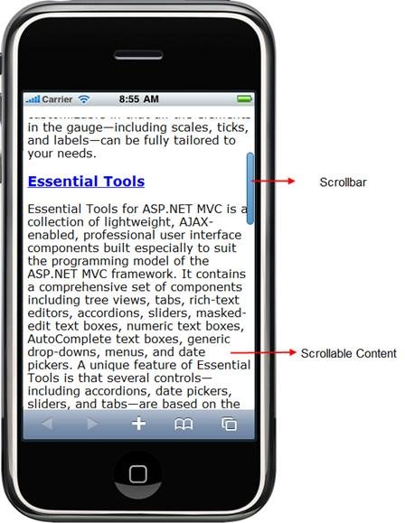

::: {style="DISPLAY: none"}
{#d2h_url_template} {#d2h_package_url style="WIDTH: 0px; DISPLAY: none; HEIGHT: 0px"}
:::

::::: {#nsbanner .d2h_main_nsbanner style="BORDER-BOTTOM: #999999 1px solid; POSITION: relative; PADDING-BOTTOM: 0px; BACKGROUND-COLOR: transparent; PADDING-LEFT: 0px; PADDING-RIGHT: 0px; DISPLAY: none; BORDER-TOP: #999999 1px solid; PADDING-TOP: 0px; LEFT: 0px"}
:::: {#TitleRow .d2h_main_titlerow style="PADDING-BOTTOM: 4px; BACKGROUND-COLOR: transparent; PADDING-LEFT: 22px; WIDTH: 100%; PADDING-RIGHT: 10px; DISPLAY: none; PADDING-TOP: 4px"}
::: {#ienav .d2h_main_ienav style="DISPLAY: none"}
{#D2HPrevious .D2HPreviousEnabled}  {#D2HNext .D2HNextEnabled}
:::
::::
:::::

:::: {#nstext .d2h_main_nstext style="PADDING-BOTTOM: 10px; BACKGROUND-COLOR: transparent; PADDING-LEFT: 22px; PADDING-RIGHT: 10px; HEIGHT: 100%; OVERFLOW: auto; PADDING-TOP: 5px" hasuserbackground="true" valign="bottom"}
::: {#d2h_breadcrumbs .d2h_breadcrumbs}
[Essential Studio User Guide Documentation](ms-xhelp:///?Id=12457748-09e3-4d74-a240-8e049cedf030){.d2h_breadcrumbsNormal} [ \> ]{.d2h_breadcrumbsLinkSeparator} [User Interface Edition](ms-xhelp:///?Id=c29296b7-531c-413b-a0ec-488ca1f7f669){.d2h_breadcrumbsNormal} [ \> ]{.d2h_breadcrumbsLinkSeparator} [Essential Mobile MVC](ms-xhelp:///?Id=74df42e3-5434-4590-9be6-3ae2f911cbbc){.d2h_breadcrumbsNormal} [ \> ]{.d2h_breadcrumbsLinkSeparator} [Essential Tools]{.d2h_breadcrumbsContentsOnly} [ \> ]{.d2h_breadcrumbsLinkSeparator} [Controls and Components](ms-xhelp:///?Id=143afae1-3f83-4d32-9bfa-92ed7022a696){.d2h_breadcrumbsNormal}
:::

## ScrollPanel {#scrollpanel style="tab-stops: 0pt"}

Essential Tools ScrollPanel for Mobile MVC builds an interactive panel for scrolling. The scroll panel control which wraps its contents in a scrollable area, is an object in a GUI with which continuous text, pictures or anything else can be scrolled, i.e., viewed even if it does not fit into the space in a mobile display, computer display, or window.

 

Key features

[·      ]{style="FONT-FAMILY: Symbol"}Supports vertical and horizontal scrolling

[·      ]{style="FONT-FAMILY: Symbol"}Four Built in skins

Use case scenario

The ScrollPanel allows the user to view the content like images and text better, according to the size of the mobile display. Since it supports vertical and horizontal scrolling the content can be adjusted even if it does not fit into the display. The panel can also be customized using the four built in skins.

Structure

The following figure depicts the important sections of ScrollPanel

{border="0"}

Figure 110: Structure of Scrollpanel

 

More:

[ ]{#related-topics}

[{border="0" align="absMiddle"}Adding to ScrollPanel to an Mobile ASP.NET MVC application](ms-xhelp:///?Id=30d06c09-c510-4fe0-bd5d-267950e1a27e){style="TEXT-DECORATION: none"}

[{border="0" align="absMiddle"}Concepts and Features](ms-xhelp:///?Id=e3fa764c-325a-4391-a9b1-3d11d25eb596){style="TEXT-DECORATION: none"}
::::
