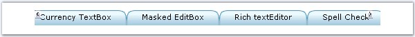

::: {style="DISPLAY: none"}
{#d2h_url_template}{#d2h_package_url style="WIDTH: 0px; DISPLAY: none; HEIGHT: 0px"}
:::

:::: {.d2h_secondary_topic style="PADDING-BOTTOM: 10pt; MARGIN: 0pt; PADDING-LEFT: 0pt; PADDING-RIGHT: 0pt; PADDING-TOP: 0pt"}
##### Scroll Settings {#scroll-settings style="tab-stops: 0pt"}

[]{style="FONT-FAMILY: 'Trebuchet MS','sans-serif'; COLOR: #15428b; FONT-SIZE: 9pt"} 

Scroll buttons can be used to traverse through the elements, when there are more tab elements to be viewed. The **ScrollingEnabled** property should be set to true to enable the scroll feature.

[]{style="FONT-FAMILY: 'Trebuchet MS','sans-serif'; COLOR: #15428b; FONT-SIZE: 9pt"} 

The scroll buttons can be applied to the horizontal tabstrip when the width exceeds a certain value, by setting the **ScrollWidth** property. Hence whenever the value exceeds the given scroll width, left and right scroll buttons will appear automatically. Similarly for vertical tabstrip when the height exceeds the value given in the **ScrollHeight** property, the up and down scroll buttons appears for the vertically laid TabStrip.

[]{style="FONT-FAMILY: 'Trebuchet MS','sans-serif'; COLOR: #15428b; FONT-SIZE: 9pt"} 

::: {align="center"}
  ----------------------- -----------------------------------------------------------------------------------------------
  Property                Description
  ScrollDownImage         Specifies the image to be used for down scroll button.
  ScrollDownImageHover    Specifies the image to be used for down scroll button on mouse hover.
  ScrollDownLook          Specifies the class name of the css definitions to apply to the down scroll.
  ScrollHeight            Specifies the scroll height.
  ScrollingEnabled        Gets/set boolean value, whether to enable scroll feature for pop ups. Default value is false.
  ScrollLeftImage         Specifies the image to be used for left scroll button.
  ScrollLeftImageHover    Specifies the image to be used for left scroll button on mouse hover.
  ScrollRightImage        Specifies the image to be used for right scroll button.
  ScrollRightImageHover   Specifies the image to be used for right scroll button on mouse hover.
  ScrollUpImage           Specifies the image to be used for up scroll button.
  ScrollUpImageHover      Specifies the image to be used for up scroll button on mouse hover.
  ScrollUpLook            Specifies styles for up scroll region.
  ScrollWidth             Specifies the scroll width.
  ----------------------- -----------------------------------------------------------------------------------------------
:::

[]{style="FONT-FAMILY: 'Trebuchet MS','sans-serif'; COLOR: #15428b; FONT-SIZE: 9pt"} 

[TabStrip also allows you to specify styles for the up and down scroll regions. This can be done by setting the **ScrollUpLook** and **ScrollDownLook** properties.]{style="FONT-FAMILY: 'Trebuchet MS','sans-serif'; COLOR: #15428b; FONT-SIZE: 9pt"}

[]{style="FONT-FAMILY: 'Trebuchet MS','sans-serif'; COLOR: #15428b; FONT-SIZE: 9pt"} 

{border="0"}

**[]{style="FONT-FAMILY: 'Trebuchet MS','sans-serif'; COLOR: #15428b; FONT-SIZE: 9pt"}** 

Figure 295: TabStrip with Scroll buttons

[]{#related-topics}
::::
