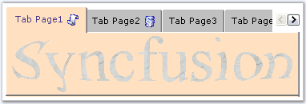
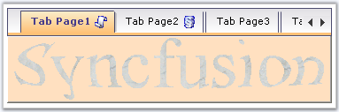
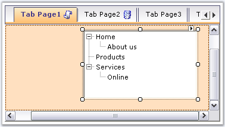

::: {style="DISPLAY: none"}
{#d2h_url_template}{#d2h_package_url style="WIDTH: 0px; DISPLAY: none; HEIGHT: 0px"}
:::

::::: {.d2h_secondary_topic style="PADDING-BOTTOM: 10pt; MARGIN: 0pt; PADDING-LEFT: 0pt; PADDING-RIGHT: 0pt; PADDING-TOP: 0pt"}
##### Scroll Settings {#scroll-settings style="MARGIN-LEFT: 18pt; tab-stops: 18.0pt"}

 

This section discusses about the Scrolling Properties available for the TabControlAdv.

 

ScrollButton

 

TabControlAdv has the ability to add scrollbuttons on the TabPanel when the number of Tab items increase. These scrollbuttons allow the user to navigate through the tabpages in the front and back. For this, the ShowScroll property of the TabControl must be set.

 

::: {align="center"}
  ------------------------ ---------------------------------------------
  TabControlAdv Property   Description
  ShowScroll               Specifies whether to show the scrollbutton.
  ------------------------ ---------------------------------------------
:::

            

[• ]{style="FONT-FAMILY: 'Arial Black','sans-serif'; COLOR: navy; FONT-SIZE: 12pt"}By default, scrollbuttons are set to 2D, 3D and Workbook tabstyles.

 

{border="0"}

 

Figure 1075: Scroll buttons displayed for the TabControlAdv**[]{style="FONT-STYLE: normal"}**

 

[• ]{style="FONT-FAMILY: 'Arial Black','sans-serif'; COLOR: navy; FONT-SIZE: 12pt"}For all other styles, scrollbuttons are set to normal button-look.

 

{border="0"}

 

Figure 1076: Scroll buttons with Normal Button-Look**[]{style="FONT-STYLE: normal"}**

 

[• ]{style="FONT-FAMILY: 'Arial Black','sans-serif'; COLOR: navy; FONT-SIZE: 12pt"}ScrollButtons can have a VS .NET - TabbedMDI scrollbutton-look, when the VSLikeScrollButton property is set to true.

 

+----------------------------------------------------------------------------------------------------------------------------------------------------------------+
| **[\[C#\]]{style="FONT-FAMILY: 'Courier New'; COLOR: black"}**                                                                                                 |
|                                                                                                                                                                |
| **[]{style="FONT-FAMILY: 'Courier New'; COLOR: black"}**                                                                                                       |
|                                                                                                                                                                |
| [this]{style="FONT-FAMILY: 'Courier New'; COLOR: blue"}[.tabControlAdv1.ShowScroll = [true]{style="COLOR: blue"};]{style="FONT-FAMILY: 'Courier New'"}         |
|                                                                                                                                                                |
| [this]{style="FONT-FAMILY: 'Courier New'; COLOR: blue"}[.tabControlAdv1.VSLikeScrollButton = [true]{style="COLOR: blue"};]{style="FONT-FAMILY: 'Courier New'"} |
+----------------------------------------------------------------------------------------------------------------------------------------------------------------+

 

+-------------------------------------------------------------------------------------------------------------------------------------------------------------+
| **[\[VB.NET\]]{style="FONT-FAMILY: 'Courier New'; COLOR: black"}**                                                                                          |
|                                                                                                                                                             |
| **[]{style="FONT-FAMILY: 'Courier New'; COLOR: black"}**                                                                                                    |
|                                                                                                                                                             |
| [Me]{style="FONT-FAMILY: 'Courier New'; COLOR: blue"}[.tabControlAdv1.ShowScroll = [True]{style="COLOR: blue"}]{style="FONT-FAMILY: 'Courier New'"}         |
|                                                                                                                                                             |
| [Me]{style="FONT-FAMILY: 'Courier New'; COLOR: blue"}[.tabControlAdv1.VSLikeScrollButton = [True]{style="COLOR: blue"}]{style="FONT-FAMILY: 'Courier New'"} |
+-------------------------------------------------------------------------------------------------------------------------------------------------------------+

 

ScrollBars

 

ScrollBars can be set for the tabpages for which the AutoScroll property has to be set to true. The AutoScrollMinSize is set to a value, which if exceeded, enables the tabcontroladv to automatically add a scrollbar to the tabpage. Setting AutoScrollMargin, allows to maintain a minimum distance between the end margin of any control that is placed and the margin of the tabpage.

 

ScrollIncrement property is used to specify whether to scroll through tabs or pages.

 

::: {align="center"}
  --------------------- ---------------------------------------------------------------------------------------------------------------
  TabPageAdv Property   Description
  AutoScroll            Specifies to add a scrollbar to the tabpage. Default value is False.
  AutoScrollMargin      Specifies the distance to be maintained between any control that is placed inside the page and the tabmargin.
  AutoScrollMinSize     Specifies the size of the tabpage, which if exceeded, would  enable scrollbars to be added.
  --------------------- ---------------------------------------------------------------------------------------------------------------
:::

 

 

{border="0"}

Figure 1077: TabPage with ScrollBars and AutoScrollMargin Set**[]{style="FONT-STYLE: normal"}**

 

 Note:***[ ]{style="COLOR: black; FONT-SIZE: 8pt"}***The TabControlAdv.BringSelectedTabToView() method is used to bring the selected tab to view, if scrolled out of view.

 

+--------------------------------------------------------------------------------------------------------------------------------------------------------------------------------------------------------------+
| **[\[C#\]]{style="FONT-FAMILY: 'Courier New'; COLOR: black"}**                                                                                                                                               |
|                                                                                                                                                                                                              |
| **[]{style="FONT-FAMILY: 'Courier New'; COLOR: black"}**                                                                                                                                                     |
|                                                                                                                                                                                                              |
| [this]{style="FONT-FAMILY: 'Courier New'; COLOR: blue"}[.tabPageAdv1.AutoScroll = [true]{style="COLOR: blue"};]{style="FONT-FAMILY: 'Courier New'"}                                                          |
|                                                                                                                                                                                                              |
| [this]{style="FONT-FAMILY: 'Courier New'; COLOR: blue"}[.tabPageAdv1.AutoScrollMargin = [new]{style="COLOR: blue"} System.Drawing.[Size]{style="COLOR: teal"}(20, 20);]{style="FONT-FAMILY: 'Courier New'"}  |
|                                                                                                                                                                                                              |
| [this]{style="FONT-FAMILY: 'Courier New'; COLOR: blue"}[.tabPageAdv1.AutoScrollMinSize = [new]{style="COLOR: blue"} System.Drawing.[Size]{style="COLOR: teal"}(50, 50);]{style="FONT-FAMILY: 'Courier New'"} |
|                                                                                                                                                                                                              |
| [this]{style="FONT-FAMILY: 'Courier New'; COLOR: blue"}[.tabControlAdv1.ScrollIncrement = Syncfusion.Windows.Forms.Tools.[ScrollIncrement]{style="COLOR: teal"}.Page;]{style="FONT-FAMILY: 'Courier New'"}   |
+--------------------------------------------------------------------------------------------------------------------------------------------------------------------------------------------------------------+

 

+----------------------------------------------------------------------------------------------------------------------------------------------------------------------------------------------------------------------------------------+
| **[\[VB.NET\]]{style="FONT-FAMILY: 'Courier New'; COLOR: black"}**                                                                                                                                                                     |
|                                                                                                                                                                                                                                        |
| **[]{style="FONT-FAMILY: 'Courier New'; COLOR: black"}**                                                                                                                                                                               |
|                                                                                                                                                                                                                                        |
| [Private]{style="FONT-FAMILY: 'Courier New'; COLOR: blue"}[ [Me]{style="COLOR: blue"}.tabPageAdv1.AutoScroll = [True]{style="COLOR: blue"}]{style="FONT-FAMILY: 'Courier New'"}                                                        |
|                                                                                                                                                                                                                                        |
| [Private]{style="FONT-FAMILY: 'Courier New'; COLOR: blue"}[ [Me]{style="COLOR: blue"}.tabPageAdv1.AutoScrollMargin = [New]{style="COLOR: blue"} System.Drawing.Size(20, 20)]{style="FONT-FAMILY: 'Courier New'"}                       |
|                                                                                                                                                                                                                                        |
| [Private]{style="FONT-FAMILY: 'Courier New'; COLOR: blue"}[ [Me]{style="COLOR: blue"}.tabPageAdv1.AutoScrollMinSize = [New]{style="COLOR: blue"} System.Drawing.Size(50, 50)]{style="FONT-FAMILY: 'Courier New'"}                      |
|                                                                                                                                                                                                                                        |
| [Private]{style="FONT-FAMILY: 'Courier New'; COLOR: blue"}[ [Me]{style="COLOR: blue"}.tabControlAdv1.ScrollIncrement = Syncfusion.Windows.Forms.Tools.[ScrollIncrement]{style="COLOR: teal"}.Page]{style="FONT-FAMILY: 'Courier New'"} |
+----------------------------------------------------------------------------------------------------------------------------------------------------------------------------------------------------------------------------------------+

 

[]{style="FONT-FAMILY: 'Calibri','sans-serif'; FONT-SIZE: 11pt"} 

[[[]{style="TEXT-DECORATION: none"}]{style="COLOR: navy; FONT-SIZE: 20pt"}]{.underline} 

 

 

[]{#related-topics}
:::::
