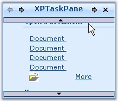

::: {style="DISPLAY: none"}
{#d2h_url_template}{#d2h_package_url style="WIDTH: 0px; DISPLAY: none; HEIGHT: 0px"}
:::

:::: {.d2h_secondary_topic style="PADDING-BOTTOM: 10pt; MARGIN: 0pt; PADDING-LEFT: 0pt; PADDING-RIGHT: 0pt; PADDING-TOP: 0pt"}
##### Scroll Settings {#scroll-settings style="MARGIN-LEFT: 18pt; tab-stops: 18.0pt"}

**[]{style="COLOR: #15428b"}** 

XPTaskPane Enables vertical scrolling for the pages using **VerticalScroll** property. On mouse hovering over the scroll bar, the taskpage automatically moves and show the hidden contents. Scrolling speed can be fixed using ScrollSpeed property.

[]{#p1082}[]{style="COLOR: #15428b"} 

::: {align="center"}
  --------------------- ----------------------------------------------------------------------------------------
  XPTaskPane Property   Description
  ScrollSpeed           Specifies the scrolling speed. Default value is 10.
  VerticalScroll        Enables scroll buttons that occupy vertical space instead of default horizontal space.
  --------------------- ----------------------------------------------------------------------------------------
:::

**[]{style="COLOR: #15428b"}** 

+-----------------------------------------------------------------------------------------------------------------------------------------------------------------------------------------------+
| **[\[C#\]]{style="FONT-FAMILY: 'Courier New'; COLOR: black"}**                                                                                                                                |
|                                                                                                                                                                                               |
| []{style="COLOR: #15428b"}                                                                                                                                                                    |
|                                                                                                                                                                                               |
| [this]{style="FONT-FAMILY: 'Courier New'; COLOR: blue"}[.xpTaskPane1.[ScrollSpeed= 20;]{style="COLOR: black"}]{style="FONT-FAMILY: 'Courier New'"}                                            |
|                                                                                                                                                                                               |
| [this]{style="FONT-FAMILY: 'Courier New'; COLOR: blue"}[.xpTaskPane1.VerticalScroll = [true]{style="COLOR: blue"};]{style="FONT-FAMILY: 'Courier New'"}[]{style="FONT-FAMILY: 'Courier New'"} |
+-----------------------------------------------------------------------------------------------------------------------------------------------------------------------------------------------+

[]{#p1083}[]{style="COLOR: #15428b"} 

+---------------------------------------------------------------------------------------------------------------------------------------------------------------------------------------------------------+
| **[\[VB.NET\]]{style="FONT-FAMILY: 'Courier New'; COLOR: black"}**                                                                                                                                      |
|                                                                                                                                                                                                         |
| []{style="COLOR: #15428b"}                                                                                                                                                                              |
|                                                                                                                                                                                                         |
| [Me]{style="FONT-FAMILY: 'Courier New'; COLOR: blue"}[.xpTaskPane1.[ScrollSpeed = 20]{style="COLOR: black"}]{style="FONT-FAMILY: 'Courier New'"}                                                        |
|                                                                                                                                                                                                         |
| [Me]{style="FONT-FAMILY: 'Courier New'; COLOR: blue"}[.xpTaskPane1.VerticalScroll = [True]{style="COLOR: blue"}]{style="FONT-FAMILY: 'Courier New'"}[]{style="FONT-FAMILY: 'Courier New'; COLOR: blue"} |
+---------------------------------------------------------------------------------------------------------------------------------------------------------------------------------------------------------+

[]{style="COLOR: #15428b"} 

{border="0"}

[]{style="COLOR: #15428b"} 

Figure 1264: Vertical Scroll Bars Displayed

 

[]{#related-topics}
::::
